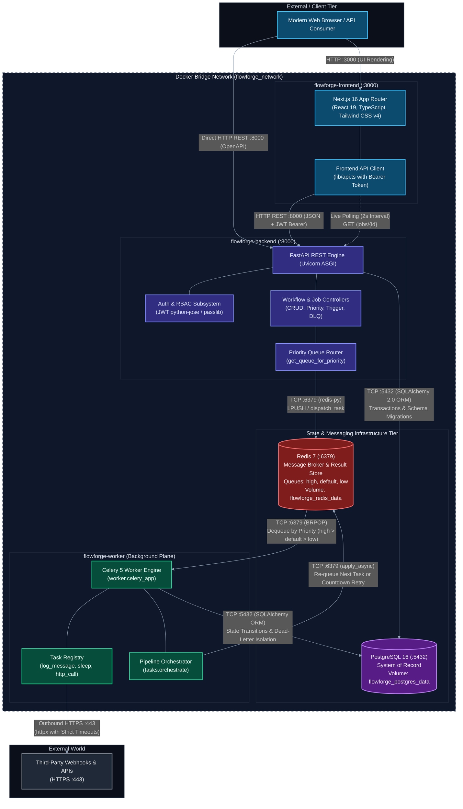
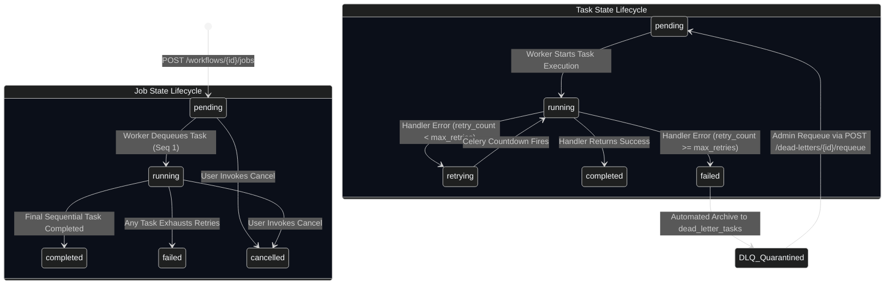

# System Architecture & Distributed Topologies

FlowForge is an enterprise-grade, distributed workflow orchestration and asynchronous task processing platform. This document provides an authoritative architectural specification of the system—detailing the multi-container network topology, communication protocols, component boundaries, end-to-end execution sequence flows, dual state-machine lifecycles, and fault-tolerance guarantees.

---

## High-Level System Architecture

FlowForge enforces strict physical and logical decoupling between the **synchronous control plane** (user-facing API and administrative dashboard) and the **asynchronous execution plane** (distributed background worker cluster). All core services run within isolated Docker containers communicating across an internal bridge network (`flowforge_network`).



---

## Network Communication & Protocol Matrix

Every inter-service communication path in FlowForge is governed by explicit transport protocols, network ports, security controls, and serialization formats:

| Source Component | Destination Component | Transport Protocol | Port | Synchronous / Asynchronous | Payload Data Format | Purpose & Description |
| :--- | :--- | :--- | :--- | :--- | :--- | :--- |
| **Browser Client** | `flowforge-frontend` | HTTP / 1.1 or HTTP/2 | `3000` | Synchronous | HTML / CSS / JS / JSON | User navigation, interactive dashboard rendering, and form interactions. |
| **`flowforge-frontend`** | `flowforge-backend` | HTTP / 1.1 REST | `8000` | Synchronous (Request / Response) | JSON (`Authorization: Bearer <JWT>`) | CRUD operations for workflows, job triggers, and non-blocking 2-second status polling. |
| **`flowforge-backend`** | `flowforge-postgres` | PostgreSQL Wire (TCP) | `5432` | Synchronous (Transactional SQL) | Structured Relational Data / JSONB | User verification, Alembic migrations, job/task creation, and query evaluation. |
| **`flowforge-backend`** | `flowforge-redis` | Redis Protocol (RESP) | `6379` | Asynchronous (Fire-and-Forget) | Serialized Celery Message (JSON) | Enqueuing execution payloads (`execute_task`) into `high`, `default`, or `low` queues. |
| **`flowforge-worker`** | `flowforge-redis` | Redis Protocol (RESP) | `6379` | Asynchronous (Blocking Pop / Polling) | Serialized Celery Message (JSON) | Worker dequeues tasks by priority, coordinates countdown retries, and stores task results. |
| **`flowforge-worker`** | `flowforge-postgres` | PostgreSQL Wire (TCP) | `5432` | Synchronous (Transactional SQL) | Structured Relational Data / JSONB | Updating task/job status (`running`, `completed`, `failed`), archiving dead letters. |
| **`flowforge-worker`** | **External APIs** | HTTPS / TLS | `443` | Synchronous (Controlled Timeout) | JSON / Form Payloads / Text | Execution of `http_call` tasks via `httpx` with enforced timeout guards. |

---

## Physical Container Specifications & Architectural Roles

FlowForge operates five purpose-built container workloads orchestrated via Docker Compose:

### 1. `flowforge-frontend`
- **Base Image / Runtime**: Node.js 20 on Alpine Linux.
- **Framework & Libraries**: Next.js 16.3 (App Router), React 19, TypeScript 5, Tailwind CSS v4.
- **Exposed Port**: `3000` (mapped to host `3000:3000`).
- **Core Responsibilities**:
  - Delivers the administrative user interface for workflow authoring and job monitoring.
  - Implements an automated 2-second background polling cycle (`setInterval`) against `GET /jobs/{id}` that seamlessly halts upon reaching terminal states (`completed`, `failed`, `cancelled`).
  - Manages JWT tokens with automated refresh handling in [api.ts](file:///d:/Edutation(P)/FlowForge/frontend/src/lib/api.ts).
  - Provides administrative interfaces for Dead-Letter Queue (DLQ) inspection and one-click task requeuing.

### 2. `flowforge-backend`
- **Base Image / Runtime**: Python 3.11-slim.
- **Framework & Libraries**: FastAPI (`^0.111.0`), Uvicorn ASGI server, Pydantic V2, SQLAlchemy 2.0 ORM, Alembic.
- **Exposed Port**: `8000` (mapped to host `8000:8000`).
- **Core Responsibilities**:
  - Serves as the platform's synchronous control plane and API gateway.
  - Enforces Role-Based Access Control (`admin`, `member`, `viewer`) via cryptographically signed JWT access tokens ([security.py](file:///d:/Edutation(P)/FlowForge/backend/app/core/security.py)).
  - Decomposes declarative workflow JSON definitions into ordered, discrete [Task](file:///d:/Edutation(P)/FlowForge/backend/app/models/task.py) database records upon job creation.
  - Evaluates priority routing via [queue_routing.py](file:///d:/Edutation(P)/FlowForge/backend/app/core/queue_routing.py), partitioning requests into `high`, `default`, or `low` Celery queues.
  - Handles administrative Dead-Letter Queue inspection and requeue endpoints ([dead_letters.py](file:///d:/Edutation(P)/FlowForge/backend/app/api/dead_letters.py)).

### 3. `flowforge-worker`
- **Base Image / Runtime**: Python 3.11-slim.
- **Framework & Libraries**: Celery (`^5.3.6`), Redis client, SQLAlchemy 2.0, HTTPX (`^0.27.0`).
- **Execution Mode**: Distributed background worker daemon (`worker/worker.py`).
- **Core Responsibilities**:
  - Consumes execution payloads from Redis priority queues using priority-weighted scheduling.
  - Dynamically resolves handler functions from the Task Registry ([registry.py](file:///d:/Edutation(P)/FlowForge/worker/tasks/registry.py)):
    - `log_message`: Formats structured log context and captures output.
    - `sleep`: Pauses worker thread for a specified duration to simulate asynchronous workloads.
    - `http_call`: Executes remote HTTP requests via `httpx.Client` with configurable methods, headers, payloads, and timeout thresholds.
  - Implements automated exponential backoff retry scheduling:
    $$\text{delay} = \min\left(\text{RETRY\_BASE\_DELAY\_SECONDS} \times 2^{\text{retry\_count}-1},\; \text{RETRY\_MAX\_DELAY\_SECONDS}\right)$$
  - Enforces dead-letter isolation when retry limits are exhausted, writing failed task metadata to `dead_letter_tasks` and halting downstream pipeline progression ([execute_task.py](file:///d:/Edutation(P)/FlowForge/worker/tasks/execute_task.py)).
  - Advances pipeline steps sequentially via the orchestrator engine ([orchestrate.py](file:///d:/Edutation(P)/FlowForge/worker/tasks/orchestrate.py)).

### 4. `flowforge-postgres`
- **Base Image**: `postgres:16-alpine`.
- **Exposed Port**: `5432` (mapped to host `5432:5432`).
- **Storage Volume**: `flowforge_postgres_data` mounted to `/var/lib/postgresql/data`.
- **Healthcheck**: `pg_isready -U postgres -d flowforge` (5s interval, 5s timeout, 5 retries).
- **Core Responsibilities**:
  - Acts as the primary ACID relational system of record for the platform.
  - Maintains tables for `users`, `workflows`, `jobs`, `tasks`, `dead_letter_tasks`, and `alembic_version`.
  - Enforces foreign key constraints, cascading deletes, and JSONB dynamic payload storage for task configs and outputs.

### 5. `flowforge-redis`
- **Base Image**: `redis:7-alpine`.
- **Exposed Port**: `6379` (mapped to host `6379:6379`).
- **Storage Volume**: `flowforge_redis_data` mounted to `/data`.
- **Healthcheck**: `redis-cli ping` (5s interval, 5s timeout, 5 retries).
- **Core Responsibilities**:
  - In-memory message broker mediating communication between the FastAPI backend and Celery workers.
  - Maintains partitioned FIFO priority queues (`high`, `default`, `low`).
  - Tracks Celery ETA countdown schedules for retrying tasks without blocking active worker concurrency.

---

## End-to-End Workflow Execution Flow

The following sequence diagram details the complete lifecycle of a multi-step job execution—from user trigger in the dashboard to priority queuing, worker processing, exponential backoff retries, dead-letter quarantine, and polling teardown:

```mermaid
%%{init: {
  'theme': 'dark',
  'themeVariables': {
    'darkMode': true,
    'background': '#0b0f19',
    'actorBkg': '#1e293b',
    'actorBorder': '#38bdf8',
    'actorTextColor': '#f8fafc',
    'actorLineColor': '#64748b',
    'signalColor': '#94a3b8',
    'signalTextColor': '#f8fafc',
    'labelBoxBkgColor': '#1e293b',
    'labelBoxBorderColor': '#38bdf8',
    'labelTextColor': '#f8fafc',
    'loopTextColor': '#f8fafc',
    'noteBorderColor': '#475569',
    'noteBkgColor': '#1e293b',
    'noteTextColor': '#f8fafc',
    'activationBorderColor': '#38bdf8',
    'activationBkgColor': '#1e293b',
    'sequenceNumberColor': '#0f172a'
  }
}}%%
sequenceDiagram
    autonumber
    actor User as Client / User
    participant Frontend as Next.js Dashboard (:3000)
    participant API as FastAPI Backend (:8000)
    participant DB as PostgreSQL 16 (:5432)
    participant Redis as Redis Broker (:6379)
    participant Worker as Celery Worker

    User->>Frontend: Click "Trigger Job" on Workflow Details
    Frontend->>API: POST /jobs/{id}/trigger (Authorization: Bearer <JWT>)
    
    rect rgb(15, 23, 42)
        Note over API,DB: Phase 1: Authentication, Authorization & State Validation
        API->>DB: Verify JWT signature & load User record (get_current_user)
        API->>DB: Query target Job by ID (SELECT * FROM jobs WHERE id = :id)
        alt Job status != 'pending'
            API-->>Frontend: 409 Conflict ("Only pending jobs can be triggered")
        end
        API->>DB: Query first task (ORDER BY sequence ASC LIMIT 1)
    end

    rect rgb(30, 27, 75)
        Note over API,Redis: Phase 2: Priority Partitioning & Dispatch
        API->>API: Resolve priority queue (1-3: high, 4-7: default, 8-10: low)
        API->>Redis: dispatch_task("execute_task", args=[task_1_id], queue=queue)
        API-->>Frontend: 200 OK (Job status: "pending", priority: N)
    end

    rect rgb(6, 78, 59)
        Note over Frontend,API: Phase 3: Client Observability & Polling Handshake
        Frontend->>Frontend: Initialize polling interval (every 2000ms)
        Frontend-->>User: Render "Pending" badge & progress UI
    end

    rect rgb(15, 23, 42)
        Note over Redis,Worker: Phase 4: Worker Dequeue & State Transition
        Worker->>Redis: BRPOP high, default, low queues
        Redis-->>Worker: Deliver task message (task_id)
        Worker->>DB: UPDATE jobs SET status = 'running', started_at = NOW() (if pending)
        Worker->>DB: UPDATE tasks SET status = 'running', started_at = NOW()
        Worker->>DB: COMMIT transaction
    end

    rect rgb(67, 56, 202)
        Note over Worker: Phase 5: Registry Lookup & Handler Execution
        Worker->>Worker: Lookup handler in TASK_REGISTRY (log_message, sleep, http_call)
        Worker->>Worker: Invoke handler with task.input_data
    end

    alt Execution Branch A: Task Handler Succeeds
        Worker->>DB: UPDATE tasks SET status = 'completed', output_data = :output, completed_at = NOW()
        Worker->>Worker: Invoke handle_task_completion(task_id, db)
        Worker->>DB: Query next task (sequence > current_sequence ORDER BY sequence ASC)
        alt Subsequent Task Exists
            Worker->>Redis: apply_async(execute_task, args=[next_task_id], queue=queue)
            Note over Redis,Worker: Next task enters queue; workflow pipeline continues
        else All Sequential Tasks Complete
            Worker->>DB: UPDATE jobs SET status = 'completed', completed_at = NOW()
        end

    else Execution Branch B: Handler Raises Exception (Retries Available)
        Worker->>DB: UPDATE tasks SET error_message = :err, retry_count = retry_count + 1, status = 'retrying'
        Worker->>Worker: Calculate backoff: min(base * 2^(retry-1), max_delay)
        Worker->>Redis: apply_async(execute_task, countdown=delay, queue=queue)
        Note over Redis: Task sleeps in Redis ETA schedule; worker is released for other jobs

    else Execution Branch C: Handler Raises Exception (Retries Exhausted)
        Worker->>DB: UPDATE tasks SET status = 'failed', completed_at = NOW()
        Worker->>DB: INSERT INTO dead_letter_tasks (task_id, job_id, workflow_id, error_message, ...)
        Worker->>DB: UPDATE jobs SET status = 'failed', completed_at = NOW()
        Note over DB: Downstream steps halted; task quarantined to Dead-Letter Queue
    end

    rect rgb(15, 23, 42)
        Note over Frontend,API: Phase 6: Terminal State Detection & Polling Teardown
        loop Every 2 Seconds
            Frontend->>API: GET /jobs/{id}
            API->>DB: Query Job with child Tasks
            API-->>Frontend: 200 OK (Job payload with status & step logs)
        end
        Frontend->>Frontend: Detect terminal status ('completed', 'failed', 'cancelled')
        Frontend->>Frontend: clearInterval() — freeze UI state & display summary
    end
```

---

## Detailed Step-by-Step Architectural Walkthrough

### 1. Job Creation & Task Decomposition
1. When a user posts a workflow definition (`POST /workflows/{id}/jobs`), the API verifies workflow existence, active status (`is_active == True`), and ownership/admin privileges.
2. The endpoint creates a parent [Job](file:///d:/Edutation(P)/FlowForge/backend/app/models/job.py) record with status `pending` and assigns an execution priority (`1` = highest, `10` = lowest, default `5`).
3. The API iterates over the workflow's JSON `definition` array, automatically generating ordered [Task](file:///d:/Edutation(P)/FlowForge/backend/app/models/task.py) records with `sequence = 1, 2, ... N`, status `pending`, initial `retry_count = 0`, and custom `max_retries` (default `3`).
4. All records are persisted atomically in a single PostgreSQL transaction.

### 2. Synchronous Job Trigger
1. An authenticated user triggers the job via `POST /jobs/{id}/trigger`.
2. The API checks that `Job.status == "pending"`. If the job is already `running`, `completed`, or `cancelled`, the API aborts with `409 Conflict`.
3. The API queries PostgreSQL for the first sequential task (`sequence == 1`).
4. The API queries the Priority Router ([queue_routing.py](file:///d:/Edutation(P)/FlowForge/backend/app/core/queue_routing.py)) to map numeric priority to a named queue:
   - Priority `1` to `3` $\rightarrow$ `"high"`
   - Priority `4` to `7` $\rightarrow$ `"default"`
   - Priority `8` to `10` $\rightarrow$ `"low"`
5. The API enqueues the task via `dispatch_task("execute_task", args=[str(first_task.id)], queue=queue)` and immediately returns HTTP `200 OK`. The entire API request finishes in **under 25 milliseconds**.

### 3. Asynchronous Worker Execution
1. A Celery worker dequeues the execution message from Redis.
2. The worker opens an independent database session via `get_worker_db()` ([worker/db.py](file:///d:/Edutation(P)/FlowForge/worker/db.py)).
3. If the parent `Job.status` is still `pending`, it transitions to `running` with `started_at = NOW()`.
4. The current `Task.status` transitions to `running` with `started_at = NOW()`, committing changes immediately so that status polling reflects live progress.

### 4. Dynamic Handler Dispatch
The worker invokes the handler corresponding to `task.type` from `TASK_REGISTRY` ([registry.py](file:///d:/Edutation(P)/FlowForge/worker/tasks/registry.py)):
- **`log_message`**: Extracts `message`, logs structured worker context, and returns `{"logged": message}`.
- **`sleep`**: Suspends the thread via `time.sleep(seconds)` to simulate compute latency.
- **`http_call`**: Initiates an outbound HTTP request using `httpx.Client(timeout=10.0)`. Validates responses via `response.raise_for_status()` and returns `{"status_code": code, "body": response.text[:1000]}`.

### 5. Outcome Resolution & Sequential Chaining
- **Success Path**:
  - `Task.status` is marked `completed` and output is persisted to `Task.output_data`.
  - [tasks.orchestrate.handle_task_completion](file:///d:/Edutation(P)/FlowForge/worker/tasks/orchestrate.py) queries PostgreSQL for the next step where `sequence > current.sequence`.
  - If a subsequent step exists, it dispatches `execute_task` with the next task's ID preserving the original priority queue.
  - If no further tasks exist, the parent `Job.status` is marked `completed` with `completed_at = NOW()`.
- **Transient Failure Path (Retries Remaining)**:
  - If an exception is raised and `task.retry_count < task.max_retries`:
    1. `task.retry_count` is incremented by 1.
    2. `task.status` transitions to `retrying` and `error_message` is recorded.
    3. Exponential backoff is calculated: $\text{delay} = \min(10.0 \times 2^{\text{retry}-1}, 300.0)$.
    4. The task is re-queued into Redis with a Celery countdown delay:
       ```python
       execute_task.apply_async(args=[task_id], countdown=delay, queue=queue)
       ```
    5. The worker thread is freed immediately to process other concurrent jobs.
- **Permanent Failure Path (Dead-Letter Isolation)**:
  - If `task.retry_count >= task.max_retries`:
    1. `task.status` is marked `failed`.
    2. A new record is inserted into `dead_letter_tasks` preserving full task context, error trace, and input payload.
    3. The parent `Job.status` transitions to `failed`. Downstream steps are not executed, preventing cascading pipeline corruption.

---

## Dual State-Machine Engine

FlowForge coordinates two coupled state machines: the macro-level **Job Lifecycle** and the micro-level **Task Lifecycle**.



### State Transition Matrix

| Entity | Current State | Trigger Event | Next State | Database Side Effects |
| :--- | :--- | :--- | :--- | :--- |
| **Job** | `pending` | User triggers job via API / UI | `pending` | First sequential task enqueued to Redis. |
| **Job** | `pending` | Worker consumes first task | `running` | `started_at` timestamp recorded. |
| **Job** | `running` | Final task completes successfully | `completed` | `completed_at` timestamp recorded. |
| **Job** | `running` | Any task exhausts retries | `failed` | `completed_at` timestamp recorded; pipeline halted. |
| **Job** | `pending` / `running` | User calls `POST /jobs/{id}/cancel` | `cancelled` | `completed_at` timestamp recorded. |
| **Task** | `pending` | Worker begins execution | `running` | `started_at` timestamp recorded. |
| **Task** | `running` | Handler completes without error | `completed` | `output_data` saved; `completed_at` stamped; next step queued. |
| **Task** | `running` | Handler raises error (`retries < max`) | `retrying` | `retry_count += 1`; error message saved; countdown scheduled. |
| **Task** | `retrying` | Celery countdown timer expires | `running` | Worker resumes execution; new attempt timestamped. |
| **Task** | `running` | Handler raises error (`retries >= max`) | `failed` | `completed_at` stamped; row written to `dead_letter_tasks`. |
| **Task** | `failed` (DLQ) | Admin calls `POST /dead-letters/{id}/requeue` | `pending` | Task reset; `requeued_at` marked; re-enqueued to Redis. |

---

## Fault Tolerance & Disaster Recovery Guarantees

FlowForge implements architectural safeguards designed to prevent data loss, eliminate poison-pill loops, and recover gracefully from infrastructure disruptions:

### 1. Mid-Execution Worker Crash
- **Behavior**: If a worker container crashes while processing a task, uncommitted database writes are automatically rolled back by PostgreSQL.
- **Recovery**: Because state transitions are transactional, restarted workers or sibling workers resume task processing safely without leaving corrupted state.

### 2. Database Disconnect & Connection Pool Recycling
- **Implementation**: Both the FastAPI API server and Celery worker engine configure SQLAlchemy engine connection pooling with `pool_pre_ping=True`.
- **Recovery**: Stale or terminated TCP connections (caused by network partitions or database restarts) are automatically detected and replaced without restarting application services.

### 3. Redis Broker Downtime & State Preservation
- **Implementation**: The Redis container is backed by the named Docker volume `flowforge_redis_data` with standard snapshotting.
- **Recovery**: When Redis reboots, existing queues and Celery countdown schedules persist from disk storage, preventing task dropouts.

### 4. Poison-Pill Quarantine (Dead-Letter Isolation)
- **Problem**: Malformed payloads or buggy remote endpoints can cause worker containers to crash repeatedly, monopolizing worker capacity.
- **Solution**: Once a task fails `max_retries` times, FlowForge halts execution, records the full error stack in `dead_letter_tasks`, and marks the parent job `failed`. Sibling and downstream jobs proceed unaffected. Operators can inspect the payload and invoke `POST /dead-letters/{id}/requeue` once the underlying issue is resolved.

---

## Related Documentation & References

- [Platform Overview](overview.md) — System philosophy, feature matrix, and architectural objectives.
- [Technology Stack Architecture](tech-stack.md) — Comprehensive inventory of technologies, libraries, and frameworks.
- [Relational Data Model Specification](../04-reference/data-model.md) — Schema definitions for users, workflows, jobs, tasks, and DLQ.
- [REST API Reference](../04-reference/api-reference.md) — Complete endpoint documentation and request/response specifications.
- [Job Lifecycle & Orchestration](../05-explanation/job-lifecycle-and-orchestration.md) — Deep dive into the orchestration engine.
- [Priority Queue Design](../05-explanation/priority-queue-design.md) — Multi-tier priority routing mechanics.
- [Retry & Dead-Letter Strategy](../05-explanation/retry-and-dead-letter-strategy.md) — Exponential backoff mathematics and failure recovery.
- [Managing Dead Letters Guide](../03-how-to-guides/managing-dead-letters.md) — Operational guide for debugging and replaying failed tasks.