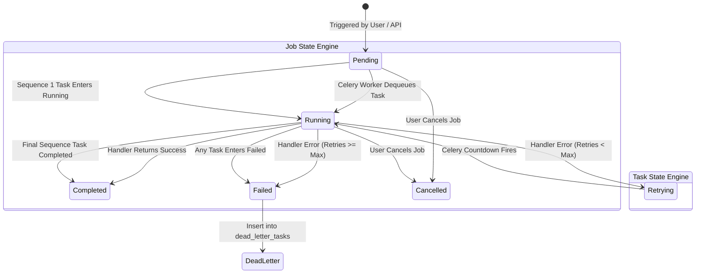

# Architecture Diagram & System Topologies

This document provides a comprehensive architectural specification of FlowForge. It details the multi-container topology, network communication boundaries, component responsibilities, end-to-end execution sequence flows, and fault-tolerance mechanics.

---

## Multi-Tier Container Architecture

FlowForge separates synchronous user-facing control plane operations from asynchronous background execution using an event-driven queue pattern. All services run in isolated Docker containers communicating across a shared bridge network (`flowforge_network`).

```mermaid
flowchart TB
    classDef client fill:#e0f2fe,stroke:#0284c7,stroke-width:2px;
    classDef api fill:#fef3c7,stroke:#d97706,stroke-width:2px;
    classDef broker fill:#fee2e2,stroke:#dc2626,stroke-width:2px;
    classDef worker fill:#dcfce7,stroke:#16a34a,stroke-width:2px;
    classDef storage fill:#ede9fe,stroke:#7c3aed,stroke-width:2px;
    classDef network fill:#f8fafc,stroke:#94a3b8,stroke-width:2px,stroke-dasharray: 5 5;

    subgraph UserSpace["External / User Space"]
        Browser["Web Browser / API Consumer"]:::client
    end

    subgraph DockerNetwork["Docker Bridge Network (flowforge_network)"]:::network
        
        subgraph FrontendContainer["flowforge-frontend (Port 3000)"]
            NextApp["Next.js 16 App Router\n(React 19, TypeScript, Tailwind CSS)"]:::client
            APIClient["Frontend API Client\n(lib/api.ts with Bearer Token)"]:::client
        end

        subgraph BackendContainer["flowforge-backend (Port 8000)"]
            FastAPIEngine["FastAPI Engine (Uvicorn ASGI)"]:::api
            AuthModule["Auth & RBAC Subsystem\n(JWT python-jose / passlib)"]:::api
            JobAPIs["Job & Workflow Endpoints\n(CRUD, Trigger, Cancel, DLQ)"]:::api
            PriorityRouter["Priority Queue Router\n(get_queue_for_priority)"]:::api
        end

        subgraph DataTier["State & Messaging Tier"]
            PostgresDB[("PostgreSQL 16 (Port 5432)\nSystem of Record\nVolume: postgres_data")]:::storage
            RedisBroker[("Redis 7 (Port 6379)\nCelery Broker & Result Store\nQueues: high | default | low\nVolume: redis_data")]:::broker
        end

        subgraph WorkerContainer["flowforge-worker (Background Plane)"]
            CeleryWorker["Celery Worker Engine\n(worker.celery_app)"]:::worker
            HandlerRegistry["Task Registry\n(log_message, sleep, http_call)"]:::worker
            Orchestrator["Pipeline Orchestrator\n(handle_task_completion / failure)"]:::worker
        end
    end

    subgraph ExternalServices["External World"]
        RemoteEndpoints["Third-Party Webhooks / External APIs"]
    end

    %% External to Container
    Browser -->|"HTTP :3000 (UI Interaction)"| NextApp
    Browser -->|"Direct HTTP REST :8000 (Optional)"| FastAPIEngine

    %% Frontend to Backend
    NextApp --- APIClient
    APIClient -->|"HTTP REST :8000 (JSON / JWT Bearer)"| FastAPIEngine
    APIClient -.->|"Live Polling (Every 2s)\nGET /jobs/:id"| FastAPIEngine

    %% Backend Internals & Outbound
    FastAPIEngine --- AuthModule
    FastAPIEngine --- JobAPIs
    JobAPIs --- PriorityRouter
    FastAPIEngine -->|"TCP :5432 (SQLAlchemy 2.0 ORM)\nCRUD Operations & Migrations"| PostgresDB
    PriorityRouter -->|"TCP :6379 (redis-py)\nLPUSH / dispatch_task"| RedisBroker

    %% Worker Connections
    RedisBroker -->|"TCP :6379 (BRPOP)\nDequeue tasks by priority"| CeleryWorker
    CeleryWorker --- HandlerRegistry
    CeleryWorker --- Orchestrator
    CeleryWorker -->|"TCP :5432 (SQLAlchemy ORM)\nUpdate Task/Job State & Write DLQ"| PostgresDB
    Orchestrator -->|"TCP :6379 (apply_async)\nRe-queue Next Step or Countdown Retry"| RedisBroker
    HandlerRegistry -->|"Outbound HTTP / HTTPS :443\n(httpx with timeouts)"| RemoteEndpoints
```

---

## Network Communication & Protocol Matrix

Every inter-service communication path in FlowForge is governed by explicit protocol boundaries, network ports, and serialization standards:

| Source Component | Destination Component | Transport Protocol | Port | Synchronous / Asynchronous | Payload Data Format | Purpose & Description |
| :--- | :--- | :--- | :--- | :--- | :--- | :--- |
| **Browser Client** | `flowforge-frontend` | HTTP / 1.1 or 2 | `3000` | Synchronous | HTML / CSS / JS / JSON | User navigation, dashboard rendering, form interactions. |
| **`flowforge-frontend`** | `flowforge-backend` | HTTP / 1.1 REST | `8000` | Synchronous (Request / Response) | JSON (`Authorization: Bearer <JWT>`) | CRUD operations for workflows, job trigger requests, 2-second status polling. |
| **`flowforge-backend`** | `flowforge-postgres` | PostgreSQL Wire (TCP) | `5432` | Synchronous (Transactional SQL) | Structured Relational Data / JSONB | User verification, schema migrations, job/task record creation, state queries. |
| **`flowforge-backend`** | `flowforge-redis` | Redis Protocol (RESP) | `6379` | Asynchronous (Fire-and-Forget) | Serialized Celery Message (JSON) | Enqueuing execution payloads (`execute_task`) into `high`, `default`, or `low` queues. |
| **`flowforge-worker`** | `flowforge-redis` | Redis Protocol (RESP) | `6379` | Asynchronous (Polling / Blocking Pop) | Serialized Celery Message (JSON) | Worker dequeues tasks, coordinates countdown retry delays, stores task results. |
| **`flowforge-worker`** | `flowforge-postgres` | PostgreSQL Wire (TCP) | `5432` | Synchronous (Transactional SQL) | Structured Relational Data / JSONB | Updating task/job status (`running`, `completed`, `failed`), archiving dead letters. |
| **`flowforge-worker`** | **External APIs** | HTTPS / TLS | `443` | Synchronous (Controlled Timeout) | JSON / Form Payloads / Text | Execution of `http_call` tasks via `httpx` with strict timeout controls. |

---

## Component Responsibility Matrix

| Component Container | Primary Responsibilities | Core Source Files | Failure Modes & Resilience Strategies |
| :--- | :--- | :--- | :--- |
| **`flowforge-backend`** | - User authentication & JWT issuance<br>- RBAC validation on protected routes<br>- Workflow & Job CRUD endpoints<br>- Priority queue mapping & task dispatch | [main.py](file:///d:/Edutation(P)/FlowForge/backend/main.py)<br>[app/api/](file:///d:/Edutation(P)/FlowForge/backend/app/api/)<br>[app/core/security.py](file:///d:/Edutation(P)/FlowForge/backend/app/core/security.py) | **Stateless**: If the backend container restarts, no state is lost. Uvicorn reboots rapidly; in-flight API requests return HTTP 503 until healthy. |
| **`flowforge-worker`** | - Consumes tasks from Redis queues<br>- Executes handlers (`log_message`, `sleep`, `http_call`)<br>- Computes exponential backoff delays<br>- Chains sequential pipeline steps<br>- Writes dead-letter records upon failure | [worker/celery_app.py](file:///d:/Edutation(P)/FlowForge/worker/celery_app.py)<br>[worker/tasks/execute_task.py](file:///d:/Edutation(P)/FlowForge/worker/tasks/execute_task.py)<br>[worker/tasks/orchestrate.py](file:///d:/Edutation(P)/FlowForge/worker/tasks/orchestrate.py)<br>[worker/tasks/registry.py](file:///d:/Edutation(P)/FlowForge/worker/tasks/registry.py) | **Autonomous Retries**: Transient failures invoke Celery countdown timers without blocking concurrency. Fatal poison tasks are isolated to the DLQ table. |
| **`flowforge-postgres`** | - Durable system of record<br>- Enforces foreign key constraints & cascading<br>- Stores dynamic JSONB payloads & results<br>- Maintains Alembic migration history | [app/models/](file:///d:/Edutation(P)/FlowForge/backend/app/models/)<br>[alembic/](file:///d:/Edutation(P)/FlowForge/backend/alembic/) | **ACID Transactions**: Atomic unit-of-work transactions roll back partial writes if a worker crashes during execution. Mounted to persistent Docker volume `postgres_data`. |
| **`flowforge-redis`** | - Low-latency Celery message transport<br>- Priority queue partitioning (`high`, `default`, `low`)<br>- Stores Celery ETA countdown schedules | [worker/celery_app.py](file:///d:/Edutation(P)/FlowForge/worker/celery_app.py) | **In-Memory Buffer**: Minimal RAM usage. Mounted to persistent Docker volume `redis_data` with standard snapshotting. |
| **`flowforge-frontend`** | - Responsive administrative web UI<br>- Workflow builder forms & JSON validator<br>- Real-time 2-second job status polling<br>- Dead-letter inspection & replay trigger | [frontend/src/app/](file:///d:/Edutation(P)/FlowForge/frontend/src/app/)<br>[frontend/src/lib/api.ts](file:///d:/Edutation(P)/FlowForge/frontend/src/lib/api.ts) | **Client-Side Fault Handling**: Gracefully handles network timeouts with UI alerts. Automatically terminates polling loop when job reaches terminal state. |

---

## End-to-End Workflow Execution Flow

The following sequence diagram details the complete lifecycle of a multi-step job trigger, showing how the control plane, data layer, message broker, worker engine, and frontend interact across success, retry, and dead-letter paths:

```mermaid
sequenceDiagram
    autonumber
    actor User
    participant Frontend as Next.js Dashboard (:3000)
    participant API as FastAPI Backend (:8000)
    participant DB as PostgreSQL 16 (:5432)
    participant Redis as Redis 7 Broker (:6379)
    participant Worker as Celery Worker

    User->>Frontend: Clicks "Trigger Job" on Workflow Page
    Frontend->>API: POST /jobs/{id}/trigger (Header: Bearer JWT)
    
    rect rgb(240, 249, 255)
        Note over API,DB: Step 1: Authentication, Authorization & State Validation
        API->>DB: Verify JWT token & check user role (admin | member | viewer)
        API->>DB: Query Job by ID (SELECT * FROM jobs WHERE id = :id)
        alt Job is not "pending" (e.g. running, completed, cancelled)
            API-->>Frontend: 409 Conflict ("Job is already running or completed")
        end
        API->>DB: Query first sequential task (sequence = 1)
    end

    rect rgb(254, 243, 199)
        Note over API,Redis: Step 2: Priority Partitioning & Asynchronous Dispatch
        API->>API: get_queue_for_priority(job.priority)<br>1-3: "high" | 4-7: "default" | 8-10: "low"
        API->>Redis: dispatch_task("execute_task", args=[task_1_id], queue=queue)
        API-->>Frontend: 200 OK (Job status: "pending")
    end

    rect rgb(240, 253, 244)
        Note over Frontend,API: Step 3: Frontend Polling Loop Initiated
        Frontend->>Frontend: Sets setInterval(fetchJob, 2000)
        Frontend-->>User: UI updates to show Job status: "pending"
    end

    rect rgb(245, 243, 255)
        Note over Redis,Worker: Step 4: Worker Consumption & State Initialization
        Worker->>Redis: BRPOP from assigned priority queues
        Redis-->>Worker: Deliver task message (task_1_id)
        Worker->>DB: BEGIN TRANSACTION
        Worker->>DB: UPDATE jobs SET status = 'running', started_at = NOW() (if pending)
        Worker->>DB: UPDATE tasks SET status = 'running', started_at = NOW() WHERE id = :task_1_id
        Worker->>DB: COMMIT TRANSACTION
    end

    rect rgb(254, 242, 242)
        Note over Worker: Step 5: Handler Lookup & Execution
        Worker->>Worker: Lookup handler in TASK_REGISTRY[task.type]<br>(log_message | sleep | http_call)
        Worker->>Worker: Execute handler with task.input_data
    end

    alt Execution Path A: Handler Succeeds
        Worker->>DB: UPDATE tasks SET status = 'completed', output_data = {...}, completed_at = NOW()
        Worker->>Worker: handle_task_completion(task_1_id, db)
        Worker->>DB: SELECT * FROM tasks WHERE job_id = :job_id AND sequence = 2
        alt Subsequent Task Exists (Step 2)
            Worker->>Redis: apply_async(args=[task_2_id], queue=queue)
            Note over Redis,Worker: Next task enters queue; process repeats for sequence 2
        else All Sequential Tasks Complete
            Worker->>DB: UPDATE jobs SET status = 'completed', completed_at = NOW()
        end

    else Execution Path B: Handler Raises Exception & Retries Remain
        Worker->>DB: UPDATE tasks SET error_message = :err
        Worker->>Worker: Calculate backoff: min(base * (2 ^ attempt), max_delay)
        Worker->>DB: UPDATE tasks SET status = 'retrying', retry_count = retry_count + 1
        Worker->>Redis: apply_async(countdown=backoff_delay, queue=queue)
        Note over Redis: Task sleeps in Redis ETA schedule; worker is free for other jobs

    else Execution Path C: Handler Raises Exception & Retries Exhausted
        Worker->>DB: UPDATE tasks SET status = 'failed', completed_at = NOW()
        Worker->>DB: INSERT INTO dead_letter_tasks (task_id, job_id, workflow_id, error_message, ...)
        Worker->>DB: UPDATE jobs SET status = 'failed', completed_at = NOW()
        Note over DB: Entire downstream pipeline halted; poison pill safely quarantined
    end

    rect rgb(240, 249, 255)
        Note over Frontend,API: Step 6: Frontend Polling Detects Completion
        loop Every 2 Seconds
            Frontend->>API: GET /jobs/{id}
            API->>DB: SELECT * FROM jobs WHERE id = :id (with tasks)
            API-->>Frontend: 200 OK (Job status: "completed" | "failed")
            Frontend->>Frontend: Update UI badges, display output JSON or error stack
        end
        Frontend->>Frontend: clearInterval() — Polling terminated on terminal state
    end
```

---

## Detailed Step-by-Step Narrative Walkthrough

### Step 1: User Action in the Administrative Dashboard
1. The user logs in and navigates to the workflow details page (`frontend/src/app/workflows/[id]/page.tsx`).
2. The user clicks **"Trigger Job"**, optionally specifying an integer execution priority (`1` = critical, `10` = background bulk).
3. The frontend API client helper (`frontend/src/lib/api.ts`) constructs an HTTP `POST` request to `/jobs/{workflow_id}/trigger`, attaching the JWT token stored in browser `localStorage` to the `Authorization: Bearer <token>` header.

### Step 2: Synchronous API Request & Validation
1. The request reaches the FastAPI application (`backend/app/api/jobs.py`).
2. **Authentication**: The `get_current_user` dependency in `backend/app/core/security.py` verifies the cryptographic signature of the JWT access token and decodes the user's `id` and `role`.
3. **State Guard**: The API checks the target job record. If the job status is already `running`, `completed`, or `cancelled`, the API immediately raises HTTP `409 Conflict`.
4. **Sequence Resolution**: The API queries PostgreSQL for the first step associated with the job:
   ```python
   first_task = db.query(Task).filter(
       Task.job_id == job.id
   ).order_by(Task.sequence.asc()).first()
   ```

### Step 3: Priority Routing & Broker Dispatch
1. FlowForge routes tasks into one of three Celery queues based on the job's numeric priority:
   ```python
   def get_queue_for_priority(priority: int) -> str:
       if priority <= 3:
           return "high"
       elif priority <= 7:
           return "default"
       else:
           return "low"
   ```
2. The API calls `dispatch_task("execute_task", args=[str(first_task.id)], queue=queue)` via `worker/celery_app.py`.
3. An execution message is pushed to Redis over TCP port `6379`.
4. The API returns an HTTP `200 OK` response with the job representation (`{"id": "...", "status": "pending"}`). The entire API roundtrip finishes in **under 20 milliseconds**.

### Step 4: Real-Time Frontend Polling Loop
1. Upon receiving the HTTP `200` response, the frontend navigates the browser to the job details page (`frontend/src/app/jobs/[id]/page.tsx`).
2. The page initializes a non-blocking 2-second polling interval:
   ```typescript
   pollIntervalRef.current = setInterval(() => {
     fetchJob(true); // Silent background fetch without flickering page loader
   }, 2000);
   ```
3. The dashboard re-renders status badges (`pending`, `running`, `retrying`, `completed`, `failed`) and updates progress bars dynamically.

### Step 5: Worker Consumption & Execution
1. An active Celery worker thread listening on the `high`, `default`, and `low` queues dequeues the task message from Redis.
2. The worker opens an isolated database session (`get_worker_db()`).
3. If the parent `Job.status` is still `"pending"`, the worker transitions it to `"running"` and sets `started_at = NOW()`.
4. The worker transitions `Task.status` to `"running"`, records `started_at = NOW()`, and commits the transaction to PostgreSQL.

### Step 6: Handler Dispatch & Task Execution
The worker looks up the handler function in `TASK_REGISTRY` (`worker/tasks/registry.py`) matching `task.type`:
- **`log_message`**: Validates `input_data["message"]`, formats structured worker log context, and outputs the logged message.
- **`sleep`**: Suspends worker execution for a simulated duration (`time.sleep(seconds)`).
- **`http_call`**: Executes an external HTTP request via `httpx.Client(timeout=10.0)`, returning response status, headers, and body payload.

### Step 7: Outcome Evaluation & Sequential Chaining
Depending on the execution outcome, FlowForge branches into one of three execution paths:

#### Path A: Success & Chaining
- `Task.status` is updated to `"completed"`, and output data is saved to `Task.output_data`.
- The worker executes `handle_task_completion(task.id, db)` (`worker/tasks/orchestrate.py`).
- The orchestrator queries PostgreSQL for the next task:
  ```python
  next_task = db.query(Task).filter(
      Task.job_id == current_task.job_id,
      Task.sequence > current_task.sequence
  ).order_by(Task.sequence.asc()).first()
  ```
- **If `next_task` exists**: The orchestrator dispatches `execute_task` with `args=[str(next_task.id)]` using the same priority queue.
- **If no subsequent tasks exist**: The entire pipeline is finished. `Job.status` is set to `"completed"`, `Job.completed_at` is stamped, and the transaction commits.

#### Path B: Transient Failure with Retries Remaining
- If an exception occurs (e.g. external HTTP timeout, temporary 503 error), the error message is recorded in `Task.error_message`.
- If `task.retry_count < task.max_retries`:
  1. `Task.retry_count` is incremented by 1.
  2. `Task.status` transitions to `"retrying"`.
  3. Exponential backoff delay is calculated: $\text{delay} = \min(\text{base} \times 2^{\text{retry\_count}-1}, \text{max\_delay})$.
  4. The task is re-queued in Redis via Celery countdown:
     ```python
     execute_task.apply_async(args=[str(task.id)], countdown=delay, queue=queue)
     ```
  5. The worker is immediately freed to process other tasks while Redis handles the countdown timer.

#### Path C: Permanent Failure (Dead-Letter Isolation)
- If retries are exhausted (`task.retry_count >= task.max_retries`):
  1. `Task.status` is marked `"failed"`.
  2. A new record is inserted into `dead_letter_tasks` containing `task_id`, `job_id`, `workflow_id`, `task_type`, `input_data`, `error_message`, and `retry_count`.
  3. The parent `Job.status` transitions to `"failed"`. All downstream tasks are cancelled, preventing cascading failures.

### Step 8: Terminal State Detection & Polling Teardown
1. During an interval poll, the frontend fetches `GET /jobs/{id}`.
2. The frontend detects that `Job.status` is a terminal state (`completed`, `failed`, or `cancelled`).
3. The component invokes `clearInterval(pollIntervalRef.current)`, stopping all further background network requests and locking the final execution view.

---

## State Transition Topology

The diagram below illustrates the exact state transition paths for both jobs and individual tasks:



---

## Fault Tolerance & Edge Case Recovery

FlowForge implements specific architectural safeguards against infrastructure and process failures:

1. **Worker Process Crash Midway Through Execution**:
   - If a worker container crashes while running a task, the task remains marked as `running` in PostgreSQL.
   - FlowForge's database transactions ensure that partial, uncommitted database writes roll back automatically.
2. **Database Temporary Network Interruption**:
   - Both the FastAPI backend and Celery workers use connection pooling with pre-ping validation (`pool_pre_ping=True`).
   - Stale or severed database connections are dropped and re-established automatically without requiring service restarts.
3. **Redis Broker Failure**:
   - Redis data is backed by the persistent Docker volume `redis_data`.
   - If Redis restarts, in-flight queue payloads are recovered from disk snapshotting, preventing lost tasks.
4. **Poison-Pill Quarantine**:
   - Malformed tasks that cause unhandled syntax or runtime errors will not loop infinitely or take down the worker cluster. After reaching `max_retries`, they are quarantined to the Dead-Letter Queue for operator review.

---

## Next Steps

1. [Database Schema Deep Dive](../02-architecture/database-schema.md) — Relational models, constraints, and JSONB definitions.
2. [Task Execution Engine](../02-architecture/task-execution.md) — Internal mechanics of Celery worker concurrency and task registries.
3. [API Reference Documentation](../04-api-reference/endpoints.md) — Complete REST endpoint specifications and example payloads.