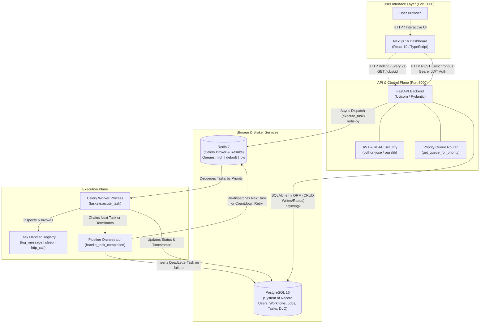

# Architecture Diagram

This document presents the system architecture of FlowForge and provides a comprehensive, step-by-step walkthrough of how requests travel through the platform from user action to asynchronous background completion.

---

## High-Level System Architecture

FlowForge separates synchronous user-facing operations from asynchronous, heavy background processing using an event-driven queue pattern.



### Communication Protocols & Boundaries

- **Synchronous HTTP (Client $\rightarrow$ API)**: The Next.js frontend communicates with FastAPI over standard HTTP using JSON payloads. Every protected route carries a signed JWT access token in the `Authorization: Bearer <token>` header.
- **Synchronous SQL (Services $\rightarrow$ PostgreSQL)**: Both FastAPI and Celery workers connect to PostgreSQL over TCP (port `5432`) via SQLAlchemy and `psycopg2`. Database operations are committed in atomic transactions.
- **Asynchronous Messaging (API / Worker $\leftrightarrow$ Redis)**: Communication between the API control plane and the background execution plane is completely decoupled through Redis (port `6379`). The API pushes task execution messages to Redis queues; workers independently pull and process them.

---

## End-to-End Walkthrough: Triggering a Job

To understand how these components collaborate in real life, consider what happens when a user clicks **"Trigger Job"** for a multi-step workflow in the FlowForge dashboard.

```mermaid
sequenceDiagram
    autonumber
    actor User
    participant Frontend as Next.js Dashboard
    participant API as FastAPI Backend
    participant DB as PostgreSQL
    participant Redis as Redis Broker
    participant Worker as Celery Worker

    User->>Frontend: Clicks "Trigger Job"
    Frontend->>API: POST /jobs/{id}/trigger (Bearer Token)
    API->>DB: Verify user ownership & Job status is "pending"
    API->>DB: Fetch first task in sequence (sequence = 1)
    API->>API: Map job.priority (1-10) -> queue ("high" | "default" | "low")
    API->>Redis: dispatch_task("execute_task", args=[task_1_id], queue=queue)
    API-->>Frontend: 200 OK (Job status: "pending")
    Frontend->>Frontend: Starts 2-second polling loop (GET /jobs/{id})

    Note over Redis,Worker: Asynchronous Worker Execution
    Worker->>Redis: Pulls task from assigned priority queue
    Worker->>DB: UPDATE jobs SET status = 'running', started_at = NOW()
    Worker->>DB: UPDATE tasks SET status = 'running', started_at = NOW()
    Worker->>Worker: Executes task handler (e.g. http_call / log_message)
    
    alt Task Execution Succeeds
        Worker->>DB: UPDATE tasks SET status = 'completed', output_data = {...}
        Worker->>Worker: Orchestrator checks for next task (sequence = 2)
        alt Next Task Exists
            Worker->>Redis: apply_async(args=[task_2_id], queue=queue)
        else All Tasks Complete
            Worker->>DB: UPDATE jobs SET status = 'completed', completed_at = NOW()
        end
    else Task Fails & Retries Remain
        Worker->>DB: UPDATE tasks SET status = 'retrying', retry_count += 1
        Worker->>Redis: apply_async(countdown=backoff_delay, queue=queue)
    else Task Fails & Retries Exhausted
        Worker->>DB: UPDATE tasks SET status = 'failed'
        Worker->>DB: INSERT INTO dead_letter_tasks (...)
        Worker->>DB: UPDATE jobs SET status = 'failed', completed_at = NOW()
    end

    loop Every 2 Seconds
        Frontend->>API: GET /jobs/{id}
        API->>DB: Query job and ordered task records
        API-->>Frontend: 200 OK (updated job & tasks JSON)
        Frontend->>Frontend: Re-render status badges in UI
    end
    Note over Frontend: Detects terminal status ('completed' or 'failed'); terminates polling loop.
```

---

### Step-by-Step Breakdown

#### Step 1: User Action in the Dashboard
The user navigates to a workflow details page in the Next.js frontend (`frontend/src/app/workflows/[id]/page.tsx`) and clicks the **"Trigger Job"** button. The frontend invokes the API client helper (`frontend/lib/api.ts`), attaching the stored JWT access token to the request header.

#### Step 2: Synchronous API Call & Validation
The request hits FastAPI at `POST /jobs/{job_id}/trigger`:
1. **Authentication & Authorization**: FastAPI's dependency injection (`get_current_user`) decodes the JWT and verifies that the requesting user either owns the job or has an `admin` role.
2. **State Guard**: The API checks the job's current status in PostgreSQL. If the job is already `running`, `completed`, or `cancelled`, the API rejects the request with HTTP `409 Conflict`. Only jobs with a `pending` status can be triggered.
3. **Task Resolution**: The API queries PostgreSQL for the first task associated with the job (`Task.job_id == job.id`) ordered by `sequence ASC` (sequence 1).

#### Step 3: Priority Routing & Broker Dispatch
Before placing the task onto the queue, FlowForge determines execution urgency:
1. The helper `get_queue_for_priority(job.priority)` inspects the job's numeric priority:
   - Priority `1`–`3` $\rightarrow$ routes to the `"high"` queue.
   - Priority `4`–`7` $\rightarrow$ routes to the `"default"` queue.
   - Priority `8`–`10` $\rightarrow$ routes to the `"low"` queue.
2. The API uses the shared Celery client (`dispatch_task`) to publish an execution message:
   ```python
   dispatch_task("execute_task", args=[str(first_task.id)], queue=queue)
   ```
3. FastAPI immediately returns an HTTP `200 OK` response with the job representation to the frontend. The HTTP transaction finishes in milliseconds—execution never blocks the web request.

#### Step 4: Frontend Polling Begins
Upon receiving the successful trigger response, the frontend navigates the user to the job detail view (`frontend/src/app/jobs/[id]/page.tsx`). The component sets up a 2-second polling interval using `setInterval`:
```typescript
pollIntervalRef.current = setInterval(() => {
  fetchJob(true); // Silent background fetch without flickering page loader
}, 2000);
```
Every 2 seconds, the browser requests `GET /jobs/{id}` to fetch the latest status of the job and each child task.

#### Step 5: Worker Pickup & Job State Initialization
In the background, a Celery worker listening on the active queues (`high`, `default`, `low`) pulls the message containing `task_id` from Redis:
1. The worker opens an isolated database session (`get_worker_db()`).
2. If the parent `Job` status is still `pending`, the worker updates `Job.status = "running"` and records `Job.started_at = datetime.now(timezone.utc)`.
3. The worker updates the current `Task.status = "running"` and commits the transaction to PostgreSQL.
4. On the very next 2-second poll, the browser's `GET /jobs/{id}` query reflects this change, updating the dashboard badge from `pending` (yellow) to `running` (blue).

#### Step 6: Task Execution
The worker looks up the handler function in `TASK_REGISTRY` (`worker/tasks/registry.py`) corresponding to the task's `type`:
- **`log_message`**: Formats and logs a structured log string with worker context.
- **`sleep`**: Suspends worker execution for a simulated duration (`time.sleep(seconds)`).
- **`http_call`**: Executes a real external HTTP request using `httpx.Client` with timeout control and status validation.

#### Step 7: Outcome Evaluation & Orchestration
Depending on whether the handler succeeded or raised an exception, one of three paths is taken:

##### Path A: Success
1. The task output is serialized into `Task.output_data`, `Task.status` is set to `"completed"`, and `Task.completed_at` is stamped.
2. The worker commits the task update and invokes the pipeline orchestrator: `handle_task_completion(task.id, db)`.
3. The orchestrator queries PostgreSQL for the next task where `sequence > current_task.sequence` ordered by `sequence ASC`:
   - **If a subsequent task exists**: The orchestrator dispatches the next task to Redis using the same priority queue (`apply_async(args=[str(next_task.id)], queue=queue)`). The pipeline continues smoothly.
   - **If no more tasks exist**: The entire workflow is finished. The orchestrator updates `Job.status = "completed"`, records `Job.completed_at`, and commits.

##### Path B: Transient Failure with Retries Remaining
1. If an error occurs (e.g. a remote server returns HTTP 503 during `http_call`), the exception is caught and recorded in `Task.error_message`.
2. If `task.retry_count < task.max_retries`, the task enters retry handling:
   - `Task.retry_count` increments by 1.
   - `Task.status` changes to `"retrying"`.
   - Exponential backoff delay is calculated: $\text{delay} = \min(\text{base} \times 2^{(\text{retry\_count} - 1)}, \text{max\_delay})$.
   - The task is re-dispatched to Redis with a Celery `countdown=delay`, preserving its queue tier without blocking other tasks in the queue.

##### Path C: Permanent Failure (Dead-Letter Queue)
1. If retries are exhausted (`retry_count >= max_retries`), the task is marked `failed`.
2. A new `DeadLetterTask` record is inserted into PostgreSQL capturing `task_id`, `job_id`, `workflow_id`, `task_type`, `input_data`, `error_message`, and `retry_count`.
3. The orchestrator marks the parent `Job.status = "failed"`, halting all remaining downstream tasks in the pipeline.

#### Step 8: Terminal State Detection & Frontend Teardown
During an interval poll, the frontend fetches the updated job record. If `Job.status` is now `completed`, `failed`, or `cancelled`:
1. The polling interval is cleared via `clearInterval(pollIntervalRef.current)`.
2. Polling stops completely to eliminate unnecessary network traffic.
3. The final execution timestamps, outputs, or error alerts remain rendered on the screen for user inspection.