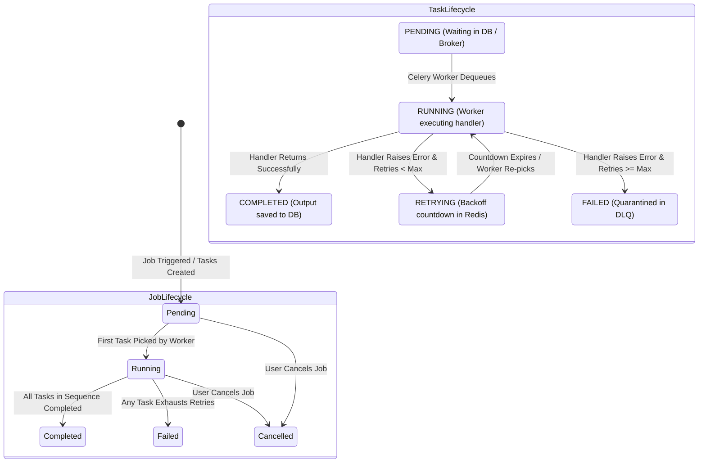

# Platform Overview

FlowForge is an enterprise-grade, distributed workflow orchestration and asynchronous background task processing platform. Designed to bridge the gap between simple background job queues and heavy, complex enterprise orchestrators, FlowForge provides developers with a complete, resilient system for defining, scheduling, executing, and monitoring multi-step computational pipelines with deterministic reliability.

The platform coordinates decoupled microservices—unifying a high-performance **FastAPI** REST control plane, a distributed **Celery** execution engine backed by **Redis**, an ACID-compliant **PostgreSQL** relational system of record, and a modern **Next.js 16** real-time administrative dashboard.

---

## Executive Summary & System Philosophy

At its core, FlowForge is built on three guiding engineering principles:

1. **Strict Decoupling of Control Plane & Execution Plane**: User-facing web transactions must remain ultra-fast (< 50ms) and never block on compute, I/O latency, or remote third-party services. The API serves strictly as a validation, authentication, and state management gateway, offloading all execution to independent background workers.
2. **Deterministic State Transitions & Transactional Auditability**: Every workflow pipeline is decomposed into discrete, ordered tasks stored in PostgreSQL. State transitions (`pending` $\rightarrow$ `running` $\rightarrow$ `retrying` $\rightarrow$ `completed` / `failed`) are atomic and permanent, guaranteeing complete execution history and auditability.
3. **Graceful Degradation & Poison-Pill Isolation**: Transient network failures must resolve automatically via exponential backoff retries without human intervention. Conversely, fatal bugs or malformed payloads ("poison tasks") must be quarantined into a Dead-Letter Queue (DLQ) without halting the worker process or exhausting queue capacity.

---

## The Problem Space: Ad-Hoc Automation vs. FlowForge

In growing software architectures, asynchronous processing often starts as ad-hoc scripts, cron jobs, or lightweight in-process background threads (e.g., FastAPI `BackgroundTasks`). As scale increases, these approaches introduce severe operational failures:

| Dimension | Legacy Scripts & Cron Jobs | In-Process Background Tasks | FlowForge Orchestration Engine |
| :--- | :--- | :--- | :--- |
| **Visibility & Observability** | Blind execution. Failures buried in disparate `/var/log` text files. | Ephemeral. Errors vanish if the web server restarts or worker crashes. | **Centralized Dashboard**: Real-time status badges, input/output inspection, timestamps, and error stacks. |
| **Fault Tolerance & Retries** | Scripts crash midway; partial data corruption requires manual rollback. | No built-in retry mechanics. Failed tasks are permanently lost. | **Automated Exponential Backoff**: Per-step configurable retries with jitter-free Celery countdown delays. |
| **Workload Prioritization** | FIFO queues. Long-running batch reports starve urgent alerts. | Single thread pool. High-priority events queue behind slow batch jobs. | **Multi-Tier Priority Routing**: Urgent jobs dynamically route to `high` priority queues ahead of `default` or `low` traffic. |
| **Poison-Task Handling** | Crashes the runner process or loops infinitely until memory exhausts. | Silently discarded or uncaught exception terminates worker container. | **Dead-Letter Quarantine (DLQ)**: Failed tasks after max retries are safely archived with full context for inspection and replay. |
| **State Persistence** | Stateless. Progress cannot be tracked, paused, or verified. | In-memory. Dropped instantly during rolling server deployments. | **Durable PostgreSQL State**: Every step execution, timing metric, and output payload is persisted with ACID guarantees. |
| **Security & Auditing** | SSH keys or root shell access required to trigger and monitor. | No authentication boundaries between task initiator and executor. | **Role-Based Access Control (RBAC)**: JWT-authenticated endpoints enforcing `admin`, `member`, and `viewer` permissions. |

---

## High-Level Workflow Execution Lifecycle

The following diagram illustrates the complete lifecycle of a workflow in FlowForge—from declarative JSON definition to asynchronous execution, resilient retry loops, dead-letter quarantine, and real-time frontend observability:

```mermaid
flowchart TD
    classDef client fill:#e0f2fe,stroke:#0284c7,stroke-width:2px;
    classDef api fill:#fef3c7,stroke:#d97706,stroke-width:2px;
    classDef broker fill:#fee2e2,stroke:#dc2626,stroke-width:2px;
    classDef worker fill:#dcfce7,stroke:#16a34a,stroke-width:2px;
    classDef storage fill:#ede9fe,stroke:#7c3aed,stroke-width:2px;
    classDef dlq fill:#fce7f3,stroke:#db2777,stroke-width:2px;

    User([Operator / Client]):::client -->|1. Author Workflow JSON| WebUI[Next.js Dashboard]:::client
    WebUI -->|2. POST /workflows & POST /jobs/:id/trigger| APIServer[FastAPI Control Plane]:::api
    
    subgraph ControlPlane [Control Plane & State Persistence]
        APIServer -->|3. Validate RBAC & Schema| AuthGuard[JWT / RBAC Guard]:::api
        APIServer -->|4. Persist Job & Tasks| PostgresDB[(PostgreSQL 16\nSystem of Record)]:::storage
        APIServer -->|5. Priority Mapping\n1-3: high | 4-7: default | 8-10: low| PriorityRouter[Queue Router]:::api
    end

    PriorityRouter -->|6. Asynchronous Dispatch\nexecute_task| RedisBroker[(Redis 7 Broker\nQueues: high, default, low)]:::broker

    subgraph ExecutionPlane [Distributed Execution Plane]
        RedisBroker -->|7. Dequeue by Priority Tier| WorkerPool[Celery Worker Cluster]:::worker
        WorkerPool -->|8. Mark Task RUNNING| PostgresDB
        WorkerPool -->|9. Invoke Handler| TaskRegistry{Task Handler Registry}:::worker
        
        TaskRegistry -->|log_message| HandlerLog[Log Message Handler]:::worker
        TaskRegistry -->|sleep| HandlerSleep[Sleep Timer Handler]:::worker
        TaskRegistry -->|http_call| HandlerHTTP[HTTP Webhook Handler]:::worker
    end

    subgraph StateResolution [Outcome Resolution & Chaining]
        HandlerLog & HandlerSleep & HandlerHTTP --> ResultEvaluation{Execution Result}:::worker
        
        ResultEvaluation -->|Success| TaskSuccess[Mark Task COMPLETED]:::worker
        TaskSuccess -->|Query Next Sequence| CheckNext{More Tasks?}:::worker
        CheckNext -->|Yes| DispatchNext[Dispatch Next Step to Redis]:::worker
        DispatchNext --> RedisBroker
        CheckNext -->|No| JobSuccess[Mark Job COMPLETED]:::worker
        JobSuccess --> PostgresDB

        ResultEvaluation -->|Failure & Retries Left| RetryEngine[Calculate Exponential Backoff]:::worker
        RetryEngine -->|Mark RETRYING & Increment Count| PostgresDB
        RetryEngine -->|Re-queue with Countdown Delay| RedisBroker

        ResultEvaluation -->|Failure & Retries Exhausted| DLQEngine[Dead-Letter Quarantine]:::dlq
        DLQEngine -->|Mark Task FAILED| PostgresDB
        DLQEngine -->|Write Record to dead_letter_tasks| DLQTable[(Dead Letter Storage)]:::dlq
        DLQEngine -->|Halt Pipeline & Mark Job FAILED| PostgresDB
    end

    subgraph Observability [Real-Time Observability]
        WebUI -.->|Poll Every 2s: GET /jobs/:id| APIServer
        APIServer -.->|Read State & Outputs| PostgresDB
    end
```

---

## Target Personas & Use Cases

FlowForge is engineered to serve software engineering teams, DevOps practitioners, and platform administrators who require robust background processing without operational complexity:

| Persona | Primary Operational Challenges | How FlowForge Solves It | Concrete Example Use Cases |
| :--- | :--- | :--- | :--- |
| **Backend Engineers** | Offloading slow external API webhooks, file transformations, and transactional operations from API threads. | Provides a declarative task schema with standardized handlers, automated retries, and sequential output passing. | Synchronizing customer records with third-party CRMs (HubSpot/Salesforce) with automatic exponential backoff. |
| **DevOps / SREs** | Mitigating pipeline failures, diagnosing unhandled exceptions, and isolating server-crashing poison pills. | Dead-Letter Queues (DLQ) with granular payload preservation and one-click replay endpoints; isolated Docker deployment. | Automated database backup verification, health checks across staging environments, and cache warm-up pipelines. |
| **Data Platform Teams** | Managing multi-step ETL extraction, validation, and loading jobs without the overhead of heavy systems like Apache Airflow. | Lightweight sequential chaining with explicit dependency sequences and deterministic priority levels. | Daily metrics aggregation, CSV ingestion and normalization, and dispatching summary emails to stakeholders. |
| **Product & Support Teams** | Lack of visibility into why a user's background job or sync operation failed without querying backend engineers. | Visual web dashboard rendering real-time job progress, formatted error messages, and task output payloads. | Auditing failed customer webhook deliveries and inspecting third-party HTTP error responses directly in the UI. |

---

## Core Platform Feature Matrix

Every feature in FlowForge is backed by concrete modules and production-grade implementations:

| Feature Area | Architectural Implementation | Key Capabilities & Behaviors | Code References |
| :--- | :--- | :--- | :--- |
| **Security & Auth** | JWT (`python-jose`) + `passlib` (bcrypt) | Stateless access/refresh token rotation; RBAC authorization with `admin`, `member`, and `viewer` permissions. | `backend/app/core/security.py`<br>`backend/app/api/auth.py` |
| **Declarative Workflows** | Pydantic V2 Models + JSONB Storage | Workflows defined as structured JSON schemas with sequential step orders, input parameters, and retry policies. | `backend/app/schemas/workflow.py`<br>`backend/app/models/workflow.py` |
| **Execution Orchestration** | Celery Multi-Queue + Redis Broker | Sequential step chaining where step $N+1$ is dispatched only after step $N$ completes successfully. | `worker/tasks/orchestrate.py`<br>`worker/tasks/execute_task.py` |
| **Priority Scheduling** | 3-Tier Priority Queue Partitioning | Integer priorities (1–10) mapped to `high` (1–3), `default` (4–7), and `low` (8–10) Redis queue channels. | `worker/tasks/orchestrate.py` (`get_queue_for_priority`) |
| **Resilient Retries** | Celery Countdown Timer + Exponential Delay | Non-blocking backoff: $\text{delay} = \min(\text{base} \times 2^{\text{attempt}-1}, \text{max\_delay})$. Worker process is freed during wait. | `worker/tasks/orchestrate.py` (`handle_task_failure`) |
| **Poison-Pill Quarantine** | Dead-Letter Queue (DLQ) Database Engine | Permanent quarantine of exhausted tasks into `dead_letter_tasks` table with full error stack and payload capture. | `backend/app/models/dead_letter.py`<br>`backend/app/api/dead_letters.py` |
| **Task Handler Registry** | Extensible Handler Architecture | Isolated execution handlers for `log_message`, `sleep`, and `http_call` (via `httpx` with timeout and status assertions). | `worker/tasks/registry.py` |
| **Administrative UI** | Next.js 16 (React 19) + Tailwind CSS v4 | Authenticated dashboard featuring workflow creation wizards, 2-second live job polling, and DLQ management. | `frontend/src/app/`<br>`frontend/src/lib/api.ts` |
| **Containerized Parity** | Docker Compose Multi-Service Topology | 5 orchestrated containers (`postgres`, `redis`, `backend`, `worker`, `frontend`) with inter-service health check dependencies. | `infrastructure/docker-compose.yml`<br>`docker-compose.prod.yml` |
| **Continuous Integration** | GitHub Actions Pipeline | Dual-track automated testing: 69 backend pytest suites (coverage enforced) and frontend Jest test suites. | `.github/workflows/ci.yml` |

---

## State Machine: Job & Task Lifecycles

FlowForge enforces deterministic state transitions across both parent jobs and individual tasks. The following state machine diagram illustrates how tasks and jobs transition through execution phases:



> [!NOTE]
> When a task transitions to `FAILED`, the parent `Job` immediately halts all downstream steps and transitions to `FAILED`. The failed task payload, error message, and execution metadata are atomically copied to `dead_letter_tasks`.

---

## Operational Guarantees

- **At-Least-Once Task Delivery**: Tasks are dispatched via Redis and acknowledged only after execution status is persisted to PostgreSQL, ensuring tasks are not lost during unexpected process termination.
- **Worker Non-Blocking Resilience**: Because retries use Celery countdown timers (`apply_async(countdown=delay)`), worker threads are never blocked by `sleep()` calls during retry delays. Workers remain free to process other priority tasks.
- **Relational Integrity**: Deleting a workflow cascades cleanly to associated jobs and tasks via foreign key constraints (`ON DELETE CASCADE`), preventing orphaned records from polluting storage.

---

## Next Steps

To explore FlowForge's technical foundation, architecture, and deployment procedures, proceed through the following documentation:

1. [Tech Stack Deep Dive](file:///d:/Edutation(P)/FlowForge/docs/01-introduction/tech-stack.md) — Detailed breakdown of all 12 core technologies, architectural layers, and trade-off rationales.
2. [Architecture Diagram & Network Topology](file:///d:/Edutation(P)/FlowForge/docs/01-introduction/architecture-diagram.md) — Comprehensive container diagrams, sequence charts, and communication protocol matrices.
3. [Architecture Overview](../02-architecture/architecture-overview.md) — Deep dive into the control plane vs. worker plane separation.
4. [Quickstart Guide](../03-getting-started/quickstart.md) — Step-by-step instructions to run FlowForge locally in under 60 seconds.