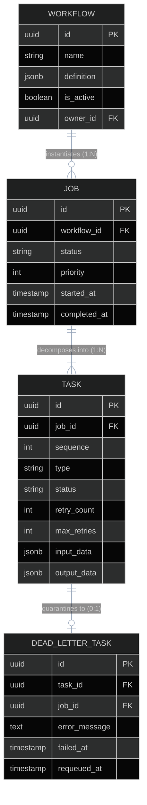
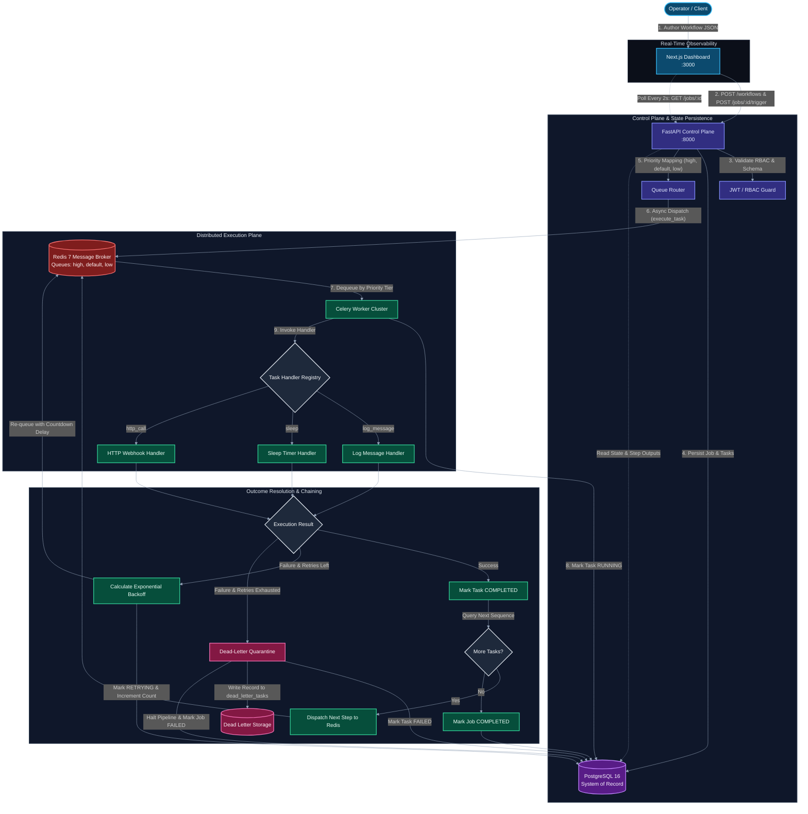
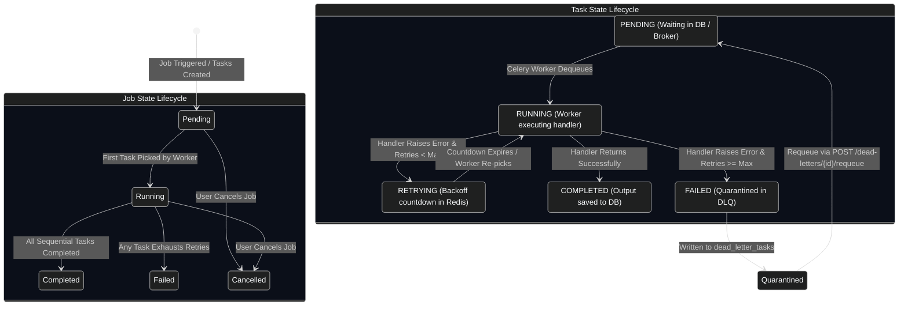

# Platform Overview

FlowForge is an enterprise-grade, distributed workflow orchestration and asynchronous background task processing platform. Designed to bridge the gap between rudimentary background job queues and heavyweight enterprise orchestrators, FlowForge provides developers with a resilient, deterministic engine for defining, scheduling, executing, and monitoring multi-step computational pipelines.

The platform coordinates decoupled microservices—unifying a high-performance **FastAPI** REST control plane, a distributed **Celery 5** worker engine backed by **Redis 7**, an ACID-compliant **PostgreSQL 16** relational system of record, and a modern **Next.js 16** real-time administrative dashboard.

---

## Executive Summary & System Philosophy

FlowForge is built upon three foundational engineering tenets:

1. **Strict Decoupling of Control Plane & Execution Plane**: User-facing web transactions must remain ultra-fast (< 25ms) and never block on heavy compute, I/O latency, or third-party HTTP requests. The API gateway serves strictly as a validation, authentication, and state management boundary, dispatching all asynchronous execution to independent worker pools.
2. **Deterministic State Transitions & Transactional Auditability**: Every workflow pipeline is decomposed into discrete, ordered tasks persisted in PostgreSQL. State transitions (`pending` $\rightarrow$ `running` $\rightarrow$ `retrying` $\rightarrow$ `completed` / `failed`) are atomic and permanent, guaranteeing complete execution history, output data capture, and transparent auditability.
3. **Graceful Degradation & Poison-Pill Isolation**: Transient network glitches must resolve autonomously via exponential backoff retries without human intervention. Conversely, unrecoverable failures or malformed payloads ("poison tasks") are safely quarantined in a dedicated Dead-Letter Queue (DLQ) without halting the worker cluster or exhausting queue capacity.

---

## Core Domain Abstractions

FlowForge models computational pipelines using four core domain entities:

- **Workflow**: Reusable blueprint defining a sequential computational pipeline. Stored with a JSON `definition` array containing step names, types, configurations, and per-step retry limits.
- **Job**: A single stateful execution of a workflow. Assigned an integer priority (`1`–`10`) that governs its queue routing across the distributed broker.
- **Task**: An atomic execution unit within a job. Tasks execute sequentially according to their `sequence` order (1, 2, ... $N$), with each task invoking a dedicated handler in the Task Registry.
- **Dead-Letter Task (DLQ)**: An isolated failure record created when a task exhausts all retry attempts. Preserves complete error diagnostics, inputs, and stack traces, and enables single-click administrative re-queuing.

---

## The Problem Space: Ad-Hoc Automation vs. FlowForge

As applications scale, asynchronous processing that begins as ad-hoc cron jobs or in-process background threads (such as FastAPI `BackgroundTasks`) inevitably encounters operational bottlenecks:

| Dimension | Legacy Cron / Scripts | In-Process Background Tasks | FlowForge Orchestration Engine |
| :--- | :--- | :--- | :--- |
| **Visibility & Observability** | Blind execution; logs buried in remote `/var/log` text files. | Ephemeral; errors disappear if the API server reboots. | **Centralized Dashboard**: Real-time status badges, step outputs, latency timestamps, and full error logs. |
| **Fault Tolerance & Retries** | Process crashes midway; partial writes require manual cleanup. | No built-in retry mechanics; failed jobs drop silently. | **Autonomous Exponential Backoff**: Per-step retries with jitter-free Celery countdown timers. |
| **Workload Prioritization** | Standard FIFO queues; heavy bulk jobs starve urgent operational tasks. | Single thread pool; high-priority events queue behind slow batch jobs. | **3-Tier Priority Routing**: Urgent jobs route to `high` priority queues ahead of `default` and `low` traffic. |
| **Poison-Task Handling** | Crashes worker loops or consumes 100% CPU repeating failures. | Silently discarded or uncaught exception crashes the application. | **Dead-Letter Quarantine (DLQ)**: Exhausted tasks isolate to `dead_letter_tasks` with payload preservation and replay. |
| **State Persistence** | Stateless; progress cannot be tracked, paused, or queried. | In-memory; dropped instantly during container redeployments. | **ACID PostgreSQL Storage**: Every step execution, timing metric, and output payload is durably recorded. |
| **Security & Access Control** | Direct shell access or root database credentials required. | No authorization boundaries between caller and background tasks. | **Role-Based Access Control (RBAC)**: JWT-authenticated endpoints enforcing `admin`, `member`, and `viewer` roles. |

---

## High-Level Workflow Execution Lifecycle

The following diagram illustrates the lifecycle of an end-to-end workflow execution in FlowForge—from JSON authoring to priority queue dispatch, worker processing, exponential backoff, dead-letter isolation, and real-time UI polling:

---

## Target Personas & Use Cases

FlowForge is designed to serve teams requiring robust background processing without the operational overhead of massive big-data orchestrators:

| Persona | Primary Operational Challenge | How FlowForge Solves It | Concrete Example Use Cases |
| :--- | :--- | :--- | :--- |
| **Backend Engineers** | Offloading long-running webhooks, third-party syncs, and data transformations from synchronous API threads. | Declarative task schemas, isolated task handlers, and automated sequential step chaining. | Syncing customer profiles with third-party CRMs (HubSpot / Salesforce) with automated retry resilience. |
| **DevOps / SREs** | Mitigating cascading failures, isolating server-crashing payloads, and managing containerized workloads. | Dead-Letter Queues with detailed failure diagnostics, one-click requeue endpoints, and container health checks. | Automated multi-stage backup verification, cache invalidation, and health checks across staging environments. |
| **Data Engineers** | Running lightweight multi-step ETL extraction, validation, and loading jobs without complex DAG engines. | Sequential pipeline chaining with explicit dependency sequences and multi-tier priority levels. | Daily metrics aggregation, CSV ingestion and normalization, and notification dispatching to Slack / email. |
| **Platform Operators** | Diagnosing job failures and customer support issues without requiring shell or database access. | Responsive web UI rendering live execution badges, step-level logs, and formatted error traces. | Auditing failed customer webhook deliveries and inspecting raw HTTP response payloads directly in the browser. |

---

## Core Platform Feature Matrix

Every capability in FlowForge is mapped to concrete architectural components and production code:

| Feature Area | Architectural Implementation | Key Capabilities & Behaviors | Core Code References |
| :--- | :--- | :--- | :--- |
| **Security & Auth** | JWT (`python-jose`) + `passlib` (bcrypt) | Stateless access/refresh token rotation; RBAC authorization with `admin`, `member`, and `viewer` permissions. | [security.py](file:///d:/Edutation(P)/FlowForge/backend/app/core/security.py) [auth.py](file:///d:/Edutation(P)/FlowForge/backend/app/api/auth.py) |
| **Declarative Workflows** | Pydantic V2 Models + JSONB Storage | Workflows defined as structured JSON schemas with sequential step orders, input parameters, and retry policies. | [schemas/workflow.py](file:///d:/Edutation(P)/FlowForge/backend/app/schemas/workflow.py) [models/workflow.py](file:///d:/Edutation(P)/FlowForge/backend/app/models/workflow.py) |
| **Execution Orchestration** | Celery 5 Multi-Queue + Redis Broker | Sequential step chaining where step $N+1$ is dispatched only after step $N$ completes successfully. | [tasks/orchestrate.py](file:///d:/Edutation(P)/FlowForge/worker/tasks/orchestrate.py) [tasks/execute_task.py](file:///d:/Edutation(P)/FlowForge/worker/tasks/execute_task.py) |
| **Priority Scheduling** | 3-Tier Priority Queue Partitioning | Integer priorities (1–10) mapped to `high` (1–3), `default` (4–7), and `low` (8–10) Redis queue channels. | [queue_routing.py](file:///d:/Edutation(P)/FlowForge/backend/app/core/queue_routing.py) |
| **Resilient Retries** | Celery Countdown Timer + Exponential Delay | Non-blocking backoff: $\text{delay} = \min(\text{base} \times 2^{\text{attempt}-1}, \text{max})$. Worker process is freed during wait. | [tasks/execute_task.py](file:///d:/Edutation(P)/FlowForge/worker/tasks/execute_task.py) |
| **Poison-Pill Quarantine** | Dead-Letter Queue (DLQ) Database Engine | Permanent quarantine of exhausted tasks into `dead_letter_tasks` table with full error stack and payload capture. | [models/dead_letter.py](file:///d:/Edutation(P)/FlowForge/backend/app/models/dead_letter.py) [api/dead_letters.py](file:///d:/Edutation(P)/FlowForge/backend/app/api/dead_letters.py) |
| **Task Handler Registry** | Extensible Handler Architecture | Isolated execution handlers for `log_message`, `sleep`, and `http_call` (via `httpx` with timeout and status assertions). | [tasks/registry.py](file:///d:/Edutation(P)/FlowForge/worker/tasks/registry.py) |
| **Administrative UI** | Next.js 16 (React 19) + Tailwind CSS v4 | Authenticated dashboard featuring workflow creation wizards, 2-second live job polling, and DLQ management. | [frontend/src/app/](file:///d:/Edutation(P)/FlowForge/frontend/src/app/) [lib/api.ts](file:///d:/Edutation(P)/FlowForge/frontend/src/lib/api.ts) |
| **Containerized Parity** | Docker Compose Multi-Service Topology | 5 orchestrated containers (`postgres`, `redis`, `backend`, `worker`, `frontend`) with inter-service health check dependencies. | [infrastructure/docker-compose.yml](file:///d:/Edutation(P)/FlowForge/infrastructure/docker-compose.yml) |
| **Continuous Integration** | GitHub Actions Pipeline | Dual-track automated testing: 69 backend pytest suites (coverage enforced) and frontend Jest test suites. | [.github/workflows/ci.yml](file:///d:/Edutation(P)/FlowForge/.github/workflows/ci.yml) |

---

## Dual State-Machine Engine: Job & Task Lifecycles

FlowForge enforces deterministic, coupled state transitions across both parent jobs and individual tasks:

> [!IMPORTANT]
> When a task transitions to `FAILED`, the parent `Job` immediately halts all subsequent sequential steps and marks the job as `FAILED`. The failed task payload, error message, and execution metadata are preserved in `dead_letter_tasks` for inspection and operator requeue.

---

## Operational Guarantees

- **At-Least-Once Task Delivery**: Tasks are enqueued to Redis and acknowledged only after execution status is committed to PostgreSQL, preventing lost messages during abrupt worker termination.
- **Non-Blocking Worker Concurrency**: Because retries use Celery countdown timers (`apply_async(countdown=delay)`), worker threads are never blocked by sleeping processes during retry delays. Worker concurrency remains dedicated to active workloads.
- **Relational Integrity**: Foreign key relationships between workflows, jobs, and tasks enforce cascading cleanup (`ON DELETE CASCADE`), ensuring no orphaned records persist upon workflow deletion.

---

## Related Documentation & Next Steps

To explore FlowForge's technical implementation, architecture, and deployment procedures, proceed through the following guides:

1. [Architecture Diagram & System Topologies](architecture-diagram.md) — Comprehensive container diagrams, sequence charts, and communication protocol matrices.
2. [Technology Stack Architecture](tech-stack.md) — Detailed breakdown of core technologies, architectural layers, and trade-off rationales.
3. [First Workflow Walkthrough](../02-tutorials/first-workflow-walkthrough.md) — Step-by-step tutorial for authoring and running your first multi-step workflow.
4. [Getting Started Tutorial](../02-tutorials/getting-started.md) — Complete onboarding guide for running FlowForge in development.
5. [Relational Data Model Reference](../04-reference/data-model.md) — Database schema specifications, table structures, and JSONB definitions.
6. [REST API Reference](../04-reference/api-reference.md) — Complete endpoint documentation and request/response schemas.
7. [Managing Dead Letters Guide](../03-how-to-guides/managing-dead-letters.md) — Operational manual for diagnosing and requeuing quarantined tasks.