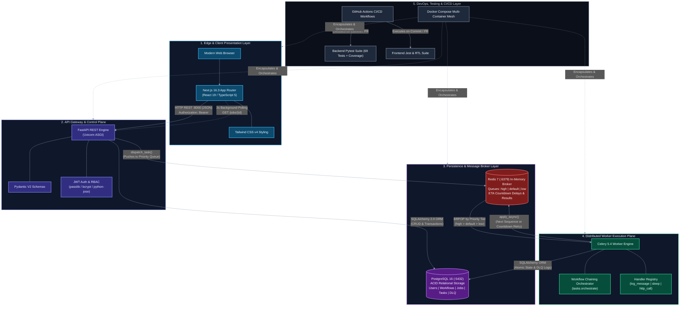

# Technology Stack Architecture

FlowForge is engineered with a modern, production-grade technology stack selected to maximize developer ergonomics, runtime execution speed, transactional reliability, and horizontal scalability. This document details every framework, database, engine, and tool utilized across the platform—explaining what each component is, why it was chosen over alternatives, and its exact role within the codebase.

---

## Master Technology Stack Matrix

The following specification details the five architectural layers of FlowForge and the technologies powering each tier:

| Layer | Technology | Version | Purpose in FlowForge | Key Trade-Off / Rejected Alternative |
| :--- | :--- | :--- | :--- | :--- |
| **API & Control** | **FastAPI** | `^0.111.0` | High-throughput async REST API, auto-OpenAPI generation, Pydantic V2 validation. | Rejected **Flask / Django**: Slower async I/O; lacks native runtime schema typing without heavy third-party plugins. |
| **Data & ORM** | **SQLAlchemy** | `^2.0.30` | Declarative relational modeling, unit-of-work transactions, and cascading relationship integrity. | Rejected **Raw SQL / Tortoise ORM**: Lacks enterprise ecosystem maturity and granular session lifecycle control. |
| **Migrations** | **Alembic** | `^1.13.1` | Automated database schema evolution, version tracking, and zero-downtime upgrades. | Rejected **Manual SQL DDL**: Fragile across multi-developer setups; cannot be verified in automated CI pipelines. |
| **Storage** | **PostgreSQL** | `16-alpine` | Primary ACID system of record for users, workflows, jobs, tasks, and dead-letter tables. | Rejected **MongoDB / DocumentDB**: Lacks atomic cross-table transactions and strict relational cascading constraints. |
| **Broker** | **Redis** | `7-alpine` | Ultra-low latency in-memory message broker, priority queues, and Celery result backend. | Rejected **RabbitMQ / Apache Kafka**: Substantially higher operational footprint, memory overhead, and setup complexity. |
| **Worker Engine** | **Celery** | `^5.4.0` | Distributed asynchronous task execution, priority-queue routing, and countdown retries. | Rejected **RQ / ARQ**: Celery provides mature multi-queue support, countdown delay timers, and ecosystem ubiquity. |
| **Security** | **JWT & passlib** | `0.4.4` / `1.7.4` | Stateless bearer token authentication (access/refresh) and bcrypt salted password hashing. | Rejected **Session Cookies**: Incompatible with headless microservice APIs and horizontally scaled deployments. |
| **Frontend** | **Next.js** | `16.3.4` | App Router-based administrative dashboard, React 19 UI components, and client-side polling. | Rejected **Vite / Plain React SPA**: Next.js App Router provides superior file-based routing, SEO, and enterprise conventions. |
| **Language** | **TypeScript** | `^5.0.0` | End-to-end static type safety across dashboard UI components, forms, and API responses. | Rejected **Plain JavaScript**: High risk of runtime `undefined` errors during dynamic payload inspection. |
| **Styling** | **Tailwind CSS** | `^4.0.0` | High-performance utility-first CSS styling for responsive layout, cards, and status badges. | Rejected **Component Libraries (MUI/Chakra)**: Bloated CSS bundle sizes and complex configuration overrides. |
| **Container** | **Docker & Compose** | Engine `24+` | Multi-container encapsulation, service discovery, persistent volumes, and health checks. | Rejected **Bare-Metal / Host Execution**: Environment drift, version conflicts (Python 3.11 vs Node 20), high onboarding friction. |
| **CI/CD** | **GitHub Actions** | Workflow `v4` | Automated testing pipelines running linting, database migrations, pytest, and Jest suites. | Rejected **Manual Verification**: Prone to human oversight, regression leakage, and broken production containers. |

---

## Architectural Layer Hierarchy

FlowForge components interact across five distinct tiers, ensuring strict isolation between user presentation, business logic, asynchronous dispatch, and persistent storage:

---

## Detailed Component Specifications

### 1. FastAPI (REST API Engine)
- **Role in FlowForge**: Powers the entire HTTP API control plane ([backend/main.py](file:///d:/Edutation(P)/FlowForge/backend/main.py), [backend/app/api/](file:///d:/Edutation(P)/FlowForge/backend/app/api/)). Provides secure endpoints for user management, workflow creation, job triggering, task inspection, and dead-letter review.
- **Why It Was Chosen**:
  - **High-Throughput ASGI Asynchronous Execution**: Built on Starlette and Uvicorn, FastAPI easily handles concurrent polling requests from hundreds of frontend dashboard instances without blocking.
  - **Native Pydantic V2 Validation**: Deep integration with Pydantic ensures arbitrary workflow JSON payloads and task parameters are validated against strict schemas before touching database queries.
  - **Automated OpenAPI Documentation**: Generates interactive Swagger (`/docs`) and Redoc (`/redoc`) documentation automatically from route decorators and type annotations.
- **Codebase References**: [main.py](file:///d:/Edutation(P)/FlowForge/backend/main.py), [backend/app/api/](file:///d:/Edutation(P)/FlowForge/backend/app/api/)
- **Alternative Considered & Rejected**: **Flask / Django REST Framework**. Flask requires disparate extensions for validation, async I/O, and OpenAPI generation. Django is excessively heavy, imposing an ORM and session architecture unsuited for microservice task routing.

---

### 2. SQLAlchemy 2.0 & Alembic (ORM & Migrations)
- **Role in FlowForge**: SQLAlchemy manages declarative models ([backend/app/models/](file:///d:/Edutation(P)/FlowForge/backend/app/models/)) and executes database transactions across all models (`User`, `Workflow`, `Job`, `Task`, `DeadLetterTask`). Alembic ([backend/migrations/](file:///d:/Edutation(P)/FlowForge/backend/migrations/)) manages database schema versions and executes non-destructive migrations.
- **Why It Was Chosen**:
  - **Relational Integrity with Cascading**: FlowForge requires strict parent-child relationships (e.g., deleting a workflow cascades to delete its executions and tasks). SQLAlchemy 2.0 provides explicit relationship semantics and query compilation.
  - **Thread-Safe Session Lifecycle**: Manages database sessions cleanly via FastAPI's `Depends(get_db)` ([backend/app/core/db.py](file:///d:/Edutation(P)/FlowForge/backend/app/core/db.py)) and dedicated worker sessions (`get_worker_db()`), eliminating database connection leaks.
  - **Automated Schema Evolution**: Alembic provides deterministic, version-controlled database migrations applied automatically during Docker container startup.
- **Codebase References**: [core/db.py](file:///d:/Edutation(P)/FlowForge/backend/app/core/db.py), [models/](file:///d:/Edutation(P)/FlowForge/backend/app/models/), [migrations/](file:///d:/Edutation(P)/FlowForge/backend/migrations/)
- **Alternative Considered & Rejected**: **Tortoise ORM / Peewee**. Tortoise ORM lacks the ecosystem maturity, complex joining power, and robust migration tooling that SQLAlchemy and Alembic deliver.

---

### 3. PostgreSQL 16 (System of Record)
- **Role in FlowForge**: Serves as the authoritative, durable database storing user credentials, workflow templates, execution state, output payloads, and dead-letter records (`flowforge-postgres` on port `5432`).
- **Why It Was Chosen**:
  - **ACID Guarantees**: Background job orchestration requires guaranteed transactional isolation. If a worker fails midway through updating a task, the transaction rolls back cleanly, avoiding corrupted state.
  - **Native JSONB Support**: Workflow task definitions, input arguments, and output results vary significantly per task type. PostgreSQL's native JSONB columns allow arbitrary structured data storage with indexing capabilities.
  - **Reliable Row-Level Locking**: Enables safe concurrent state changes without deadlocks when multiple workers process tasks from the same job.
- **Codebase References**: [docker-compose.yml](file:///d:/Edutation(P)/FlowForge/infrastructure/docker-compose.yml), [migrations/versions/](file:///d:/Edutation(P)/FlowForge/backend/migrations/versions/)
- **Alternative Considered & Rejected**: **MongoDB / NoSQL**. While MongoDB accommodates flexible JSON schemas, it lacks native foreign key constraints, cascading deletes, and strict transactional relational integrity essential for financial-grade workflow auditing.

---

### 4. Redis 7 (Message Broker & Result Store)
- **Role in FlowForge**: Acts as the message transport layer connecting the FastAPI control plane with Celery background workers (`flowforge-redis` on port `6379`). It hosts the three priority queues (`high`, `default`, `low`) and Celery result metadata.
- **Why It Was Chosen**:
  - **Sub-Millisecond Message Delivery**: In-memory list operations (`LPUSH`, `BRPOP`) provide ultra-low latency dispatch and consumption.
  - **Minimal Operational Footprint**: Requires minimal RAM (~30MB) and boots in under a second inside Docker, ideal for local development and containerized cloud setups.
  - **Native Countdown Support**: Integrates seamlessly with Celery's ETA/countdown scheduling for non-blocking exponential backoff retries.
- **Codebase References**: [celery_app.py](file:///d:/Edutation(P)/FlowForge/worker/celery_app.py), [config.py](file:///d:/Edutation(P)/FlowForge/backend/app/core/config.py)
- **Alternative Considered & Rejected**: **RabbitMQ / Apache Kafka**. RabbitMQ has native numeric priority queues but requires an Erlang runtime and higher memory. Kafka is designed for high-volume append-only event streaming rather than discrete work queue acknowledgment.

---

### 5. Celery 5.4 (Distributed Task Engine)
- **Role in FlowForge**: Coordinates the distributed execution plane ([worker/celery_app.py](file:///d:/Edutation(P)/FlowForge/worker/celery_app.py), [worker/tasks/](file:///d:/Edutation(P)/FlowForge/worker/tasks/)). Workers pull tasks from Redis, execute handlers (`log_message`, `sleep`, `http_call`), handle retries, and trigger subsequent pipeline steps.
- **Why It Was Chosen**:
  - **Decoupled Asynchronous Execution**: Offloads long-running I/O and compute outside of the web server's request-response lifecycle.
  - **Non-Blocking Countdown Timers**: Celery's `apply_async(countdown=seconds)` schedules exponential backoff retries in Redis without blocking the worker process, keeping worker concurrency high.
  - **Queue Partitioning**: Allows routing tasks into discrete queues (`high`, `default`, `low`) matching the job's priority level.
- **Codebase References**: [tasks/execute_task.py](file:///d:/Edutation(P)/FlowForge/worker/tasks/execute_task.py), [tasks/orchestrate.py](file:///d:/Edutation(P)/FlowForge/worker/tasks/orchestrate.py)
- **Alternative Considered & Rejected**: **RQ (Redis Queue) / ARQ**. RQ is simpler but lacks robust multi-queue priority management and enterprise retry countdown mechanics.

---

### 6. JWT & passlib (Authentication & RBAC)
- **Role in FlowForge**: `passlib` securely hashes and validates user passwords using bcrypt ([backend/app/core/security.py](file:///d:/Edutation(P)/FlowForge/backend/app/core/security.py)). `python-jose` generates and verifies signed JSON Web Tokens (`access_token` and `refresh_token`), embedding user claims (`sub`, `role`) for Role-Based Access Control.
- **Why It Was Chosen**:
  - **Stateless Scalability**: APIs do not query the database to validate sessions on every request; the cryptographic signature guarantees identity and roles.
  - **Cryptographic Resilience**: Bcrypt uses adaptive key derivation with automatic salt generation, protecting against rainbow table and brute-force attacks.
- **Codebase References**: [security.py](file:///d:/Edutation(P)/FlowForge/backend/app/core/security.py), [api/auth.py](file:///d:/Edutation(P)/FlowForge/backend/app/api/auth.py)
- **Alternative Considered & Rejected**: **Server-Side Session Cookies**. Sessions require a central Redis session store or database lookup on every single API hit, creating unnecessary network overhead and deployment complexity.

---

### 7. Next.js 16 & TypeScript (Frontend Dashboard)
- **Role in FlowForge**: Implements the full-featured administrative web dashboard ([frontend/src/app/](file:///d:/Edutation(P)/FlowForge/frontend/src/app/)). Provides responsive interfaces for authentication, workflow construction, real-time job execution polling, task inspection, and dead-letter queue management.
- **Why It Was Chosen**:
  - **Modern App Router Architecture**: Clean file-based routing (`/workflows`, `/jobs/[id]`, `/dead-letters`) with optimized layout nesting and server component scaffolding.
  - **Static Type Safety**: TypeScript interfaces mirror backend Pydantic models, guaranteeing compile-time detection of mismatched API properties.
  - **Controlled Client Polling**: Seamlessly powers interval-based polling (`setInterval(fetchJob, 2000)`) with zero UI flicker.
- **Codebase References**: [frontend/src/app/](file:///d:/Edutation(P)/FlowForge/frontend/src/app/), [frontend/src/lib/api.ts](file:///d:/Edutation(P)/FlowForge/frontend/src/lib/api.ts)
- **Alternative Considered & Rejected**: **Plain React SPA (Vite / CRA)**. Next.js App Router enforces robust project structure, modern bundling, and future-proof server rendering options out of the box.

---

### 8. Tailwind CSS v4 (Design System)
- **Role in FlowForge**: Provides all styling, layout grids, cards, interactive buttons, modal dialogs, and dynamic color-coded status badges (`completed` green, `running` blue, `retrying` orange, `failed` red).
- **Why It Was Chosen**:
  - **Zero CSS Bloat**: Eliminates hand-written CSS and specificity conflicts by composing utility classes directly in TSX templates.
  - **High Performance**: Modern JIT compilation produces microscopic production CSS bundles without unused rules.
- **Codebase References**: [globals.css](file:///d:/Edutation(P)/FlowForge/frontend/src/app/globals.css)
- **Alternative Considered & Rejected**: **Material UI (MUI) / Ant Design**. Heavy component libraries introduce substantial runtime JavaScript overhead, rigid design constraints, and complex theme override friction.

---

### 9. Docker & Docker Compose (Infrastructure)
- **Role in FlowForge**: Encapsulates the five platform services into containerized images with health checks, private bridge networking (`flowforge_network`), and persistent data volumes.
- **Why It Was Chosen**:
  - **Environment Parity**: Guarantees identical execution across developer laptops, GitHub Actions CI runners, and production cloud VMs.
  - **Single-Command Orchestration**: Developers spin up PostgreSQL, Redis, FastAPI, Celery, and Next.js in a single command (`docker compose up --build`).
- **Codebase References**: [infrastructure/docker-compose.yml](file:///d:/Edutation(P)/FlowForge/infrastructure/docker-compose.yml), [docker-compose.prod.yml](file:///d:/Edutation(P)/FlowForge/docker-compose.prod.yml)
- **Alternative Considered & Rejected**: **Bare-Metal Installation**. Requires manually provisioning Python 3.11, Node.js 20, PostgreSQL 16, and Redis 7, introducing frequent environment conflicts and high developer onboarding friction.

---

### 10. GitHub Actions (Continuous Integration)
- **Role in FlowForge**: Automated CI engine executing on every commit and pull request ([.github/workflows/ci.yml](file:///d:/Edutation(P)/FlowForge/.github/workflows/ci.yml)). Enforces linting, database migrations, backend test suites with coverage validation, and frontend component testing.
- **Why It Was Chosen**:
  - **Native GitHub Integration**: Instant feedback on pull requests with branch protection rules.
  - **Parallel Job Matrix**: Runs backend and frontend test suites concurrently, completing full pipeline validation in under 2 minutes.
- **Codebase References**: [.github/workflows/ci.yml](file:///d:/Edutation(P)/FlowForge/.github/workflows/ci.yml)

---

### 11. pytest & pytest-cov (Backend Test Suite)
- **Role in FlowForge**: Comprehensive backend test framework ([backend/tests/](file:///d:/Edutation(P)/FlowForge/backend/tests/)). Executes 69 tests spanning JWT authentication, workflow creation, job triggering, task orchestration, priority routing, exponential backoff, and dead-letter isolation.
- **Why It Was Chosen**:
  - **Fixtures & Dependency Overrides**: Pytest fixtures enable isolated in-memory test databases and mock HTTP integrations via `respx` and `httpx`.
  - **Strict Coverage Enforcement**: `pytest-cov` measures test coverage, ensuring critical execution paths remain thoroughly validated.
- **Codebase References**: [backend/tests/](file:///d:/Edutation(P)/FlowForge/backend/tests/)

---

### 12. Jest & React Testing Library (Frontend Test Suite)
- **Role in FlowForge**: Unit and integration test runner for frontend components (`frontend/src/__tests__/`). Verifies authentication forms, navigation, job status rendering, and API client behaviors.
- **Why It Was Chosen**:
  - **User-Centric Testing**: React Testing Library evaluates components based on DOM accessibility and user behavior rather than internal implementation details.
  - **Mock Service Integration**: Mocks API client responses cleanly to test loading spinners, error alerts, and polling state changes.
- **Codebase References**: [frontend/src/__tests__/](file:///d:/Edutation(P)/FlowForge/frontend/src/__tests__/)

---

## Inter-Service Communication & Network Topology

The following table details runtime network communication between services within the Docker bridge network (`flowforge_network`):

| Container Service | Base Image | Internal Port | Exposed Port | Inbound Connections From | Outbound Connections To | Health Check Command |
| :--- | :--- | :--- | :--- | :--- | :--- | :--- |
| `flowforge-postgres` | `postgres:16-alpine` | `5432` | `5432` | `backend`, `worker` | None | `pg_isready -U postgres -d flowforge` |
| `flowforge-redis` | `redis:7-alpine` | `6379` | `6379` | `backend`, `worker` | None | `redis-cli ping` |
| `flowforge-backend` | `python:3.11-slim` | `8000` | `8000` | `frontend`, External Clients | `postgres:5432`, `redis:6379` | Dependent on postgres & redis health |
| `flowforge-worker` | `python:3.11-slim` | N/A | None | None | `postgres:5432`, `redis:6379`, External APIs | Dependent on postgres & redis health |
| `flowforge-frontend` | `node:20-alpine` | `3000` | `3000` | Browser Clients | `backend:8000` | Dependent on backend service |

---

## Related Documentation & References

1. [Architecture Diagram & Network Topology](architecture-diagram.md) — Comprehensive container diagrams, sequence charts, and communication protocol matrices.
2. [Platform Overview](overview.md) — System philosophy, domain model, problem space analysis, and feature matrix.
3. [Relational Data Model Specification](../04-reference/data-model.md) — Detailed relational schema, foreign key constraints, and JSONB structures.
4. [Getting Started Tutorial](../02-tutorials/getting-started.md) — Step-by-step instructions for launching the full stack locally.
5. [REST API Reference](../04-reference/api-reference.md) — Complete endpoint specifications, authentication schemas, and query parameters.
6. [CI/CD Pipeline Reference](../04-reference/ci-cd-pipeline.md) — GitHub Actions pipeline configuration and test matrix execution.