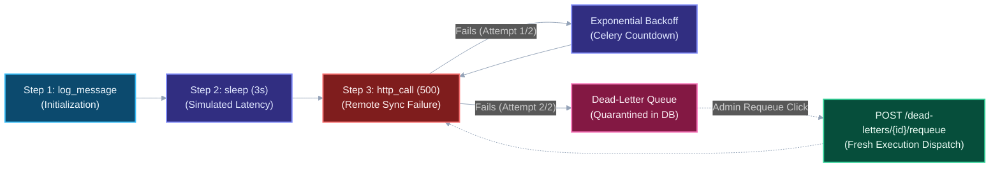

# Tutorial: Build and Run Your First Resilient Pipeline in 10 Minutes

**What you will build**: An automated multi-step computational pipeline that demonstrates sequential chaining, priority queue routing, automated exponential backoff retries, dead-letter quarantine (DLQ), and one-click failure recovery.

**What you will learn**:
- How to author declarative multi-step workflows using FlowForge's JSON schema.
- How priority queue routing partitions jobs across Celery execution tiers.
- How FlowForge's worker engine handles transient exceptions with non-blocking exponential backoff.
- How unrecoverable failures are safely quarantined in the Dead-Letter Queue.
- How administrators inspect failed payloads and trigger deterministic recovery replays.

**Prerequisites**:
- [x] Docker Engine 24+ and Docker Compose v2 installed.
- [x] FlowForge running locally via `docker compose -f infrastructure/docker-compose.yml up -d` (see [Getting Started](getting-started.md)).
- [x] Web browser accessible to `http://localhost:3000`.

---

## Pipeline Execution Blueprint

The following diagram illustrates the lifecycle of the demo pipeline you are about to construct:



---

## Step 1: Create an Account and Log In

FlowForge enforces JWT-based authentication and role-based access control (RBAC).

1. Ensure the platform is running:
   ```bash
   docker compose -f infrastructure/docker-compose.yml ps
   ```
   All five containers (`flowforge-postgres`, `flowforge-redis`, `flowforge-backend`, `flowforge-worker`, `flowforge-frontend`) should display `healthy` or `Up` status.

2. Open your browser and navigate to the registration portal:
   ```
   http://localhost:3000/register
   ```

3. Register a new user account:
   - **Email**: `operator@example.com`
   - **Password**: `SecurePass123!`

4. After clicking **"Create Account"**, the application automatically redirects you to the login page (`http://localhost:3000/login`).

5. Log in with your credentials. You will land on the main **Workflows** dashboard (`http://localhost:3000/workflows`).

---

## Step 2: Elevate Your Account to Administrator

By default, self-registered users are assigned the `member` role. In FlowForge, accessing and requeuing Dead-Letter Queue (DLQ) records is an administrative operation protected by `require_role("admin")`.

To promote your account to administrator, execute this SQL update command in your terminal while Docker is active:

```bash
docker compose -f infrastructure/docker-compose.yml exec postgres \
  psql -U postgres -d flowforge -c "UPDATE users SET role = 'admin' WHERE email = 'operator@example.com';"
```

> [!IMPORTANT]
> Because FlowForge issues stateless JWT access tokens containing embedded user claims (`"role": "admin"`), you must **log out** and **log back in** via the web dashboard. This refreshes the token in your browser's `localStorage`.

---

## Step 3: Author the Multi-Step Workflow

Now you will create a pipeline containing three distinct task handlers to observe normal execution, simulated delays, and controlled failures:

1. On the **Workflows** page (`http://localhost:3000/workflows`), click **"Create Workflow"**.
2. Provide the following workflow metadata:
   - **Name**: `Resilience Demo Pipeline`
   - **Description**: `Multi-step pipeline demonstrating sequential execution, retries, and dead-letter capture.`
3. In the **Definition (JSON)** editor field, paste the following structured configuration:

```json
[
  {
    "name": "Step 1 - Pipeline Initialization",
    "type": "log_message",
    "config": {
      "message": "Initiating batch data synchronization..."
    },
    "max_retries": 3
  },
  {
    "name": "Step 2 - Simulated Processing Delay",
    "type": "sleep",
    "config": {
      "seconds": 3
    },
    "max_retries": 3
  },
  {
    "name": "Step 3 - Remote Sync Webhook",
    "type": "http_call",
    "config": {
      "url": "https://httpbin.org/status/500",
      "method": "GET",
      "timeout": 5.0
    },
    "max_retries": 2
  }
]
```

### Deconstructing the Workflow Configuration:
- **`log_message` (Step 1)**: Executes instantaneously, recording a structured logging message in the Celery worker daemon.
- **`sleep` (Step 2)**: Suspends execution for 3 seconds, allowing you to observe the live `running` status badge in the UI without freezing system resources.
- **`http_call` (Step 3)**: Dispatches an HTTP GET request to `https://httpbin.org/status/500`, an endpoint designed to deliberately return an HTTP 500 Internal Server Error. With `max_retries: 2`, this step will fail, compute exponential backoff, retry once, and subsequently quarantine to the Dead-Letter Queue.

4. Click **"Create Workflow"**. Your new workflow appears in the dashboard catalog.

---

## Step 4: Configure Priority and Trigger Execution

FlowForge supports integer execution priorities from `1` (critical) to `10` (bulk background).

1. Click on **"Resilience Demo Pipeline"** from the catalog to open the workflow detail page (`http://localhost:3000/workflows/<workflow-id>`).
2. Locate the **"Trigger Job"** control card in the sidebar.
3. Select **`2 - High`** from the **Priority** selector:
   - Priority `1` to `3` $\rightarrow$ routes to Celery's `high` queue.
   - Priority `4` to `7` $\rightarrow$ routes to Celery's `default` queue.
   - Priority `8` to `10` $\rightarrow$ routes to Celery's `low` queue.
4. Click **"Trigger Job"**.

---

## Step 5: Observe Real-Time Execution in the Dashboard

The dashboard immediately navigates to the Job Details view (`http://localhost:3000/jobs/<job-id>`). The frontend initiates a silent 2-second background polling cycle (`setInterval`) against `GET /jobs/<job-id>`.

Here is the exact progression of events you will observe:

### Phase 1: Rapid Ingestion (`pending` $\rightarrow$ `running`)
- The job displays an initial yellow `pending` badge.
- Within milliseconds, a Celery worker pulls the first task from Redis's `high` queue. The job and Step 1 badges transition to blue `running`.

### Phase 2: Instant Completion of Step 1
- Step 1 completes in under 10 milliseconds.
- Its badge turns green (`completed`).
- Click on Step 1 to expand the output accordion and inspect the recorded result:
  ```json
  {
    "logged": "Initiating batch data synchronization..."
  }
  ```

### Phase 3: Simulated Latency in Step 2
- The orchestrator dispatches Step 2 into the queue.
- Step 2 switches to blue `running` and remains active for 3 seconds while executing `time.sleep(3)`.
- Upon completion, the badge turns green (`completed`) with the output payload:
  ```json
  {
    "slept": 3.0
  }
  ```

### Phase 4: Failure, Exponential Backoff & Quarantine in Step 3
- Step 3 initiates an HTTP request to `https://httpbin.org/status/500`.
- The endpoint returns `500 Internal Server Error`, triggering an `HTTPStatusError` in `httpx`.
- **First Retry**: The worker increments `retry_count` from `0` to `1`, transitions the step status to orange `retrying`, and schedules a countdown delay:
  $$\text{delay} = \min(10.0 \times 2^0, 300.0) = 10.0\text{ seconds}$$
  During this 10-second countdown, the Celery worker thread is completely freed to process other pending queue items.
- **Second Attempt**: After the countdown expires, the worker re-attempts Step 3. The request fails a second time (`retry_count: 2/2`).
- **Retries Exhausted**: Because `retry_count >= max_retries`, FlowForge permanently marks Step 3 as red `failed`.
- The parent job transitions to red `failed` and the frontend polling interval automatically terminates.

```
[Job Details Page Summary]
----------------------------------------------------------------------
Job Status: FAILED
Priority:   2 (High)
Step 1:     COMPLETED (0.01s)
Step 2:     COMPLETED (3.02s)
Step 3:     FAILED    (Retries: 2/2) -> Server error '500 Internal Server Error'
----------------------------------------------------------------------
```

---

## Step 6: Inspect and Requeue from Dead Letters

Because Step 3 exhausted all retry attempts, FlowForge isolated the failed step into the Dead-Letter storage table, preventing it from crashing worker loops or blocking subsequent jobs.

1. In the top navigation bar, click **"Dead Letters"** (`http://localhost:3000/dead-letters`).
2. Locate the quarantined record corresponding to **Step 3 - Remote Sync Webhook**:
   - **Task Type**: `http_call`
   - **Retries Recorded**: `2`
   - **Error Message**: `Server error '500 Internal Server Error' for url 'https://httpbin.org/status/500'`
   - **Input Payload**: `{"url": "https://httpbin.org/status/500", "method": "GET", "timeout": 5.0}`
3. Click the **"Requeue"** button adjacent to the dead-letter entry.

### Architectural Mechanics of a Requeue Operation:
1. The client invokes `POST /dead-letters/{id}/requeue` ([backend/app/api/dead_letters.py](file:///d:/Edutation(P)/FlowForge/backend/app/api/dead_letters.py)).
2. The backend resets `Task.status` to `pending`, resets `retry_count` to `0`, and clears previous error messages.
3. The parent `Job.status` is reopened from `failed` to `running`.
4. The dead-letter record stamps `requeued_at = NOW()` for complete compliance auditability.
5. The task is re-dispatched into Redis, allowing operators to safely recover from upstream service outages without manual database intervention.

---

## Architectural Principles in Action

Through this 10-minute walkthrough, you experienced the core architectural components of FlowForge firsthand:

| Architectural Component | What You Observed | Codebase Location |
| :--- | :--- | :--- |
| **Authentication & RBAC** | JWT bearer token issuance, role-based admin enforcement on `/dead-letters`. | [core/security.py](file:///d:/Edutation(P)/FlowForge/backend/app/core/security.py)<br>[api/auth.py](file:///d:/Edutation(P)/FlowForge/backend/app/api/auth.py) |
| **Declarative Workflows** | Decomposed custom step configurations (`log_message`, `sleep`, `http_call`) into tasks. | [models/workflow.py](file:///d:/Edutation(P)/FlowForge/backend/app/models/workflow.py)<br>[tasks/registry.py](file:///d:/Edutation(P)/FlowForge/worker/tasks/registry.py) |
| **Priority Routing** | Routed priority `2` to the dedicated `high` Celery queue channel. | [core/queue_routing.py](file:///d:/Edutation(P)/FlowForge/backend/app/core/queue_routing.py) |
| **Asynchronous Orchestration** | FastAPI returned HTTP 200 in < 25ms while Celery workers executed steps asynchronously. | [tasks/execute_task.py](file:///d:/Edutation(P)/FlowForge/worker/tasks/execute_task.py)<br>[tasks/orchestrate.py](file:///d:/Edutation(P)/FlowForge/worker/tasks/orchestrate.py) |
| **Exponential Backoff** | Automated non-blocking countdown retry calculation ($10 \times 2^{\text{retry}-1}$). | [tasks/execute_task.py](file:///d:/Edutation(P)/FlowForge/worker/tasks/execute_task.py) |
| **Poison-Pill Quarantine** | Exhausted tasks safely archived to `dead_letter_tasks` with full payload preservation. | [models/dead_letter.py](file:///d:/Edutation(P)/FlowForge/backend/app/models/dead_letter.py)<br>[api/dead_letters.py](file:///d:/Edutation(P)/FlowForge/backend/app/api/dead_letters.py) |
| **Real-Time Observability** | Non-blocking client polling (every 2s) with automatic teardown on terminal states. | [frontend/src/app/jobs/[id]/page.tsx](file:///d:/Edutation(P)/FlowForge/frontend/src/app/jobs/[id]/page.tsx) |

---

## Next Steps

Now that you have built and executed your first resilient workflow, deepen your mastery of FlowForge with the following guides:

- [Managing Dead Letters Guide](../03-how-to-guides/managing-dead-letters.md) — Production operations for filtering, inspecting, and bulk-recovering failed pipelines.
- [System Architecture & Topologies](../01-introduction/architecture-diagram.md) — Multi-container networking, protocol matrices, and state transitions.
- [Technology Stack Architecture](../01-introduction/tech-stack.md) — In-depth breakdown of FlowForge's backend, broker, worker, and frontend engines.
- [REST API Reference](../04-reference/api-reference.md) — Comprehensive OpenAPI endpoint specifications and payload schemas.
- [Retry & Dead-Letter Strategy](../05-explanation/retry-and-dead-letter-strategy.md) — Mathematical formulation and operational guarantees of the retry engine.