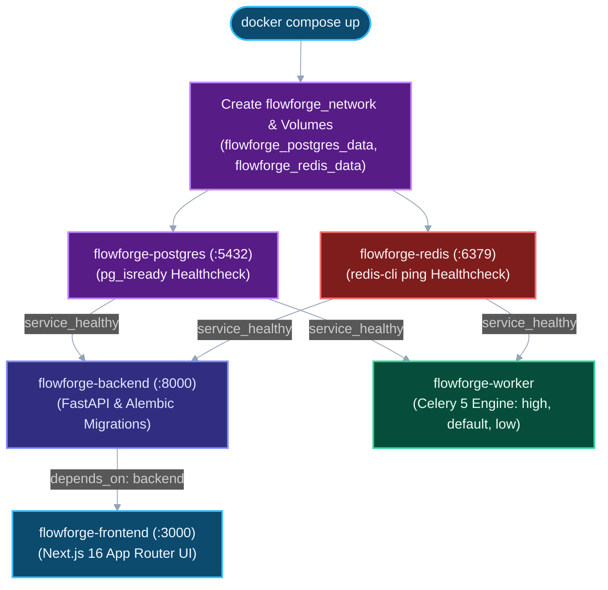

# Tutorial: Get Started with FlowForge in 5 Minutes

**What you will build**: A fully functional, locally orchestrated FlowForge distributed task-processing cluster running PostgreSQL 16, Redis 7, the FastAPI backend control plane, the Celery background worker, and the Next.js 16 dashboard.

**What you will learn**:
- How to clone the repository and configure environment variables.
- How to launch the multi-container architecture using Docker Compose.
- How container startup dependency gates and healthchecks ensure clean initialization.
- How to verify system health across the REST API, OpenAPI docs, and worker logs.
- How to diagnose and resolve common first-run port and network issues.

**Prerequisites**:
- [x] **Docker Desktop 4.25+** (Docker Engine 24+, Docker Compose v2) installed and running.
- [x] **Git 2.30+** installed.
- [x] Ports `3000` (Frontend), `8000` (Backend API), `5432` (Postgres), and `6379` (Redis) free on your host.

---

## Container Startup & Dependency Topology

When you boot FlowForge, Docker Compose enforces healthcheck dependency ordering: the PostgreSQL and Redis containers must report healthy before the backend runs database migrations and the worker engine registers priority queues:



---

## Step-by-Step Setup

### Step 1: Clone the Repository

Clone the FlowForge repository to your local workstation and change into the project root:

```bash
git clone https://github.com/chandadiya2004/FlowForge.git
cd FlowForge
```

---

### Step 2: Configure Environment Variables

FlowForge uses environment variables to configure database connection strings, JWT signing keys, CORS origins, and exponential backoff retry caps.

Create your local `.env` file from the provided example template:

```bash
# On Linux / macOS / Git Bash
cp infrastructure/.env.example infrastructure/.env

# On Windows (PowerShell)
Copy-Item infrastructure/.env.example infrastructure/.env
```

Open `infrastructure/.env` in your text editor. The default values are pre-tuned for seamless local development:

```ini
# PostgreSQL Relational System of Record
POSTGRES_USER=postgres
POSTGRES_PASSWORD=postgres
POSTGRES_DB=flowforge

# Redis Broker & Result Backend
REDIS_URL=redis://redis:6379/0

# Security & Stateless Authentication
JWT_SECRET=flowforge_default_secret_key_change_in_production
JWT_EXPIRE_MINUTES=60
CORS_ORIGINS=http://localhost:3000

# Exponential Backoff Retry Caps
RETRY_BASE_DELAY_SECONDS=10.0
RETRY_MAX_DELAY_SECONDS=300.0

# Frontend Browser-Facing API URL
NEXT_PUBLIC_API_URL=http://localhost:8000
```

> [!TIP]
> If you customize `POSTGRES_USER`, `POSTGRES_PASSWORD`, or `POSTGRES_DB`, Docker Compose automatically synchronizes those values into the `DATABASE_URL` for both the backend and worker containers.

---

### Step 3: Launch FlowForge

You can launch FlowForge in one of two ways depending on whether you want instant pre-built images or source compilation:

#### Option A: Quick Launch with Pre-Built Images (~30 Seconds)
> **Recommended for:** Quick evaluations, product demonstrations, or running FlowForge without compiling Node.js or Python packages locally.

```bash
docker compose -f docker-compose.prod.yml up -d
```

**What Docker Does & Expected Output:**
Docker pulls the pre-built multi-architecture container images from Docker Hub, provisions the bridge network and named volumes, and boots the cluster:

```text
[+] Running 8/8
 ✔ Network flowforge_network             Created
 ✔ Volume "flowforge_postgres_data"      Created
 ✔ Volume "flowforge_redis_data"         Created
 ✔ Container flowforge-postgres          Healthy
 ✔ Container flowforge-redis             Healthy
 ✔ Container flowforge-backend           Started
 ✔ Container flowforge-worker            Started
 ✔ Container flowforge-frontend          Started
```

---

#### Option B: Build from Local Source Code
> **Recommended for:** Anyone modifying backend routes, Celery tasks, or Next.js dashboard UI components.

```bash
docker compose -f infrastructure/docker-compose.yml up --build -d
```

**What Docker Does & Expected Output:**
Docker executes `backend/Dockerfile`, `worker/Dockerfile`, and `frontend/Dockerfile`, compiles the Next.js production build, runs Alembic migrations, and boots the services:

```text
[+] Building 34.8s (32/32) FINISHED
...
[+] Running 8/8
 ✔ Network flowforge_network             Created
 ✔ Volume "flowforge_postgres_data"      Created
 ✔ Volume "flowforge_redis_data"         Created
 ✔ Container flowforge-postgres          Healthy
 ✔ Container flowforge-redis             Healthy
 ✔ Container flowforge-backend           Started
 ✔ Container flowforge-worker            Started
 ✔ Container flowforge-frontend          Started
```

---

### Step 4: Verify Container Health

Confirm that all five containers are running and healthy:

```bash
# If launched with Option A:
docker compose -f docker-compose.prod.yml ps

# If launched with Option B:
docker compose -f infrastructure/docker-compose.yml ps
```

**Expected Status Output:**
```text
NAME                 IMAGE                                         SERVICE    STATUS
flowforge-postgres   postgres:16-alpine                            postgres   Up (healthy)
flowforge-redis      redis:7-alpine                                redis      Up (healthy)
flowforge-backend    arpanpramanik2003/flowforge-backend:latest    backend    Up
flowforge-worker     arpanpramanik2003/flowforge-worker:latest     worker     Up
flowforge-frontend   arpanpramanik2003/flowforge-frontend:latest   frontend   Up
```

> [!NOTE]
> `flowforge-postgres` and `flowforge-redis` will report `Up (healthy)` once their internal healthcheck commands pass. The backend and worker containers will only boot after this state is verified.

---

## Verification & Sanity Checks

Verify each tier of the system using your browser or terminal:

### 1. Administrative Web Dashboard
Navigate to `http://localhost:3000` in your web browser:
```
http://localhost:3000
```
You will see the FlowForge landing portal with access to **Login**, **Register**, and the **Workflows** dashboard.

### 2. Backend Health Check
Query the FastAPI health check endpoint:
```bash
curl http://localhost:8000/health
```
**Expected Response:**
```json
{"status": "ok"}
```

### 3. Interactive OpenAPI Documentation (Swagger)
Open `http://localhost:8000/docs` in your browser:
```
http://localhost:8000/docs
```
You can review and test endpoints for authentication, workflows, jobs, and dead letters directly from this interactive documentation page.

### 4. Background Worker Queue Registration
Stream the Celery worker logs to ensure it has connected to Redis and registered the priority queues:

```bash
docker compose -f infrastructure/docker-compose.yml logs -f worker
```

**Expected Log Output:**
```text
[tasks]
  . execute_task
  . ping

[queues]
  . high
  . default
  . low

[2026-09-07 10:00:00,000: INFO/MainProcess] celery@flowforge-worker ready.
```

---

## Troubleshooting First-Run Issues

### Problem 1: Port Conflict (`bind: address already in use`)
- **Cause**: A local instance of PostgreSQL (`5432`), Redis (`6379`), Node.js (`3000`), or an existing HTTP service (`8000`) is running natively on your host machine.
- **Resolution**:
  - Stop the conflicting local service:
    - **Windows**: Stop Postgres / Redis in Services (`services.msc`) or kill processes via `Stop-Process`.
    - **macOS / Linux**: `sudo systemctl stop postgresql redis` or `brew services stop postgresql redis`.
  - Alternatively, modify the host port mappings in `infrastructure/docker-compose.yml` (e.g., change `"5432:5432"` to `"5433:5432"`).

---

### Problem 2: Backend Container Exits Immediately with Migration Error
- **Cause**: The backend attempted to execute Alembic migrations before PostgreSQL finished initializing its database cluster.
- **Resolution**:
  FlowForge's `docker-compose.yml` includes `condition: service_healthy` to mitigate this. On machines under heavy I/O load:
  1. Inspect the backend log output:
     ```bash
     docker compose -f infrastructure/docker-compose.yml logs backend
     ```
  2. Once PostgreSQL reports healthy, restart the backend:
     ```bash
     docker compose -f infrastructure/docker-compose.yml restart backend
     ```

---

### Problem 3: CORS or Network Error in the Web Dashboard
- **Cause**: `NEXT_PUBLIC_API_URL` or `CORS_ORIGINS` is misconfigured in `infrastructure/.env`.
- **Resolution**:
  Ensure that in `infrastructure/.env`:
  - `NEXT_PUBLIC_API_URL=http://localhost:8000` (this URL is resolved by your client browser on your host machine).
  - `CORS_ORIGINS=http://localhost:3000`.
  After adjusting `.env`, rebuild and restart the frontend:
  ```bash
  docker compose -f infrastructure/docker-compose.yml up --build -d frontend
  ```

---

## Stopping the Platform

When you are finished testing or developing:

- **Stop containers and preserve all database records and queue state**:
  ```bash
  docker compose -f infrastructure/docker-compose.yml down
  ```

- **Stop containers and completely remove all persistent volumes** (clean slate):
  ```bash
  docker compose -f infrastructure/docker-compose.yml down -v
  ```

---

## What You Just Built & Next Steps

You now have a fully operational, multi-container distributed task engine running locally. To continue exploring FlowForge, follow these guides:

1. [First Workflow Walkthrough](first-workflow-walkthrough.md) — Create, trigger, and inspect your first multi-step workflow with exponential backoff and dead-letter recovery.
2. [Understanding Docker Architecture](understanding-docker.md) — Deep-dive into container networking, Docker Compose configs, and production deployment strategies.
3. [System Architecture Specification](../01-introduction/architecture-diagram.md) — Detailed specifications of network topologies, protocol boundaries, and state machines.
4. [Technology Stack Architecture](../01-introduction/tech-stack.md) — In-depth analysis of FastAPI, Celery, Redis, PostgreSQL, and Next.js.
5. [Managing Dead Letters How-To](../03-how-to-guides/managing-dead-letters.md) — Operational guide for handling unrecoverable pipeline exceptions.