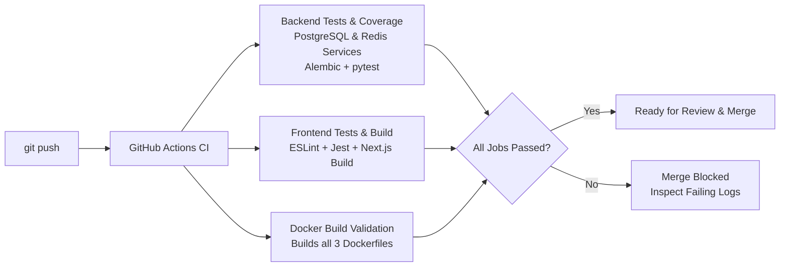

# Git and GitHub Workflow

This guide documents the development workflow and collaboration standards for contributing to FlowForge. Whether you are adding a new task handler, adjusting UI layouts, or writing documentation, following this workflow ensures code quality, prevents regressions, and keeps the repository history clean.

---

## Core Git Concepts

If you are new to collaborative Git workflows:

- **Branch**: An independent, isolated line of development. Creating a branch allows you to experiment, add features, or fix bugs without affecting the stable code in the main branch.
- **Pull Request (PR)**: A proposal submitted on GitHub to merge changes from your feature branch into the base branch (`main`). It provides a dedicated interface for peer code review, automated testing, and discussion.
- **Why We Never Commit Directly to `main`**: The `main` branch represents deployable, stable software. Direct commits bypass peer review and automated testing, risking broken builds or database corruption for the entire team.

---

## FlowForge Development Lifecycle

FlowForge follows a feature-branch workflow. Every code modification follows these steps:

### 1. Update Your Local Repository
Before creating a new branch, ensure your local `main` is up to date with the remote repository:

```bash
git checkout main
git pull origin main
```

### 2. Create a Feature Branch
Create a descriptive branch using lowercase words and hyphens. Use prefixes that clarify intent:
- `feat/<feature-name>` (e.g. `feat/webhook-retry-policy`)
- `fix/<bug-name>` (e.g. `fix/postgres-connection-leak`)
- `docs/<doc-topic>` (e.g. `docs/api-reference-update`)

```bash
git checkout -b feat/add-slack-notification-handler
```

### 3. Implement and Test Your Changes
Make your code changes, run the application locally, and ensure the test suite passes:

```bash
# Verify backend tests
cd backend && pytest

# Verify frontend tests
cd ../frontend && npm test
```

### 4. Stage and Commit Your Work
Stage your modified files and commit with a concise, descriptive message following our commit message convention:

```bash
git add .
git commit -m "feat(worker): add slack notification task handler"
```

### 5. Push Your Branch to GitHub
Push your local branch to the remote repository:

```bash
git push -u origin feat/add-slack-notification-handler
```

### 6. Open a Pull Request
1. Navigate to the FlowForge repository on GitHub: `https://github.com/chandadiya2004/FlowForge`.
2. GitHub will prompt you with a **"Compare & pull request"** banner. Click it.
3. Provide a clear summary of your changes, referencing any relevant issues.
4. Set the base branch to `main`.
5. Submit the Pull Request.

---

## Commit Message Convention

FlowForge adopts a simplified **Conventional Commits** standard. Structure commit messages as follows:

```
<type>(<optional scope>): <short imperative description>
```

### Supported Types
- **`feat`**: A new feature or capability (e.g., `feat(api): add batch job cancel endpoint`).
- **`fix`**: A bug fix (e.g., `fix(worker): handle null payload in sleep handler`).
- **`docs`**: Documentation changes only (e.g., `docs(readme): add troubleshooting section`).
- **`test`**: Adding or updating tests without changing production code (e.g., `test(auth): add expired token test`).
- **`refactor`**: Code reorganization that neither fixes a bug nor adds a feature.
- **`chore`**: Maintenance tasks, dependency updates, or build configuration (e.g., `chore(deps): bump next.js version`).

### Why This Convention Matters
1. **Scannable History**: Team members can glance at `git log` and immediately understand what changed.
2. **Simplified Changelog Maintenance**: Makes updating `CHANGELOG.md` straightforward by grouping commits under `[Unreleased]` by category.
3. **Automated Tooling**: Enables automated release scripts and semantic version bumping in future milestones.

---

## What Happens Automatically on Push (CI Feedback)

The moment you push commits to GitHub or open a Pull Request, **GitHub Actions** automatically triggers the FlowForge CI pipeline (`.github/workflows/ci.yml`):



### Automated Quality Gates
1. **`backend-tests`**: Runs against real containerized PostgreSQL and Redis services, applies database migrations, and enforces code coverage via `pytest-cov`.
2. **`frontend-tests`**: Validates TypeScript types, runs ESLint, executes Jest unit tests, and verifies that the production bundle builds (`npm run build`).
3. **`docker-build-check`**: Builds the backend, worker, and frontend Docker images to ensure no broken dependencies or Dockerfile syntax errors slipped through.

> [!IMPORTANT]
> Pull Requests cannot be merged into `main` if any CI job fails. Always check the GitHub Actions tab on your PR to review logs if a check turns red!