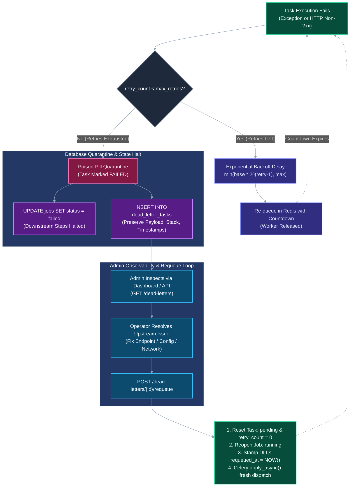

# How to Manage Dead-Letter Tasks & Quarantined Pipelines

In distributed workflow systems, tasks can fail permanently due to malformed payloads, third-party API outages, or unexpected runtime exceptions. Rather than silently dropping failed jobs or letting poison-pill tasks repeatedly crash worker threads, FlowForge quarantines exhausted tasks into a dedicated **Dead-Letter Queue (DLQ)** database table.

This guide details how administrators inspect dead-lettered tasks via the dashboard and REST API, diagnose failure root causes from immutable execution snapshots, and safely re-drive pipeline execution once issues are resolved.

---

## Dead-Letter Quarantine & Recovery Lifecycle

The diagram below illustrates how FlowForge transitions failing tasks through exponential backoff retry loops, quarantines exhausted executions into `dead_letter_tasks`, and enables deterministic one-click operator replay:



---

## When Does a Task Enter the Dead-Letter Queue?

A task is automatically quarantined into `dead_letter_tasks` when all three of the following conditions are met:
1. **Execution Exception**: A task handler (`log_message`, `sleep`, or `http_call`) raises an unhandled exception or non-2xx HTTP status code.
2. **Exhausted Retry Budget**: The task's `retry_count` reaches or exceeds its configured `max_retries` (`task.retry_count >= task.max_retries`).
3. **Atomic Pipeline Quarantine**:
   - The worker marks the task's status as `failed`.
   - The worker halts all subsequent pipeline tasks (`sequence > current.sequence`), preventing cascading failures.
   - The parent `Job.status` transitions to `failed`.
   - An immutable snapshot record is inserted into the [DeadLetterTask](file:///d:/Edutation(P)/FlowForge/backend/app/models/dead_letter.py) table.

---

## 1. Inspecting Dead Letters via the Web Dashboard

Inspecting and requeuing dead letters requires an account with the **`admin`** role.

1. Navigate to the FlowForge dashboard at `http://localhost:3000`.
2. Click **"Dead Letters"** in the navigation header, or visit:
   ```
   http://localhost:3000/dead-letters
   ```
3. **If authenticated as an Administrator**: You will see the administrative dead-letter console listing quarantined tasks ordered chronologically (`failed_at DESC`).
4. **If authenticated as a standard Member**: The UI will display an **Access Denied** alert, as dead-letter operations are restricted by `require_role("admin")`.

> [!TIP]
> To elevate a local user account to administrator for testing, execute:
> ```bash
> docker compose -f infrastructure/docker-compose.yml exec postgres \
>   psql -U postgres -d flowforge -c "UPDATE users SET role = 'admin' WHERE email = 'operator@example.com';"
> ```
> Afterward, log out and log back in to refresh your JWT access token.

---

## 2. Querying Dead Letters via the REST API

All dead-letter endpoints are exposed under `/dead-letters` and require a valid administrator JWT bearer token in the `Authorization` header:

### List All Quarantined Tasks
```bash
curl -X GET "http://localhost:8000/dead-letters" \
  -H "Authorization: Bearer <ADMIN_JWT_TOKEN>"
```

### Filter Dead Letters by Workflow UUID
To isolate failures originating from a specific workflow pipeline:
```bash
curl -X GET "http://localhost:8000/dead-letters?workflow_id=<WORKFLOW_UUID>" \
  -H "Authorization: Bearer <ADMIN_JWT_TOKEN>"
```

### Fetch a Specific Dead-Letter Record
```bash
curl -X GET "http://localhost:8000/dead-letters/<DEAD_LETTER_UUID>" \
  -H "Authorization: Bearer <ADMIN_JWT_TOKEN>"
```

---

## 3. Diagnosing Failures from the Record Snapshot

Every dead-letter record stores an immutable diagnostic snapshot captured at the exact moment of permanent failure:

```json
{
  "id": "7b8f9e0a-1234-4567-89ab-cdef01234567",
  "task_id": "a1b2c3d4-e5f6-7890-abcd-ef1234567890",
  "job_id": "f0e1d2c3-b4a5-6789-0123-456789abcdef",
  "workflow_id": "3c4d5e6f-7a8b-9012-3456-789abcdef012",
  "task_type": "http_call",
  "input_data": {
    "url": "https://api.partner.example.com/v1/sync",
    "method": "POST",
    "timeout": 10.0,
    "headers": {
      "Content-Type": "application/json"
    }
  },
  "error_message": "HTTPStatusError: 503 Service Unavailable for url 'https://api.partner.example.com/v1/sync'",
  "retry_count": 3,
  "failed_at": "2026-09-07T10:15:30.123456Z",
  "requeued_at": null
}
```

### Root-Cause Diagnostic Matrix

| Snapshot Field | Diagnostic Analysis & Actionable Remediation |
| :--- | :--- |
| **`task_type`** | Indicates which handler function executed (`http_call`, `log_message`, `sleep`). Directs engineers to the handler implementation in [worker/tasks/registry.py](file:///d:/Edutation(P)/FlowForge/worker/tasks/registry.py). |
| **`error_message`** | Captures the raw exception string. Common diagnostic categories include:<br>• `HTTPStatusError: 503 / 502 / 500`: Downstream service outage or gateway failure.<br>• `HTTPStatusError: 401 / 403`: Expired API keys or invalid webhook credentials.<br>• `ConnectTimeout / ReadTimeout`: Remote service latency exceeding configured `timeout`.<br>• `ValueError`: Malformed or missing parameters in `input_data`. |
| **`input_data`** | The raw JSON parameters supplied to the task. Allows verification of payload syntax, URLs, query parameters, and custom request bodies without guessing. |
| **`retry_count`** | Verifies that all configured retry cycles were exhausted before abandonment. |
| **`failed_at`** | UTC timestamp of permanent failure. Use this timestamp to cross-reference worker container logs (`docker compose logs worker --since ...`). |
| **`requeued_at`** | Remains `null` while quarantined. Updated with an ISO timestamp once an administrator triggers a requeue. |

---

## 4. Requeuing Dead-Lettered Tasks

Once the root cause is resolved (e.g., third-party API is restored, network firewall updated, or credential refreshed), administrators can safely replay the task without recreating the workflow or re-running prior completed steps.

### Option A: Requeue via the Administrative Dashboard
1. Navigate to `http://localhost:3000/dead-letters`.
2. Locate the row containing the quarantined task.
3. Click the **"Requeue"** button.
4. A green alert confirmation will notify you that the task has been re-dispatched to the worker pool.

### Option B: Requeue via the REST API
Invoke `POST /dead-letters/{id}/requeue` with your administrator JWT token:

```bash
curl -X POST "http://localhost:8000/dead-letters/<DEAD_LETTER_UUID>/requeue" \
  -H "Authorization: Bearer <ADMIN_JWT_TOKEN>"
```

**Expected Response:**
```json
{
  "id": "7b8f9e0a-1234-4567-89ab-cdef01234567",
  "task_id": "a1b2c3d4-e5f6-7890-abcd-ef1234567890",
  "job_id": "f0e1d2c3-b4a5-6789-0123-456789abcdef",
  "workflow_id": "3c4d5e6f-7a8b-9012-3456-789abcdef012",
  "task_type": "http_call",
  "input_data": { ... },
  "error_message": "HTTPStatusError: 503 Service Unavailable...",
  "retry_count": 0,
  "failed_at": "2026-09-07T10:15:30.123456Z",
  "requeued_at": "2026-09-07T10:30:00.654321Z"
}
```

---

## Internal Mechanics of a Requeue Operation

When `POST /dead-letters/{id}/requeue` executes ([backend/app/api/dead_letters.py](file:///d:/Edutation(P)/FlowForge/backend/app/api/dead_letters.py)), the backend applies four atomic database and broker state transitions:

1. **Task State Reset**:
   - `Task.status` resets from `failed` to `pending`.
   - `Task.retry_count` resets from $N$ back to `0`.
   - `Task.error_message` is cleared (`None`).
   - `Task.started_at` and `completed_at` are cleared.
2. **Parent Job Reopening**:
   - If the parent `Job.status` was `failed`, it transitions back to `running`.
   - `Job.completed_at` is cleared to allow downstream sequential steps to execute.
3. **Audit Trail Preservation**:
   - The record in `dead_letter_tasks` is **never deleted**.
   - `requeued_at` is stamped with `datetime.now(timezone.utc)`, providing full auditability of failure occurrences and operational interventions.
4. **Celery Re-Dispatch**:
   - The backend looks up the job's priority and resolves the original queue (`high`, `default`, `low`) via `get_queue_for_priority(job.priority)`.
   - The task is dispatched fresh to Redis via `dispatch_task("execute_task", args=[str(task.id)], queue=queue)`.
   - An active Celery worker dequeues the task immediately, resuming pipeline execution.

---

## Related Documentation & Next Steps

- [Retry & Dead-Letter Strategy](../05-explanation/retry-and-dead-letter-strategy.md) — Mathematical backoff formulation and fault tolerance architecture.
- [First Workflow Walkthrough](../02-tutorials/first-workflow-walkthrough.md) — Hands-on tutorial demonstrating intentional HTTP 500 failure and DLQ requeue.
- [REST API Reference](../04-reference/api-reference.md) — Complete specification for all `/dead-letters` endpoints.
- [Relational Data Model Specification](../04-reference/data-model.md) — Schema documentation for `dead_letter_tasks` and foreign key relationships.
- [Job Lifecycle & Orchestration](../05-explanation/job-lifecycle-and-orchestration.md) — How the orchestration engine sequences steps and handles state progression.