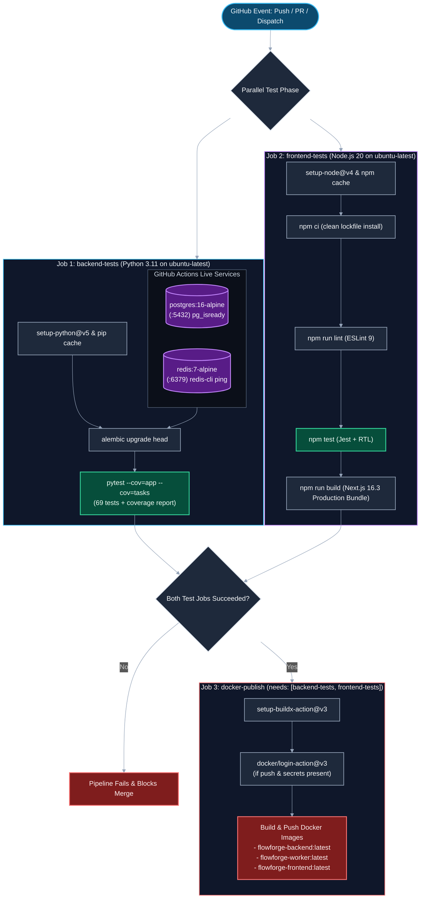

# CI/CD Pipeline Architecture & Quality Gates Reference

FlowForge uses **GitHub Actions** for continuous integration, automated quality gates, and container image publishing. The master workflow is defined in [.github/workflows/ci.yml](file:///d:/Edutation(P)/FlowForge/.github/workflows/ci.yml).

This document serves as an exhaustive technical specification of workflow triggers, containerized testing services, execution matrices, required repository secrets, and result evaluation rules.

---

## Pipeline Execution Topology

The CI pipeline runs unit and integration tests across backend and frontend environments in parallel before gating container image compilation and Docker Hub publishing:



---

## Workflow Triggers

The CI pipeline executes under three distinct GitHub trigger conditions:

```yaml
on:
  push:
    branches: [ main, diya-feature, "feature/**" ]
  pull_request:
    branches: [ main, diya-feature ]
  workflow_dispatch:
```

| Event Type | Target Scope | Execution Behavior |
| :--- | :--- | :--- |
| **`push`** | `main`, `diya-feature`, `feature/**` | Executes full test matrix. If pushed to `main` and credentials exist, compiles and pushes production images to Docker Hub. |
| **`pull_request`** | `main`, `diya-feature` | Executes `backend-tests`, `frontend-tests`, and runs local Docker build verification without pushing images. |
| **`workflow_dispatch`** | Any branch on-demand | Allows manual execution from the GitHub Actions dashboard for ad-hoc validation. |

---

## Detailed Job Specifications

### Job 1: `backend-tests`
- **Runner OS**: `ubuntu-latest`
- **Runtimes**: Python 3.11 with pip caching (`actions/setup-python@v5`)
- **Service Containers**:
  - **`postgres:16-alpine`**:
    - Port: `5432:5432`
    - Environment: `POSTGRES_USER: postgres`, `POSTGRES_PASSWORD: postgres`, `POSTGRES_DB: flowforge_test`
    - Health Check: `pg_isready` (interval: 10s, timeout: 5s, retries: 5)
  - **`redis:7-alpine`**:
    - Port: `6379:6379`
    - Health Check: `redis-cli ping` (interval: 10s, timeout: 5s, retries: 5)
- **Execution Steps**:
  1. Check out repository source via `actions/checkout@v4`.
  2. Set up Python 3.11 and restore pip cache.
  3. Upgrade pip and install dependencies: `pip install -r backend/requirements.txt`.
  4. Apply database migrations: `alembic upgrade head` in `backend/` against the temporary PostgreSQL service.
  5. Execute test suite with terminal coverage output:
     ```bash
     pytest --cov=app --cov=tasks --cov-report=term-missing
     ```

---

### Job 2: `frontend-tests`
- **Runner OS**: `ubuntu-latest`
- **Runtimes**: Node.js 20 with npm caching (`actions/setup-node@v4`)
- **Working Directory**: `frontend/`
- **Execution Steps**:
  1. Check out repository source via `actions/checkout@v4`.
  2. Set up Node.js 20 and configure `cache-dependency-path: frontend/package-lock.json`.
  3. Install exact dependencies using `npm ci`.
  4. Run static linting: `npm run lint` (ESLint 9).
  5. Execute Jest test suites: `npm test`.
  6. Verify production Next.js compilation:
     ```bash
     NEXT_PUBLIC_API_URL=http://localhost:8000 npm run build
     ```
     (Validates TypeScript types, React 19 JSX syntax, and static page generation).

---

### Job 3: `docker-publish`
- **Runner OS**: `ubuntu-latest`
- **Prerequisite Dependencies**: `needs: [backend-tests, frontend-tests]`
- **Execution Steps**:
  1. Check out repository source.
  2. Set up Docker Buildx via `docker/setup-buildx-action@v3`.
  3. Evaluate secrets condition: checks if `DOCKERHUB_USERNAME` and `DOCKERHUB_TOKEN` are present and event is not a pull request.
  4. Authenticate to Docker Hub registry via `docker/login-action@v3`.
  5. Build and push container images:
     - **Backend**: Context `backend/`, Dockerfile `backend/Dockerfile`, Tag `<username>/flowforge-backend:latest`.
     - **Worker**: Context `.`, Dockerfile `worker/Dockerfile`, Tag `<username>/flowforge-worker:latest`.
     - **Frontend**: Context `frontend/`, Dockerfile `frontend/Dockerfile`, Tag `<username>/flowforge-frontend:latest`.

---

## Required Repository Secrets

To enable automated image publishing to Docker Hub, configure these secrets under **Repository Settings $\rightarrow$ Secrets and variables $\rightarrow$ Actions**:

| Secret Name | Purpose | Example Value |
| :--- | :--- | :--- |
| **`DOCKERHUB_USERNAME`** | Docker Hub account identifier | `arpanpramanik2003` |
| **`DOCKERHUB_TOKEN`** | Docker Hub Personal Access Token (PAT) with Read & Write permissions | `dckr_pat_abc123...` |

> [!NOTE]
> If repository secrets are not configured (e.g. in public forks), the `docker-publish` job gracefully skips registry authentication and builds the images locally using the tag `:ci` to verify Dockerfile syntax without failing the workflow.

---

## Interpreting CI Failures & Troubleshooting

| Failing Stage | Typical Root Cause | Actionable Remediation |
| :--- | :--- | :--- |
| **`backend-tests` $\rightarrow$ Alembic Migrations** | Missing foreign key or conflicting schema revision heads. | Run `alembic check` and verify `backend/migrations/versions/` locally before pushing. |
| **`backend-tests` $\rightarrow$ Pytest Failure** | Logic regression, broken status transition, or unhandled exception. | Run `pytest -v tests/<failing_test>.py` locally in your virtual environment. |
| **`backend-tests` $\rightarrow$ Coverage Threshold** | New functions added without corresponding test coverage. | Run `pytest --cov=app --cov=tasks --cov-report=term-missing` and add tests for uncovered lines. |
| **`frontend-tests` $\rightarrow$ ESLint** | Formatting violations or unused variables. | Run `npm run lint` in `frontend/` and fix flagged issues. |
| **`frontend-tests` $\rightarrow$ Jest** | Component snapshot mismatch or broken API client mock. | Run `npm test` in `frontend/` and inspect Jest assertion diffs. |
| **`frontend-tests` $\rightarrow$ Next.js Build** | TypeScript type errors or invalid route layouts. | Run `npm run build` locally in `frontend/` to view TypeScript compiler errors. |
| **`docker-publish` $\rightarrow$ Build Failure** | Syntax error in `Dockerfile` or missing dependency in `requirements.txt`/`package.json`. | Test locally with `docker compose -f infrastructure/docker-compose.yml build`. |

---

## Related Documentation & References

- [Git & GitHub Development Workflow](../03-how-to-guides/git-and-github-workflow.md) — Branching standards, conventional commits, and PR reviews.
- [Running the Test Suite How-To](../03-how-to-guides/running-the-test-suite.md) — Local execution instructions for pytest and Jest.
- [Deploying to Production How-To](../03-how-to-guides/deploying-to-production.md) — Multi-container production deployment using pre-built images.
- [Technology Stack Architecture](../01-introduction/tech-stack.md) — Comprehensive technical inventory.
- [REST API Reference](api-reference.md) — OpenAPI endpoint specifications.