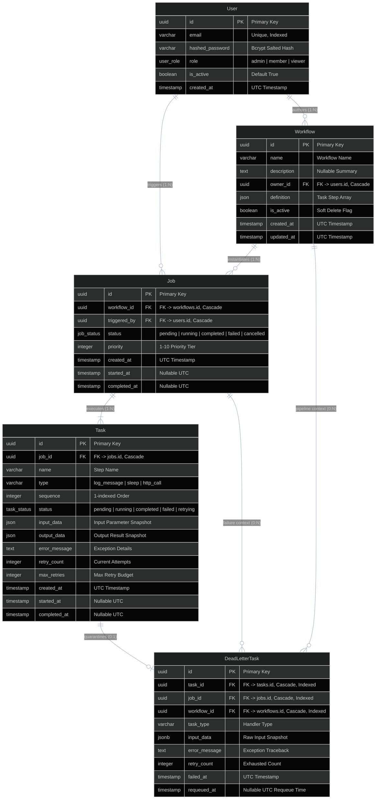
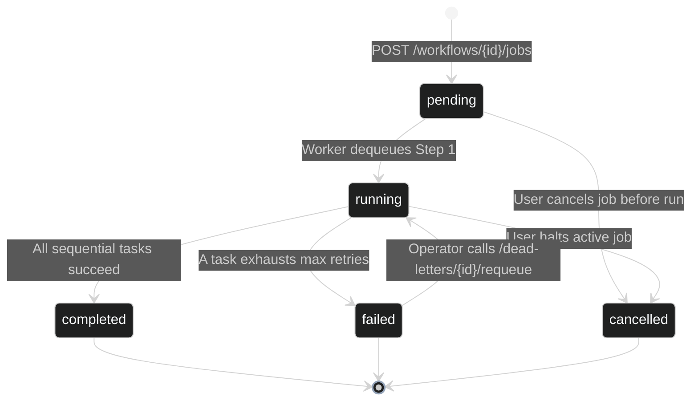
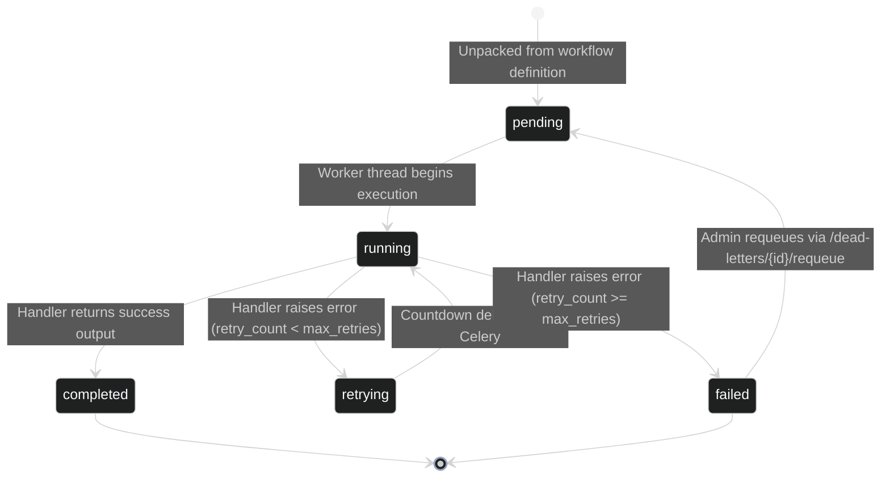

# Relational Data Model & Database Architecture Specification

FlowForge utilizes a normalized, ACID-compliant relational data model managed through SQLAlchemy 2.0 ORM and PostgreSQL 16. This document provides an exhaustive reference specification of all database entities, relational constraints, cascading rules, JSONB dynamic structures, and state engine lifecycles.

---

## Entity-Relationship Diagram (ERD)

The diagram below details table structures, primary/foreign keys, cardinality, and relational cascade policies across the FlowForge schema:



---

## Master Table Specifications

### 1. `users` Table
Stores authenticated user accounts, password credentials, and system permission roles.
- **ORM Model**: [backend/app/models/user.py](file:///d:/Edutation%28P%29/FlowForge/backend/app/models/user.py)

| Column | Type | Nullable | Default | Constraints & Indexes | Description |
| :--- | :--- | :--- | :--- | :--- | :--- |
| **`id`** | `UUID` | No | `uuid.uuid4` | `PRIMARY KEY`, Indexed | Unique identifier for the user account. |
| **`email`** | `VARCHAR(255)` | No | None | `UNIQUE`, Indexed | Unique user email address used for login. |
| **`hashed_password`** | `VARCHAR(255)` | No | None | None | Bcrypt salted one-way hash (`passlib`). |
| **`role`** | `user_role` (Enum) | No | `'member'` | None | Access role (`admin`, `member`, `viewer`). |
| **`is_active`** | `BOOLEAN` | No | `true` | None | Active state. Inactive accounts are blocked from login. |
| **`created_at`** | `TIMESTAMP WITH TZ`| No | `NOW()` | None | Timestamp of user registration. |

---

### 2. `workflows` Table
Represents reusable pipeline blueprints defining an ordered list of task steps.
- **ORM Model**: [backend/app/models/workflow.py](file:///d:/Edutation%28P%29/FlowForge/backend/app/models/workflow.py)

| Column | Type | Nullable | Default | Constraints & Indexes | Description |
| :--- | :--- | :--- | :--- | :--- | :--- |
| **`id`** | `UUID` | No | `uuid.uuid4` | `PRIMARY KEY`, Indexed | Unique identifier for the workflow. |
| **`name`** | `VARCHAR(255)` | No | None | None | Human-readable workflow title. |
| **`description`**| `TEXT` | Yes | `null` | None | Optional Markdown or plain text description. |
| **`owner_id`** | `UUID` | No | None | `FK -> users.id (ON DELETE CASCADE)`, Indexed | User ID of the workflow creator. |
| **`definition`** | `JSON` | No | None | None | Ordered JSON array defining steps and configurations. |
| **`is_active`** | `BOOLEAN` | No | `true` | None | Soft-deletion flag. False prevents new job creation. |
| **`created_at`** | `TIMESTAMP WITH TZ`| No | `NOW()` | None | Creation timestamp. |
| **`updated_at`** | `TIMESTAMP WITH TZ`| No | `NOW()` | On update `NOW()` | Timestamp of last modification. |

#### Schema of `workflows.definition` (JSON Array)
```json
[
  {
    "name": "Step 1: Ingest Data",
    "type": "log_message",
    "config": {
      "message": "Starting batch import"
    },
    "max_retries": 3
  },
  {
    "name": "Step 2: Sync Webhook",
    "type": "http_call",
    "config": {
      "url": "https://api.partner.example.com/sync",
      "method": "POST",
      "timeout": 15.0,
      "headers": { "Authorization": "Bearer token123" }
    },
    "max_retries": 2
  }
]
```

---

### 3. `jobs` Table
Represents an instantiated execution run of a specific workflow.
- **ORM Model**: [backend/app/models/job.py](file:///d:/Edutation%28P%29/FlowForge/backend/app/models/job.py)

| Column | Type | Nullable | Default | Constraints & Indexes | Description |
| :--- | :--- | :--- | :--- | :--- | :--- |
| **`id`** | `UUID` | No | `uuid.uuid4` | `PRIMARY KEY`, Indexed | Unique identifier for this execution run. |
| **`workflow_id`** | `UUID` | No | None | `FK -> workflows.id (ON DELETE CASCADE)`, Indexed | Target workflow executed by this job. |
| **`triggered_by`** | `UUID` | No | None | `FK -> users.id (ON DELETE CASCADE)`, Indexed | User ID who initiated the execution. |
| **`status`** | `job_status` (Enum)| No | `'pending'` | Indexed | Pipeline execution status. |
| **`priority`** | `INTEGER` | No | `5` | None | Priority integer (1–10). |
| **`created_at`** | `TIMESTAMP WITH TZ`| No | `NOW()` | None | Timestamp when job row was inserted. |
| **`started_at`** | `TIMESTAMP WITH TZ`| Yes | `null` | None | Timestamp when worker dequeued Step 1. |
| **`completed_at`**| `TIMESTAMP WITH TZ`| Yes | `null` | None | Timestamp when job reached a terminal state. |

---

### 4. `tasks` Table
Represents discrete, ordered steps belonging to an instantiated parent job.
- **ORM Model**: [backend/app/models/task.py](file:///d:/Edutation%28P%29/FlowForge/backend/app/models/task.py)

| Column | Type | Nullable | Default | Constraints & Indexes | Description |
| :--- | :--- | :--- | :--- | :--- | :--- |
| **`id`** | `UUID` | No | `uuid.uuid4` | `PRIMARY KEY`, Indexed | Unique task step identifier. |
| **`job_id`** | `UUID` | No | None | `FK -> jobs.id (ON DELETE CASCADE)`, Indexed | Parent job identifier. |
| **`name`** | `VARCHAR(255)` | No | None | None | Step name copied from workflow definition. |
| **`type`** | `VARCHAR(100)` | No | None | None | Handler type (`log_message`, `sleep`, `http_call`). |
| **`sequence`** | `INTEGER` | No | None | None | 1-indexed order of execution within the job. |
| **`status`** | `task_status` (Enum)| No | `'pending'` | Indexed | Current task execution status. |
| **`input_data`** | `JSON` | Yes | `null` | None | Arguments passed to the handler function. |
| **`output_data`**| `JSON` | Yes | `null` | None | Serialized output dictionary on success. |
| **`error_message`**| `TEXT` | Yes | `null` | None | Exception message or HTTP error traceback. |
| **`retry_count`**| `INTEGER` | No | `0` | None | Number of retries executed so far. |
| **`max_retries`**| `INTEGER` | No | `3` | None | Maximum allowed retries before permanent failure. |
| **`created_at`** | `TIMESTAMP WITH TZ`| No | `NOW()` | None | Task creation timestamp. |
| **`started_at`** | `TIMESTAMP WITH TZ`| Yes | `null` | None | Timestamp when worker began processing. |
| **`completed_at`**| `TIMESTAMP WITH TZ`| Yes | `null` | None | Timestamp of success or permanent failure. |

---

### 5. `dead_letter_tasks` Table
Captures immutable failure snapshots when a task exhausts all allowed retry attempts.
- **ORM Model**: [backend/app/models/dead_letter.py](file:///d:/Edutation%28P%29/FlowForge/backend/app/models/dead_letter.py)

| Column | Type | Nullable | Default | Constraints & Indexes | Description |
| :--- | :--- | :--- | :--- | :--- | :--- |
| **`id`** | `UUID` | No | `uuid.uuid4` | `PRIMARY KEY` | Unique dead-letter record identifier. |
| **`task_id`** | `UUID` | No | None | `FK -> tasks.id (ON DELETE CASCADE)`, Indexed | Identifier of the permanently failed task. |
| **`job_id`** | `UUID` | No | None | `FK -> jobs.id (ON DELETE CASCADE)`, Indexed | Identifier of the parent job. |
| **`workflow_id`**| `UUID` | No | None | `FK -> workflows.id (ON DELETE CASCADE)`, Indexed | Identifier of the originating workflow. |
| **`task_type`** | `VARCHAR(100)` | No | None | None | Type of task handler that failed. |
| **`input_data`** | `JSONB` | Yes | `null` | None | Immutable snapshot of task input parameters. |
| **`error_message`**| `TEXT` | Yes | `null` | None | Raw error string or exception traceback. |
| **`retry_count`**| `INTEGER` | No | `0` | None | Retries attempted before abandonment. |
| **`failed_at`** | `TIMESTAMP WITH TZ`| No | `NOW()` | None | Timestamp when task entered DLQ quarantine. |
| **`requeued_at`**| `TIMESTAMP WITH TZ`| Yes | `null` | None | Timestamp when admin triggered replay. |

---

## State Transition Lifecycles & Enums

### 1. `JobStatus` State Machine



### 2. `TaskStatus` State Machine



---

## Relational Cascading Rules & Data Integrity

FlowForge enforces strict referential integrity at the database engine level via PostgreSQL foreign keys:

1. **User Deletion**:
   - `users.id` → `workflows.owner_id` (`ON DELETE CASCADE`): Deleting a user deletes all their authored workflows.
   - `users.id` → `jobs.triggered_by` (`ON DELETE CASCADE`): Deleting a user purges all job executions they initiated.
2. **Workflow Deletion**:
   - `workflows.id` → `jobs.workflow_id` (`ON DELETE CASCADE`): Deleting a workflow automatically purges all child jobs and their sequential tasks.
3. **Job Deletion**:
   - `jobs.id` → `tasks.job_id` (`ON DELETE CASCADE`): Purging a job record immediately cascades to remove all associated task rows.
4. **Dead-Letter Isolation**:
   - `dead_letter_tasks` maintains foreign keys targeting `task_id`, `job_id`, and `workflow_id` with `ON DELETE CASCADE`, ensuring no orphaned dead-letter records remain if an entire workflow or job is purged.

---

## Related Documentation & References

- [REST API Reference](api-reference.md) — Endpoint request and response schemas mapping to these database entities.
- [Architecture Diagram & Topologies](../01-introduction/architecture-diagram.md) — System data flow, network boundaries, and state progression.
- [Managing Dead Letters Guide](../03-how-to-guides/managing-dead-letters.md) — Operator instructions for diagnosing and re-driving quarantined tasks.
- [Retry & Dead-Letter Strategy](../05-explanation/retry-and-dead-letter-strategy.md) — Architectural rationale for dead-letter database isolation.