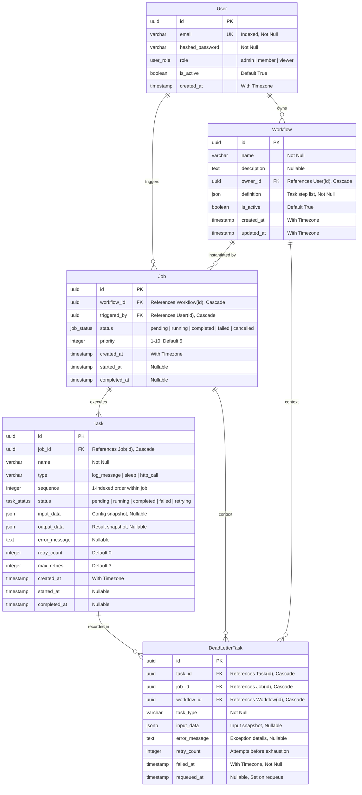
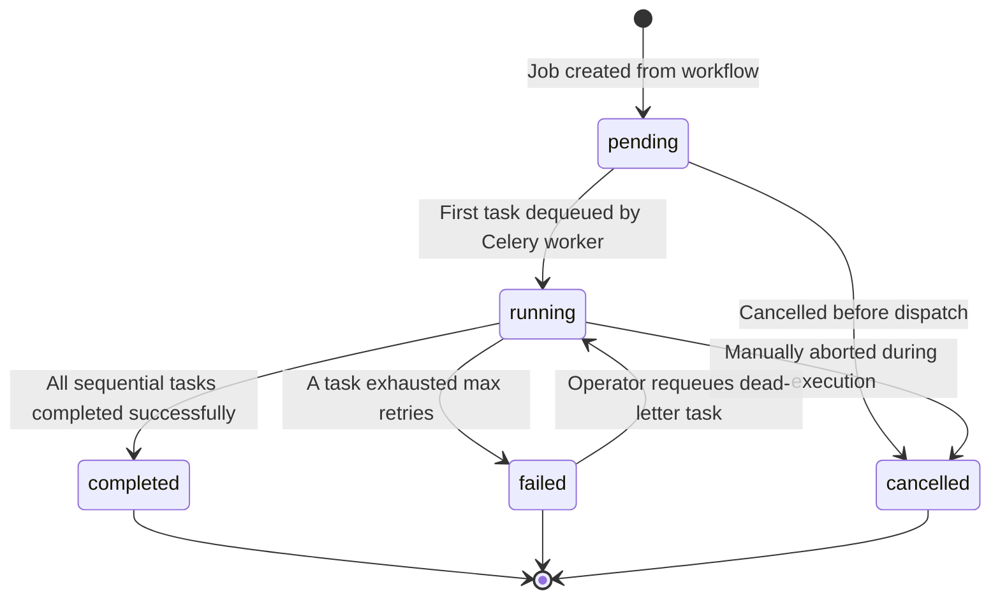
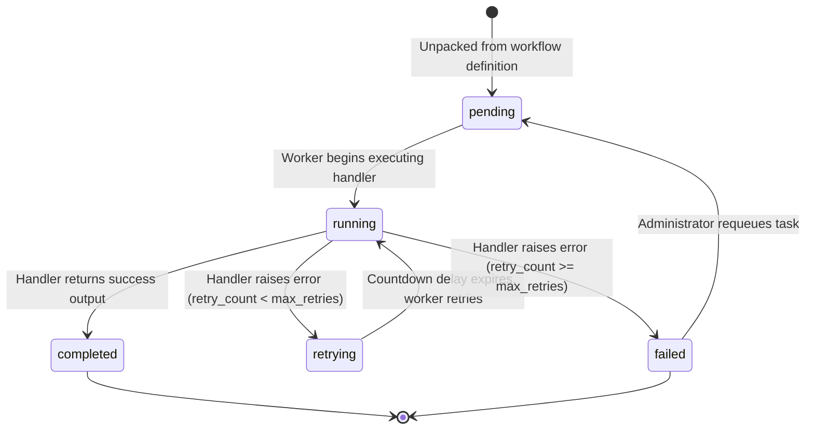

# Data Model

FlowForge uses a normalized relational database schema managed via SQLAlchemy ORM and PostgreSQL. This document details the entity-relationship architecture, table definitions, constraints, and valid state transitions.

---

## Entity-Relationship Diagram

---

## Schema Tables Reference

### 1. `users` Table
Stores authenticated user accounts, encrypted credentials, and system roles.

| Column | Type | Constraints | Description |
| :--- | :--- | :--- | :--- |
| `id` | `UUID` | `PRIMARY KEY`, indexed | Unique user identifier (`uuid.uuid4`). |
| `email` | `VARCHAR(255)` | `UNIQUE`, `NOT NULL`, indexed | User's email address used for authentication. |
| `hashed_password` | `VARCHAR(255)` | `NOT NULL` | One-way salted bcrypt password hash. |
| `role` | `user_role` (Enum) | `NOT NULL`, default: `'member'` | System permission role (`admin`, `member`, `viewer`). |
| `is_active` | `BOOLEAN` | `NOT NULL`, default: `true` | Account active flag. Deactivated accounts cannot authenticate. |
| `created_at` | `TIMESTAMP WITH TZ` | `NOT NULL` | UTC timestamp when account was registered. |

---

### 2. `workflows` Table
Represents reusable workflow blueprints defining a sequence of execution steps.

| Column | Type | Constraints | Description |
| :--- | :--- | :--- | :--- |
| `id` | `UUID` | `PRIMARY KEY`, indexed | Unique workflow identifier (`uuid.uuid4`). |
| `name` | `VARCHAR(255)` | `NOT NULL` | Human-readable workflow display name. |
| `description` | `TEXT` | `NULLABLE` | Detailed summary of the workflow's purpose. |
| `owner_id` | `UUID` | `NOT NULL`, `FK -> users.id (ON DELETE CASCADE)` | User ID who created and owns this workflow. |
| `definition` | `JSON` | `NOT NULL` | Ordered JSON array defining steps (`name`, `type`, `config`, `max_retries`). |
| `is_active` | `BOOLEAN` | `NOT NULL`, default: `true` | Soft-deletion flag. False prevents new jobs from being instantiated. |
| `created_at` | `TIMESTAMP WITH TZ` | `NOT NULL` | UTC creation timestamp. |
| `updated_at` | `TIMESTAMP WITH TZ` | `NOT NULL` | UTC timestamp of last metadata/definition modification. |

---

### 3. `jobs` Table
Represents an instantiated execution run of a workflow.

| Column | Type | Constraints | Description |
| :--- | :--- | :--- | :--- |
| `id` | `UUID` | `PRIMARY KEY`, indexed | Unique job execution identifier (`uuid.uuid4`). |
| `workflow_id` | `UUID` | `NOT NULL`, `FK -> workflows.id (ON DELETE CASCADE)` | Target workflow blueprint this job executes. |
| `triggered_by` | `UUID` | `NOT NULL`, `FK -> users.id (ON DELETE CASCADE)` | User ID who initiated this job run. |
| `status` | `job_status` (Enum) | `NOT NULL`, indexed, default: `'pending'` | Current execution state of the pipeline. |
| `priority` | `INTEGER` | `NOT NULL`, default: `5` | Integer priority 1–10 (1–3: High, 4–7: Default, 8–10: Low). |
| `created_at` | `TIMESTAMP WITH TZ` | `NOT NULL` | UTC timestamp when job record was created. |
| `started_at` | `TIMESTAMP WITH TZ` | `NULLABLE` | UTC timestamp when Celery worker picked up first task. |
| `completed_at` | `TIMESTAMP WITH TZ` | `NULLABLE` | UTC timestamp when job finished (`completed`, `failed`, or `cancelled`). |

---

### 4. `tasks` Table
Represents discrete, ordered steps belonging to a parent job.

| Column | Type | Constraints | Description |
| :--- | :--- | :--- | :--- |
| `id` | `UUID` | `PRIMARY KEY`, indexed | Unique task step identifier (`uuid.uuid4`). |
| `job_id` | `UUID` | `NOT NULL`, `FK -> jobs.id (ON DELETE CASCADE)` | Parent job identifier. |
| `name` | `VARCHAR(255)` | `NOT NULL` | Step name copied from workflow definition. |
| `type` | `VARCHAR(100)` | `NOT NULL` | Handler type (`log_message`, `sleep`, `http_call`). |
| `sequence` | `INTEGER` | `NOT NULL` | 1-indexed execution order within the parent job. |
| `status` | `task_status` (Enum) | `NOT NULL`, indexed, default: `'pending'` | Execution state of this step. |
| `input_data` | `JSON` | `NULLABLE` | Input parameters passed to the step handler. |
| `output_data` | `JSON` | `NULLABLE` | Serialized dictionary output returned by the handler on success. |
| `error_message` | `TEXT` | `NULLABLE` | Exception stack or HTTP error message if step failed. |
| `retry_count` | `INTEGER` | `NOT NULL`, default: `0` | Number of retry attempts made so far. |
| `max_retries` | `INTEGER` | `NOT NULL`, default: `3` | Maximum retry attempts allowed before permanent failure. |
| `created_at` | `TIMESTAMP WITH TZ` | `NOT NULL` | UTC timestamp when task was created. |
| `started_at` | `TIMESTAMP WITH TZ` | `NULLABLE` | UTC timestamp when worker began processing attempt. |
| `completed_at` | `TIMESTAMP WITH TZ` | `NULLABLE` | UTC timestamp when task succeeded or permanently failed. |

---

### 5. `dead_letter_tasks` Table
Captures permanent failure snapshots when tasks exhaust all retry attempts.

| Column | Type | Constraints | Description |
| :--- | :--- | :--- | :--- |
| `id` | `UUID` | `PRIMARY KEY` | Unique dead-letter record identifier. |
| `task_id` | `UUID` | `NOT NULL`, `FK -> tasks.id (ON DELETE CASCADE)` | Identifier of the permanently failed task. |
| `job_id` | `UUID` | `NOT NULL`, `FK -> jobs.id (ON DELETE CASCADE)` | Identifier of the parent job. |
| `workflow_id` | `UUID` | `NOT NULL`, `FK -> workflows.id (ON DELETE CASCADE)` | Identifier of the workflow pipeline. |
| `task_type` | `VARCHAR(100)` | `NOT NULL` | Type string of the failed task handler. |
| `input_data` | `JSONB` / `JSON` | `NULLABLE` | Exact snapshot of input parameters provided to the task. |
| `error_message` | `TEXT` | `NULLABLE` | Raw error message or exception that caused exhaustion. |
| `retry_count` | `INTEGER` | `NOT NULL`, default: `0` | Number of retries performed prior to dead-lettering. |
| `failed_at` | `TIMESTAMP WITH TZ` | `NOT NULL` | UTC timestamp when task was declared permanently failed. |
| `requeued_at` | `TIMESTAMP WITH TZ` | `NULLABLE`, default: `null` | UTC timestamp when an administrator requeued the task. |

---

## State Transitions & Enums

### 1. `UserRole` (`admin`, `member`, `viewer`)
- **`admin`**: Full system permissions across all accounts, workflows, jobs, and dead-letter tables.
- **`member`**: Standard user. Can author workflows, trigger jobs, and inspect runs that they own.
- **`viewer`**: Read-only user. Can view workflows and execution runs they own, but cannot create or trigger.

---

### 2. `JobStatus` Lifecycle & Transitions

- **`pending`**: Initial state upon creation via `POST /workflows/{id}/jobs`.
- **`running`**: Worker has begun processing steps.
- **`completed`**: Terminal state. Every step in the sequence completed successfully.
- **`failed`**: Terminal state. A step failed and exhausted all configured retries. (Can be reopened to `running` via `/dead-letters/{id}/requeue`).
- **`cancelled`**: Terminal state. Manually halted.

---

### 3. `TaskStatus` Lifecycle & Transitions

- **`pending`**: Waiting in queue to be picked up by Celery.
- **`running`**: Task handler function is actively executing.
- **`retrying`**: Task failed temporarily; countdown delay scheduled in Celery with exponential backoff.
- **`completed`**: Handler returned valid output data without errors.
- **`failed`**: Retries exhausted; step failed permanently and created a `DeadLetterTask` record.