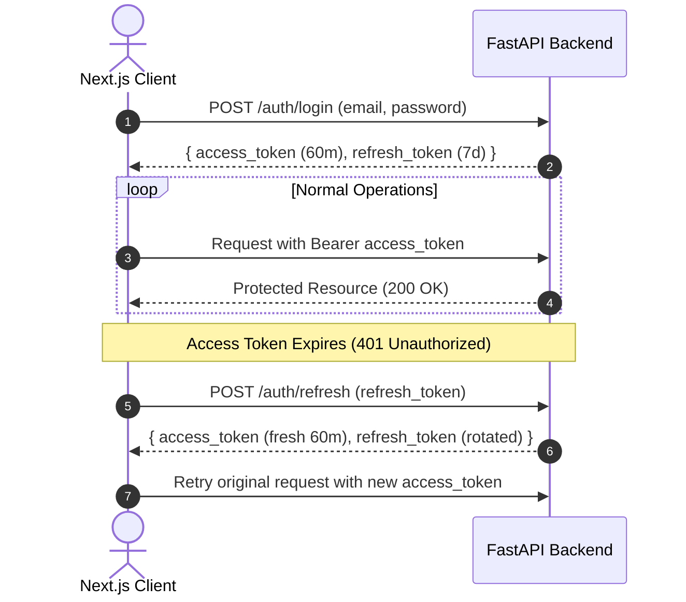

# Authentication and Role-Based Access Control (RBAC)

This document explains the architectural rationale behind FlowForge's authentication mechanism, token lifecycle, and authorization model, as well as the deliberate trade-offs and features currently omitted from the implementation.

---

## 1. Why JWTs Over Server-Side Sessions

When designing authentication for an API-driven platform with a separate frontend dashboard, there are two standard approaches: **server-side sessions** (storing a session ID in a cookie and querying Redis or PostgreSQL on every request) or **stateless JSON Web Tokens (JWTs)**.

FlowForge uses stateless JWTs signed via HMAC-SHA256 (`python-jose`).

### The Advantages for FlowForge
1. **Stateless Verification**: The FastAPI control plane verifies incoming requests purely through mathematical signature validation using the shared `JWT_SECRET`. It does not make a database query or Redis lookup just to check if the caller is authenticated.
2. **Horizontal Scalability**: If the FastAPI backend is scaled to multiple container instances behind a load balancer, any container can validate any request without requiring shared session caching or sticky sessions.
3. **Decoupled Architecture**: The frontend communicates with the backend as a pure REST API client. Bearer tokens in the `Authorization` header work identically whether requests originate from the Next.js browser client, automated CI test suites, or curl scripts.

---

## 2. Token Rotation: Short-Lived Access vs. Long-Lived Refresh Tokens

A major risk with pure JWT authentication is token revocation: because tokens are stateless, an issued token remains valid until its expiration timestamp (`exp`) is reached.

To mitigate this exposure window without introducing stateful session tracking, FlowForge implements an **Access + Refresh Token pair**:



- **Short-Lived Access Token (Default: 60 minutes)**: Carries the user's identity (`sub`) and role (`role`). If an access token is intercepted or leaked, the attacker's window of opportunity is bounded by the expiration time.
- **Longer-Lived Refresh Token (Default: 7 days)**: Contains a distinct token type claim (`"type": "refresh"`). It cannot be used to access protected workflow or job endpoints; it is strictly accepted at `POST /auth/refresh`.
- **Client-Side Refresh Interceptor**: The frontend API client (`frontend/lib/api.ts`) transparently catches HTTP 401 responses, calls `/auth/refresh` in the background, updates local storage, and retries the failed request without disrupting the user.

---

## 3. Password Security: bcrypt via Passlib

FlowForge uses `passlib` with `bcrypt` for password hashing.
- **Salt Generation**: Every password receives a unique, cryptographically random salt automatically, preventing rainbow table attacks.
- **Adaptive Work Factor**: Unlike standard cryptographic hashing algorithms (such as SHA-256 or MD5), bcrypt is intentionally CPU- and memory-intensive. This makes offline brute-force and dictionary attacks computationally infeasible if database records are ever compromised.

---

## 4. Why Three Coarse-Grained Roles Over Granular Permissions

FlowForge defines three static roles in `UserRole`:
- **`admin`**: Full access to all resources, system endpoints, and the Dead-Letter Queue (DLQ).
- **`member`**: Standard tenant. Can create, edit, trigger, and delete their own workflows and jobs.
- **`viewer`**: Read-only tenant. Can view workflows and job runs they own, but cannot trigger or mutate resources.

### The Trade-Off
- **What We Gained**: Extreme implementation simplicity. Role checks are declarative and lightweight:
  ```python
  current_user: User = Depends(require_role("admin"))
  ```
  We avoided the overhead of maintaining dynamic permission tables (`permissions`, `role_permissions`), complex many-to-many database joins, and runtime access control list (ACL) evaluation on every request.
- **What We Traded Away**: Flexibility. FlowForge currently cannot express fine-grained permissions, such as *"User A can view Workflow 1 and edit Workflow 2, but cannot trigger Job 3."* All authorization boundaries are coarse-grained at the role and ownership level (`workflow.owner_id == current_user.id or is_admin`).

---

## 5. Honest Gaps & Out-of-Scope Features

To keep the platform focused on core job orchestration rather than building an enterprise identity provider, several standard auth features were intentionally deferred:

1. **No OAuth / Social SSO (Google, GitHub)**: Users must register with a local email and password. There is no third-party OAuth redirect handshake or token exchange.
2. **No Multi-Factor Authentication (MFA / 2FA)**: Accounts are protected solely by single-factor passwords. TOTP authenticator app support is not implemented.
3. **No Automated Password Reset Flow**: If a user forgets their password, there is no email-based reset link mechanism because FlowForge does not integrate an external SMTP or transactional email delivery service. Password updates require manual database administration.
4. **Local Token Storage in Frontend**: For development ergonomics, tokens are stored in the browser's `localStorage` rather than HTTP-only, secure, SameSite cookies. In a hardened production deployment, moving to HTTP-only cookies would be necessary to protect against cross-site scripting (XSS) token extraction.