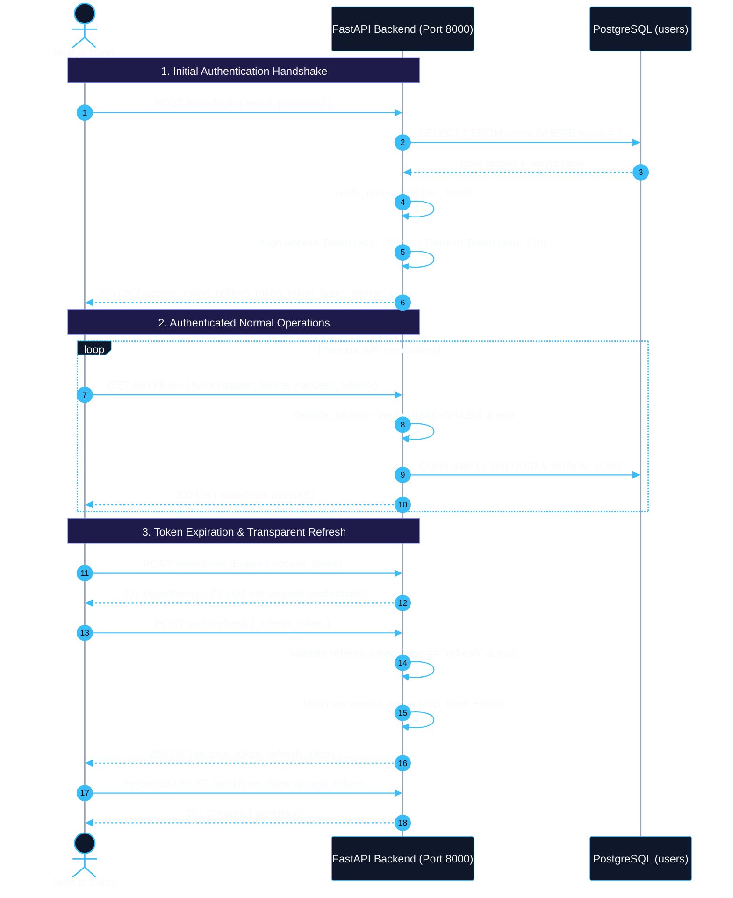
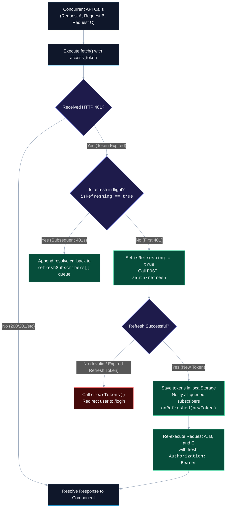
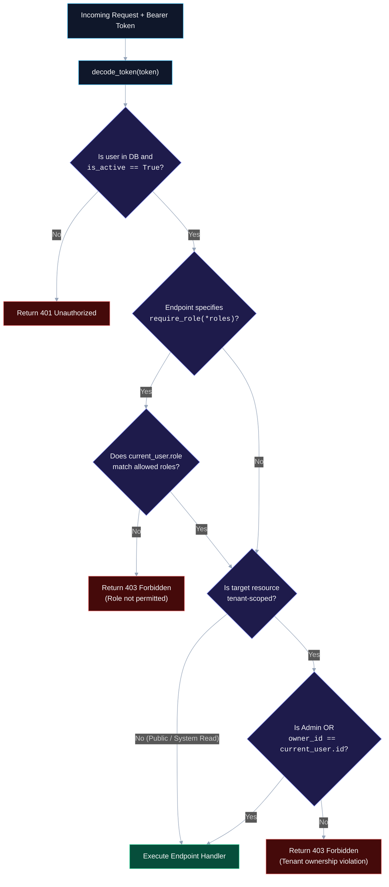

# Authentication and Role-Based Access Control (RBAC) Architecture

This document provides an in-depth architectural explanation of FlowForge's identity verification, stateless token lifecycle, and role-based access control (RBAC) authorization models. It details the design decisions, cryptographic choices, concurrency patterns, and deliberate trade-offs made across the platform.

---

## 1. Architectural Foundation: Stateless JWTs vs. Stateful Sessions

When designing authentication for a decoupled, distributed platform consisting of an asynchronous control plane (FastAPI), a background execution worker cluster (Celery), and a client-side dashboard (Next.js), two primary identity paradigms exist:

1. **Server-Side Stateful Sessions**: The server generates a random session identifier stored in a client cookie, while persisting active session state, user metadata, and expiration timestamps inside a centralized datastore (such as Redis or PostgreSQL).
2. **Stateless JSON Web Tokens (JWTs)**: The server cryptographically signs a self-contained JSON payload using a shared symmetric secret (`JWT_SECRET`) or asymmetric key pair. The client transmits this token in the `Authorization: Bearer <token>` HTTP header with every request.



### Why FlowForge Chose Stateless JWTs
- **Zero I/O Control Plane Validation**: The cryptographic signature verifies that claims (user ID, permissions, issue timestamp) were minted by a trusted FlowForge instance without performing remote network roundtrips to Redis or PostgreSQL to check session validity.
- **Horizontal Gateway Scalability**: Because the API gateway maintains no in-memory session state, incoming HTTP traffic can be arbitrarily load-balanced across multiple FastAPI replicas without requiring sticky sessions or distributed session synchronization.
- **Unified Client Semantics**: The API acts as a pure REST boundary. The authorization mechanism operates identically regardless of whether the caller is the Next.js browser dashboard, a Python SDK script, a CI/CD test harness, or a curl command.

---

## 2. Token Lifecycle & Dual-Token Strategy

A fundamental vulnerability of purely stateless tokens is the inability to easily revoke access before expiration without re-introducing stateful tracking (such as a token revocation blacklist). If an access token with a 30-day lifetime is compromised, the attacker retains access for the entire 30 days.

To minimize the window of vulnerability while maintaining scalability, FlowForge implements a **dual-token architecture**:

| Token Type | Lifespan | Scope / Permitted Usage | Claims Payload (`data`) |
| :--- | :--- | :--- | :--- |
| **Access Token** | 60 minutes (`JWT_EXPIRE_MINUTES`) | Authorizes all standard platform endpoints (`/workflows`, `/jobs`, `/dead-letters`). | `sub` (User UUID), `role` (`admin`/`member`/`viewer`), `iat`, `exp`, `type: "access"` |
| **Refresh Token** | 7 days (`REFRESH_TOKEN_EXPIRE_DAYS = 7`) | Strictly restricted to `POST /auth/refresh`. Rejected by all resource endpoints. | `sub` (User UUID), `role`, `iat`, `exp`, `type: "refresh"` |

### Token Type Enforcement in the Dependency Layer
FlowForge strictly enforces token type segregation inside [backend/app/core/deps.py](file:///d:/Edutation%28P%29/FlowForge/backend/app/core/deps.py). If a client attempts to present a long-lived refresh token to a protected endpoint like `POST /workflows`, the request is immediately rejected with HTTP 401:

```python
payload = decode_token(token)
token_type = payload.get("type")
if token_type != "access":
    raise HTTPException(
        status_code=status.HTTP_401_UNAUTHORIZED,
        detail="Invalid token type: access token required",
        headers={"WWW-Authenticate": "Bearer"},
    )
```

Conversely, the `POST /auth/refresh` endpoint in [backend/app/api/auth.py](file:///d:/Edutation%28P%29/FlowForge/backend/app/api/auth.py) explicitly asserts `payload.get("type") == "refresh"`.

---

## 3. Client-Side Concurrency & Token Refresh Interceptor

In modern single-page applications, multiple components frequently trigger asynchronous HTTP requests concurrently upon page load (e.g., fetching user profile, workflow catalogs, and active jobs simultaneously). If the access token expires while multiple requests are in flight, a naive client would trigger a "thundering herd" of redundant `/auth/refresh` calls, leading to race conditions and potential logout errors.

To solve this, FlowForge's frontend HTTP client in [frontend/src/lib/api.ts](file:///d:/Edutation%28P%29/FlowForge/frontend/src/lib/api.ts) implements an **in-flight refresh lock and subscriber queue**:



### Refresh Token Retention vs. Rotation Trade-off
In FlowForge's current implementation, `POST /auth/refresh` returns the newly minted short-lived `access_token` while retaining the existing `refresh_token` until its 7-day expiration. 

- **Advantage**: Simplicity and extreme resilience against network drops. If a refresh request succeeds on the backend but the response packet drops over a flaky mobile connection, the client can safely retry the refresh without being permanently locked out.
- **Trade-off**: A leaked refresh token remains usable for the remainder of its 7-day lifespan unless an administrator manually deactivates the user record (`is_active = False`) in PostgreSQL.

---

## 4. Cryptographic Implementation: bcrypt & Passlib

User credentials are protected using the `bcrypt` adaptive key-derivation function through `passlib.context.CryptContext` in [backend/app/core/security.py](file:///d:/Edutation%28P%29/FlowForge/backend/app/core/security.py):

```python
pwd_context = CryptContext(schemes=["bcrypt"], deprecated="auto")

def verify_password(plain_password: str, hashed_password: str) -> bool:
    return pwd_context.verify(plain_password, hashed_password)

def get_password_hash(password: str) -> str:
    return pwd_context.hash(password)
```

### Architectural Rationale
1. **Per-User Automatic Salt Generation**: Bcrypt transparently generates a 128-bit cryptographically secure pseudorandom salt for every password hashed. Even if two users choose identical passwords, their resulting database hashes differ completely, neutralizing pre-computed dictionary and rainbow table attacks.
2. **Computational Work Factor (Slowness by Design)**: Unlike cryptographic digest algorithms designed for high throughput (such as SHA-256 or MD5), bcrypt is deliberately computationally intensive. A high cost factor forces an attacker performing an offline dictionary attack on a stolen database dump to consume orders of magnitude more GPU/CPU cycles per hash guess, making brute force economically unviable.

---

## 5. Role-Based Access Control (RBAC) & Multi-Tenant Authorization

FlowForge utilizes a declarative, two-tier authorization model:

1. **System-Level Role Guards**: Enforced via FastAPI dependency injection (`require_role`).
2. **Resource-Level Tenant Ownership**: Evaluated within the route handler based on entity ownership columns (`workflow.owner_id == current_user.id`).



### Role Hierarchy & Capability Matrix

The platform models three static roles in [backend/app/models/user.py](file:///d:/Edutation%28P%29/FlowForge/backend/app/models/user.py):

| Role Identifier | Workflows & Jobs (Owned) | Workflows & Jobs (Other Users) | Dead-Letter Queue (DLQ) | System Health & Metrics |
| :--- | :--- | :--- | :--- | :--- |
| **`admin`** | Full (Create, Read, Update, Run, Delete) | Full (Inspect, Audit, Cancel all jobs) | Full Access (Inspect DLQ, Requeue quarantined tasks) | Full Read Access |
| **`member`** | Full (Create, Read, Update, Run, Delete own) | Strictly Denied (HTTP 403) | Strictly Denied (HTTP 403) | Basic Health Checks |
| **`viewer`** | Read-Only (Inspect own workflows & jobs) | Strictly Denied (HTTP 403) | Strictly Denied (HTTP 403) | Basic Health Checks |

### The Declarative Role Dependency Factory
In [backend/app/core/deps.py](file:///d:/Edutation%28P%29/FlowForge/backend/app/core/deps.py), the `require_role` function acts as a reusable higher-order dependency factory:

```python
def require_role(*roles: Union[str, UserRole]) -> Callable[..., User]:
    allowed_roles = {r.value if isinstance(r, UserRole) else str(r) for r in roles}

    def role_checker(current_user: User = Depends(get_current_user)) -> User:
        current_role = current_user.role.value if isinstance(current_user.role, UserRole) else str(current_user.role)
        if current_role not in allowed_roles:
            raise HTTPException(
                status_code=status.HTTP_403_FORBIDDEN,
                detail=f"Operation not permitted. Required role: {', '.join(allowed_roles)}",
            )
        return current_user

    return role_checker
```

This pattern guarantees compile-time readability and prevents accidental privilege escalation:
```python
@router.post("/{dead_letter_id}/requeue")
def requeue_dead_letter(
    dead_letter_id: uuid.UUID,
    db: Session = Depends(get_db),
    current_user: User = Depends(require_role("admin")), # Guaranteed Admin-only
):
    ...
```

---

## 6. Architectural Trade-Offs & Production Hardening Roadmap

To keep FlowForge focused on core distributed pipeline execution and deterministic job reliability, several enterprise identity features were deliberately excluded in the current design. 

Below is an honest evaluation of these architectural trade-offs:

### 1. Browser Token Storage: `localStorage` vs. `HttpOnly` Cookies
- **Current Choice**: Tokens are persisted in the browser's `localStorage` via [frontend/src/lib/api.ts](file:///d:/Edutation%28P%29/FlowForge/frontend/src/lib/api.ts).
- **Why**: Drastically simplifies local development, eliminates Cross-Origin Request Sharing (CORS) cookie negotiation issues across different ports (`localhost:3000` vs `localhost:8000`), and works cleanly with non-browser API clients (Python scripts, curl).
- **The Risk**: Any malicious JavaScript injected via a Cross-Site Scripting (XSS) vulnerability can read `localStorage` and exfiltrate tokens.
- **Production Hardening**: In high-security production deployments, the frontend and backend should sit behind a unified reverse proxy (e.g. Nginx or Cloudflare) on the same top-level domain. Tokens should be stored inside `HttpOnly; Secure; SameSite=Strict` cookies, preventing JavaScript access entirely.

### 2. Immediate Token Revocation & Blocklisting
- **Current Choice**: Revocation is bound to the token's expiration timestamp (`exp`). Deactivating a user (`is_active = False`) blocks them on their next request because `get_current_user` queries PostgreSQL, but there is no distributed revocation blocklist for in-flight tokens.
- **Why**: Avoids querying Redis on every single microsecond-level API request, maintaining the pure performance benefits of stateless JWT verification.
- **Production Hardening**: A Redis-backed Deny-List (`jti` claim lookup) can be introduced to support instantaneous token invalidation upon user logout or password reset.

### 3. Identity Federation & Single Sign-On (SSO)
- **Current Choice**: Local username/password authentication via PostgreSQL.
- **Why**: Eliminates external dependencies on third-party OAuth2 providers (Google, GitHub, Okta) during local Docker or offline deployments.
- **Production Hardening**: Incorporating an OpenID Connect (OIDC) middleware layer to support enterprise SAML 2.0 / Okta authentication for corporate deployments.

---

## Related Documentation & References

- [REST API Reference](../04-reference/api-reference.md) — Endpoint request and response schemas, auth endpoints, and error codes.
- [Environment Variables Specification](../04-reference/environment-variables.md) — Configuration parameters for `JWT_SECRET`, `JWT_EXPIRE_MINUTES`, and `CORS_ORIGINS`.
- [Relational Data Model & Architecture](../04-reference/data-model.md) — `users` table schema, constraints, and cascading integrity rules.
- [Managing Dead Letters Guide](../03-how-to-guides/managing-dead-letters.md) — Administrative workflows guarded by the `require_role("admin")` dependency.
- [Design Decisions and Trade-offs](design-decisions-and-tradeoffs.md) — Full platform design rationale and distributed architecture choices.