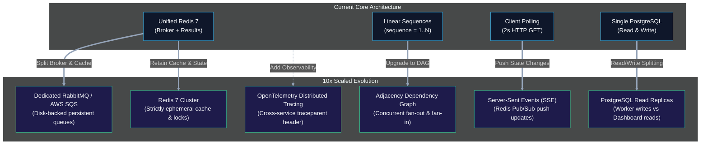

# Design Decisions and Trade-offs: An Architectural Synthesis

Every distributed software architecture is a series of deliberate compromises. When architecting an asynchronous task execution and workflow orchestration engine, the temptation to reach for complex enterprise-scale abstractions—distributed consensus protocols, event sourcing, multi-broker topologies, and arbitrary directed graph solvers—is immense.

Across every layer of FlowForge, we resisted premature complexity in favor of **radical simplicity, mechanical sympathy, operational ergonomics, and bounded blast radiuses**.

This document outlines the philosophical principles guiding FlowForge's technical choices, provides deep-dive analyses of our core architectural trade-offs, and details the engineering evolution required to scale the platform by an order of magnitude.

---

## 1. The Core Philosophy: Bounded Complexity Over Hypothetical Scale

A distributed system that is simple to reason about is simple to operate, debug, test, and containerize. The foundational tenet of FlowForge is that **predictable operational characteristics trump theoretical feature completeness**.

```mermaid
%%{init: {
  'theme': 'dark',
  'themeVariables': {
    'darkMode': true,
    'background': '#0b0f19',
    'primaryColor': '#1e293b',
    'primaryTextColor': '#f8fafc',
    'primaryBorderColor': '#38bdf8',
    'lineColor': '#94a3b8'
  }
}}%%
flowchart LR
    subgraph Theoretical ["The Theoretical 'Enterprise' Trap"]
        direction TB
        E1["Apache Kafka + ZooKeeper<br/>(Heavy JVM & Storage Fabric)"]
        E2["Arbitrary Dynamic DAGs<br/>(Topological graph resolution)"]
        E3["Event Sourcing & CQRS<br/>(Eventual consistency lag)"]
        E4["Full Mesh WebSockets<br/>(Stateful connection pinning)"]
        E5["Complex Dynamic ABAC<br/>(Expensive runtime join graphs)"]
    end

    subgraph FlowForge ["The FlowForge Engineering Reality"]
        direction TB
        F1["Unified Redis 7<br/>(Ephemeral Broker & Backend)"]
        F2["Deterministic Linear Sequences<br/>(1-indexed SQL sequence model)"]
        F3["Normalized PostgreSQL 16<br/>(ACID relational state machine)"]
        F4["Stateless Client Polling<br/>(Zero server connection tracking)"]
        F5["Coarse RBAC + Tenant Ownership<br/>(Declarative FastAPI guards)"]
    end

    Theoretical -.->|"Deliberately Excluded For"| FlowForge

    classDef enterprise fill:#450a0a,stroke:#f87171,stroke-width:1px,color:#f8fafc;
    classDef flowforge fill:#064e3b,stroke:#34d399,stroke-width:1px,color:#f8fafc;
    class E1,E2,E3,E4,E5 enterprise;
    class F1,F2,F3,F4,F5 flowforge;
```



### Architectural Dividends of This Philosophy
1. **Instantaneous Local Orchestration**: The entire four-tier stack (PostgreSQL, Redis, FastAPI, Celery, Next.js) boots from a clean checkout in under 10 seconds via a single, transparent [docker-compose.yml](file:///d:/Edutation%28P%29/FlowForge/infrastructure/docker-compose.yml).
2. **Sub-Second Test Execution**: The backend test suite executes 69 end-to-end integration and unit tests with SQLite/eager Celery drivers in less than 5 seconds in CI, eliminating the friction of mocked distributed infrastructure.
3. **Zero-Ambiguity Failure Modes**: When a task fails, its state transition is deterministic and atomic. Operators can inspect the entire failure history and retry countdown directly in PostgreSQL without correlating multi-system event logs.

---

## 2. Architectural Trade-off Evaluation Matrix

| Subsystem Dimension | The Complex Enterprise Pattern | The FlowForge Implementation | What We Gained | What We Traded Away |
| :--- | :--- | :--- | :--- | :--- |
| **Message Broker Fabric** | RabbitMQ + Redis or Apache Kafka | **Single Redis 7 Instance** | Single broker container; shared Celery result backend; lightweight memory footprint (<50MB). | In-memory queue limits; risk of memory exhaustion under millions of pending tasks with large payloads. |
| **Pipeline Workflow Model** | Arbitrary Directed Acyclic Graphs (DAGs) | **Strict Linear Sequences** | 1-indexed deterministic step progression; atomic sequence queries; elimination of cycle detection. | Cannot run parallel branch fan-out / fan-in steps within a single workflow execution. |
| **Task Prioritization** | Granular numeric AMQP priorities (0–255) | **3 Tiered Physical Queues (`high`, `default`, `low`)** | Native Redis list operations (`LPUSH`/`BRPOP`); strict worker consumption order; zero queue starvation. | Priority is quantized into three coarse tiers; fine-grained sub-tier prioritization is not supported. |
| **Dashboard State Sync** | Stateful WebSockets or SSE | **Lightweight Client Polling (2s intervals)** | Fully stateless backend control plane; zero socket leak risks; trivial horizontal auto-scaling. | Slight latency (up to 2 seconds) for UI updates; increased baseline read queries against PostgreSQL. |
| **Authorization & Security** | Dynamic Attribute-Based Access Control (ABAC) | **3 Static Roles (`admin`, `member`, `viewer`) + Ownership** | Fast declarative dependencies (`require_role`); zero join overhead; clear audit boundaries. | Cannot express arbitrary permissions (e.g. "User X can view Workflow Y but only edit Step 2"). |
| **Storage & Consistency** | Event Sourcing & CQRS | **PostgreSQL 16 Relational State Machine** | Immediate ACID consistency; strict relational cascading (`ON DELETE CASCADE`); foreign key guarantees. | High write concurrency requires connection pooling and eventual read/write splitting at extreme scale. |

---

## 3. Deep-Dive Architectural Analyses

### Decision 1: Unified Redis 7 vs. Kafka / RabbitMQ Dual-Broker Topologies

#### The Trade-Off
In large-scale enterprise deployments, operators frequently pair **RabbitMQ** (for complex routing and message acknowledgment guarantees) or **Apache Kafka** (for distributed immutable event streaming) with **Redis** (for fast key-value caching). 

FlowForge collapses this into a **single Redis 7 instance** acting as both the Celery message broker and the task result backend.

```mermaid
%%{init: {
  'theme': 'dark',
  'themeVariables': {
    'darkMode': true,
    'background': '#0b0f19',
    'primaryColor': '#1e293b',
    'primaryTextColor': '#f8fafc',
    'primaryBorderColor': '#38bdf8',
    'lineColor': '#94a3b8'
  }
}}%%
graph TD
    subgraph Enterprise ["Dual-Broker Complexity (Excluded)"]
        API_ENT["FastAPI Control Plane"] -->|"AMQP Protocol"| RMQ["RabbitMQ Broker<br/>(Erlang VM, Mnesia Clustering)"]
        RMQ -->|"Consume"| WRK_ENT["Celery Workers"]
        WRK_ENT -->|"Store Result"| REDIS_ENT["Redis Cache"]
        API_ENT -->|"Read Result"| REDIS_ENT
    end

    subgraph FlowForgeArch ["FlowForge Unified Architecture (Selected)"]
        API_FF["FastAPI Control Plane"] -->|"Redis Protocol (TCP 6379)"| REDIS_FF["Single Redis 7 Container<br/>Lists: high, default, low<br/>Key-Value: celery-task-meta-*"]
        REDIS_FF -->|"BRPOP"| WRK_FF["Celery Worker Cluster"]
        WRK_FF -->|"Result & State"| REDIS_FF
    end

    classDef ent fill:#1e1b4b,stroke:#818cf8,stroke-width:1px,color:#f8fafc;
    classDef ff fill:#0f172a,stroke:#34d399,stroke-width:1px,color:#f8fafc;
    class API_ENT,RMQ,WRK_ENT,REDIS_ENT ent;
    class API_FF,REDIS_FF,WRK_FF ff;
```



#### Why This Was Chosen
1. **Operational Ergonomics**: Redis has negligible operational overhead compared to RabbitMQ (which requires managing Erlang cookies and cluster state) or Kafka (requiring JVM tuning and partition balancing).
2. **Minimal Failure Domains**: Eliminating an external broker reduces the number of stateful network hops, connection pool configurations, and container healthchecks from two down to one.
3. **High Throughput with Low Latency**: Redis processes in-memory list push and pop operations in sub-millisecond durations, providing more than enough performance for thousands of tasks per minute.

---

### Decision 2: Strict Linear Sequences vs. Arbitrary Directed Acyclic Graphs (DAGs)

#### The Trade-Off
Enterprise orchestrators like Apache Airflow, Prefect, and Temporal model workflows as arbitrary Directed Acyclic Graphs (DAGs), permitting complex branch fan-outs, parallel join conditions, and conditional dynamic paths.

FlowForge models workflow definitions strictly as an **ordered array of sequential task steps**:

```json
[
  { "name": "Step 1", "type": "log_message", "config": { ... } },
  { "name": "Step 2", "type": "http_call", "config": { ... } },
  { "name": "Step 3", "type": "sleep", "config": { ... } }
]
```

#### Why This Was Chosen
1. **Mathematical Simplicity**: A linear chain requires no cycle detection algorithms (Tarjan's or Kahn's algorithms) during workflow submission. A step's execution prerequisite is simply `sequence = current_sequence - 1 AND status = 'completed'`.
2. **Relational Cleanliness**: Tasks are stored with a simple `sequence` integer column in PostgreSQL. Querying the next step or finding active progress requires a trivial SQL index lookup:
   ```sql
   SELECT * FROM tasks 
   WHERE job_id = :job_id AND sequence = :next_seq;
   ```
3. **Deterministic Blast Radius**: If Step 2 fails, Step 3 never executes. The pipeline halts cleanly, and quarantine state is immediately transparent.

---

### Decision 3: Tiered Physical Queues vs. Granular Numeric Priorities

#### The Trade-Off
The AMQP 0-9-1 specification supports message prioritization integers (0–255). However, when Celery is paired with Redis, Redis lacks native priority queues; it simulates priorities using multiple internal Redis lists or sorted sets, which can lead to unpredictable consumption order and starvation.

FlowForge implements **three physical Celery queues** mapped via [backend/app/core/queue_routing.py](file:///d:/Edutation%28P%29/FlowForge/backend/app/core/queue_routing.py):

| Priority Score | Celery Queue Name | Worker Consumption Order |
| :--- | :--- | :--- |
| **1 – 3** | `high` | Consumed First |
| **4 – 7** | `default` | Consumed Second |
| **8 – 10** | `low` | Consumed Last |

Workers are explicitly instructed to consume in strict priority order via:
```bash
celery -A worker.celery_app worker -Q high,default,low
```

#### Why This Was Chosen
- **Guaranteed Strict Priority**: Celery's `BRPOP` command queries Redis lists in the order they are defined (`high` first, then `default`, then `low`). A `low` priority task is mathematically guaranteed never to preempt a pending `high` priority task.
- **Starvation Protection**: By routing bulk batch jobs to `low` and user-facing interactive triggers to `high`, long-running data ingestion runs cannot block operational alerts or high-priority webhooks.

---

### Decision 4: Client Polling vs. Full-Duplex WebSockets

#### The Trade-Off
To reflect job progress in the Next.js frontend, modern web architectures often reach for WebSockets or Server-Sent Events (SSE) to push updates instantly.

FlowForge implements **short-interval client-side polling** (every 2 seconds) on active job detail screens.

#### Why This Was Chosen
1. **Stateless Control Plane**: WebSockets require the API server to maintain stateful, open TCP connections. This complicates horizontal scaling behind load balancers (requiring sticky sessions or a distributed Redis Pub/Sub backplane).
2. **Resilience to Network Jitter**: If a user's laptop sleeps or switches Wi-Fi networks, WebSocket connections sever and require complex reconnection and message replay logic. HTTP polling recovers transparently on the very next fetch interval.
3. **Negligible Database Load**: FlowForge's database indexes `jobs.id` and `tasks.job_id`. A single `GET /jobs/{id}` query completes in under 1 millisecond on PostgreSQL 16, resulting in virtually undetectable resource consumption for standard teams.

---

## 4. The 10x Scale Evolution Blueprint

While the current architecture reliably supports hundreds of concurrent jobs and thousands of daily pipeline runs, scaling the platform by an order of magnitude (10,000+ concurrent jobs and millions of daily task dispatches) would stress specific architectural seams.

Below is the verified engineering roadmap for evolving FlowForge to 10x scale:



### 1. Message Broker Decoupling
- **The Bottleneck**: Redis stores queue payloads entirely in RAM. A sustained backlog of 500,000 tasks containing large JSON bodies risks memory exhaustion and OOM termination.
- **The Solution**: Transition the Celery broker to **RabbitMQ** or **Amazon SQS** with disk persistence, retaining Redis strictly as an ephemeral cache and result store.

### 2. Task Idempotency & Distributed Locking
- **The Bottleneck**: If a worker node crashes mid-execution or suffers a network timeout, Celery may re-deliver the task unacknowledged, resulting in duplicate execution of external side-effects (e.g. charging a payment card or posting a duplicate webhook).
- **The Solution**: Implement mandatory **Idempotency Keys** generated at task creation and enforced via distributed Redis locks (`Redlock`) or PostgreSQL advisory locks.

### 3. Orchestration Engine: Linear Chains to Dynamic DAGs
- **The Bottleneck**: Data pipelines frequently require parallel operations (e.g. processing 10 partitions simultaneously before aggregating results).
- **The Solution**: Replace the `sequence` integer with an explicit `task_dependencies` adjacency table (`parent_task_id`, `child_task_id`). The orchestrator calculates in-degree node counts upon task completion, dispatching all unblocked child tasks concurrently.

### 4. Database Read/Write Splitting
- **The Bottleneck**: Hundreds of dashboard users polling `GET /jobs/{id}` every 2 seconds generate competing read traffic against PostgreSQL, consuming connection pools needed by workers for status writes.
- **The Solution**: Route frontend dashboard queries to **PostgreSQL Read Replicas**, reserving the primary database instance strictly for worker write transactions.

### 5. OpenTelemetry Distributed Tracing
- **The Bottleneck**: Diagnosing latency across FastAPI, Redis, Celery, and third-party HTTP endpoints requires manually correlating timestamps across disparate container log files.
- **The Solution**: Inject OpenTelemetry middleware into FastAPI and Celery. Propagating a standard `traceparent` header across Celery task metadata will provide unified end-to-end trace waterfalls in Jaeger or Datadog.

---

## Related Documentation & References

- [Job Lifecycle and Orchestration](job-lifecycle-and-orchestration.md) — Detailed explanation of state progression and task dispatching.
- [Priority Queue Design](priority-queue-design.md) — Complete breakdown of the 3-tier physical queue architecture.
- [Retry and Dead-Letter Strategy](retry-and-dead-letter-strategy.md) — Technical rationale for exponential backoff and quarantine isolation.
- [Authentication and RBAC](auth-and-rbac.md) — Architectural analysis of stateless JWTs and authorization guards.
- [Relational Data Model & Architecture](../04-reference/data-model.md) — Database schema specifications and cascading referential integrity.
- [Architecture Diagram & System Topologies](../01-introduction/architecture-diagram.md) — Multi-container network topologies and communication boundaries.