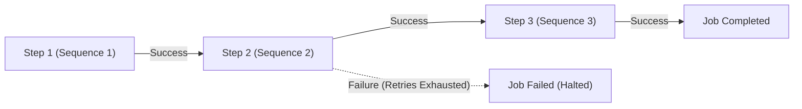
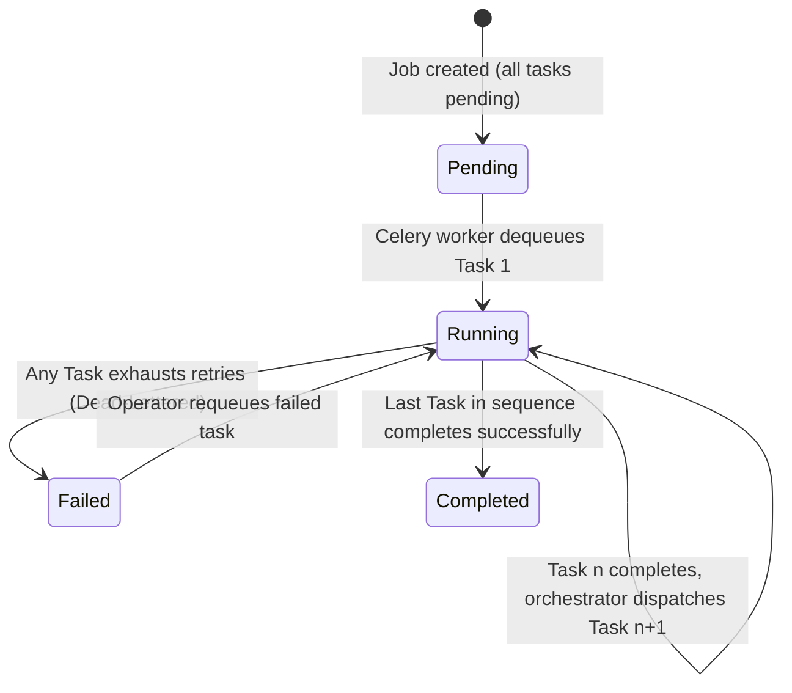

# Job Lifecycle and Orchestration

This document explains how FlowForge coordinates multi-step pipelines, derives overall job execution status from individual task outcomes, and manages real-time status synchronization with the web dashboard.

---

## 1. Linear Sequential Execution vs. Full DAGs

A central design decision in FlowForge is that **workflows execute as strictly ordered, linear task chains** (`sequence = 1, 2, 3, ...`) rather than arbitrary Directed Acyclic Graphs (DAGs).



### Why We Chose a Linear Chain
1. **Mathematical & Conceptual Simplicity**: Modeling a linear pipeline requires only an integer `sequence` column on the `tasks` table. Determining the next task is a single indexed SQL query:
   ```python
   next_task = (
       db.query(Task)
       .filter(Task.job_id == job.id, Task.sequence > task.sequence)
       .order_by(Task.sequence.asc())
       .first()
   )
   ```
2. **Deterministic State Transitions**: There are no race conditions involving join nodes, topological sorting, or conditional branching paths. A step either succeeds and unblocks the next sequence number, or it fails and halts the entire pipeline.
3. **Operational Clarity**: Operators looking at a job in the dashboard see a clear, chronological top-to-bottom progress bar.

### The Trade-Off & Current Limitation
FlowForge **cannot express fan-out / fan-in parallel execution**. For example, you cannot configure:
> *"Run Step A; then run Step B and Step C simultaneously in parallel; once both finish, run Step D."*

Every step must execute strictly in serial order. If Step B takes 5 minutes, Step C cannot begin until Step B finishes, even if the two steps are logically independent.

---

## 2. Deriving Job Status from Task Outcomes

Rather than running an independent, persistent background scheduler service that monitors jobs and mutates their state, **a job's lifecycle is derived directly from its tasks' outcomes**.



### Orchestration Mechanics (`worker/tasks/orchestrate.py`)
Orchestration logic is event-driven and runs inside the worker process immediately upon completing a task:

1. **When Task 1 Starts**: The worker checks if `Job.status == "pending"`. If so, it stamps `Job.status = "running"` and records `Job.started_at`.
2. **When Any Task Fails Permanently**: If a task exhausts all retry attempts, `execute_task` marks the task `failed`, creates a `DeadLetterTask` record, and calls `handle_task_completion`. The orchestrator immediately marks `Job.status = "failed"` and stamps `Job.completed_at`. **Downstream tasks remain `pending` and are never dispatched.**
3. **When a Task Completes Successfully**: The orchestrator searches for the next task in ascending sequence order.
   - If a next task exists, it is dispatched to Celery via Redis preserving the job's priority tier.
   - If no subsequent task exists, the pipeline is finished: `Job.status = "completed"` is committed.

### Why This Keeps the System Resilient
There is no central "master node" or scheduler process that can crash and leave jobs orphaned in memory. The database acts as the single source of truth, and each worker autonomously drives the state machine forward as tasks complete.

---

## 3. Real-Time Status: Polling vs. WebSockets / Server-Sent Events

When a user triggers a job in the dashboard, the UI needs to display status transitions in near real-time. FlowForge implements this using **lightweight client-side HTTP polling** rather than WebSockets or Server-Sent Events (SSE).

### How Polling Works in Practice
Inside `frontend/src/app/jobs/[id]/page.tsx`, the component initiates a 2-second interval upon mount:
```typescript
pollIntervalRef.current = setInterval(() => {
  fetchJob(true); // Silent background fetch without UI flickering
}, 2000);
```

When `fetchJob` observes that `job.status` has reached a terminal state (`completed`, `failed`, or `cancelled`), it immediately executes `clearInterval` to stop polling.

### Why Polling Was Chosen
1. **Zero Infrastructure Complexity**: WebSockets require stateful connection tracking, persistent TCP sockets, heartbeat pings, and sticky sessions or Redis pub/sub bridges across horizontally scaled web servers.
2. **Resilient to Network Interruptions**: If a user's laptop sleeps or disconnects from Wi-Fi, a WebSocket drops and requires complex reconnection logic. An HTTP polling loop naturally recovers on the next interval without custom retry logic.
3. **Proxy & CDN Friendly**: Standard HTTP `GET` requests pass through corporate firewalls, reverse proxies, and ingress controllers without special WebSocket protocol upgrading.

### The Trade-Off
- **Latency**: There is an average 1-second (up to 2-second) delay between a worker completing a task and the dashboard reflecting the update.
- **Wasted Network Overhead**: When multiple users have active job tabs open, the browser issues queries every 2 seconds regardless of whether the task status changed. For our current scale this overhead is negligible, but at high concurrency it places unnecessary read load on PostgreSQL.