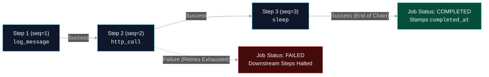
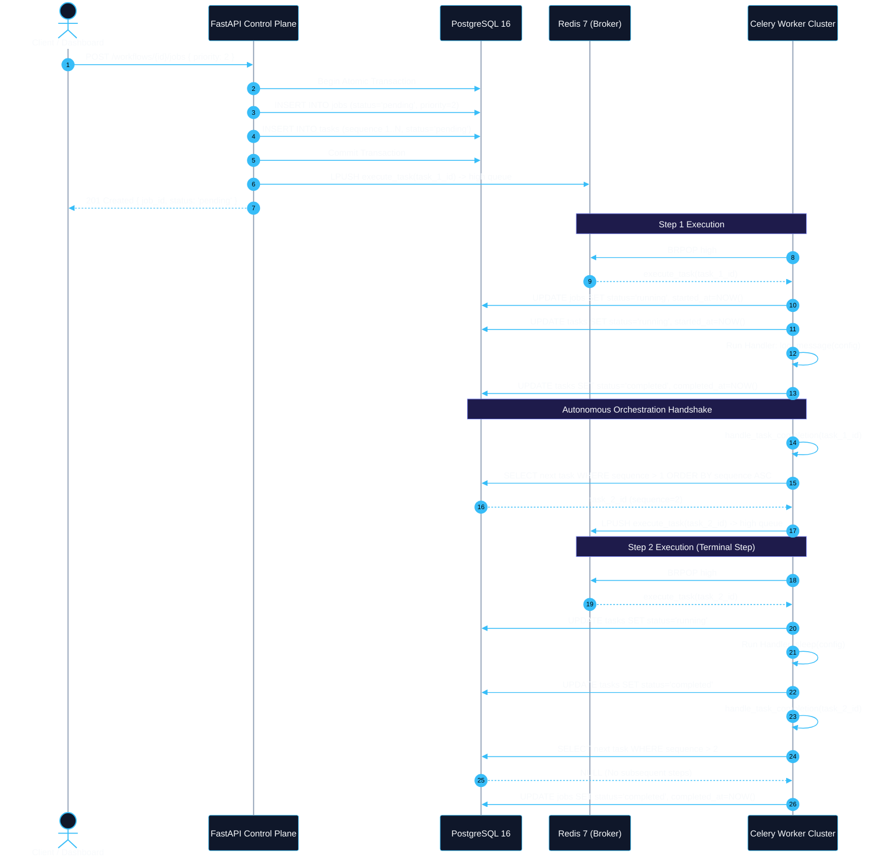
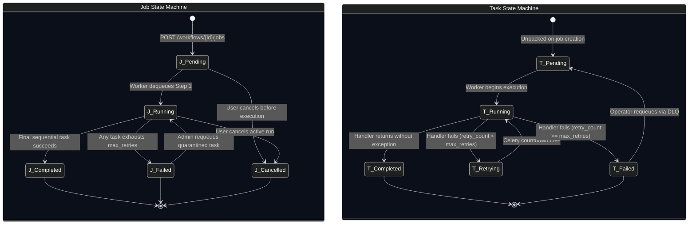

# Job Lifecycle and Orchestration Architecture

This document provides an exhaustive architectural explanation of how FlowForge coordinates multi-step pipelines, manages asynchronous task dispatching, derives overall job execution status from individual task outcomes, and maintains real-time synchronization with the frontend dashboard.

---

## 1. Architectural Model: Linear Sequential Pipelines vs. Dynamic DAGs

A foundational design decision in FlowForge is that **workflows execute as strictly ordered, linear task chains** (`sequence = 1, 2, 3, ...`) rather than arbitrary Directed Acyclic Graphs (DAGs).



### Why FlowForge Chose a Linear Execution Model

1. **Mathematical & Algorithmic Simplicity**:
   In arbitrary DAG systems (such as Apache Airflow or Prefect), workflow execution requires running cycle-detection algorithms (e.g., Tarjan’s or Kahn’s algorithms) on submission, tracking in-degree edge counts, and synchronizing join-node dependencies across distributed nodes. In FlowForge, locating the next step requires a single indexed SQL query:
   ```python
   next_task = (
       db.query(Task)
       .filter(Task.job_id == job.id, Task.sequence > task.sequence)
       .order_by(Task.sequence.asc())
       .first()
   )
   ```
2. **Deterministic State Progression**:
   Race conditions involving concurrent join nodes, parallel deadlocks, and split-brain branch synchronization are structurally eliminated. A task step either succeeds and immediately dispatches the next sequence integer, or it exhausts retries and halts the pipeline cleanly.
3. **Bounded Failure Blast Radius**:
   If Step 2 encounters an unrecoverable exception, Step 3 is never dispatched to the message broker. Downstream steps remain quarantined in `pending` status, avoiding cascading side-effects or partial state corruption.
4. **Predictable Operational Ergonomics**:
   Operators inspecting execution progress in the dashboard or via API can instantly determine pipeline status through a simple 1-indexed progress ratio ($\text{progress} = \frac{\text{completed\_steps}}{\text{total\_steps}}$).

### The Architectural Trade-Off
FlowForge **cannot natively express parallel fan-out / fan-in execution patterns**. For example, a pipeline cannot execute Step A, split into Step B1 and Step B2 simultaneously, and then synchronize at Step C. Every task step must execute serially. (See [Design Decisions and Trade-offs](design-decisions-and-tradeoffs.md) for the 10x roadmap transitioning to adjacency graphs).

---

## 2. End-to-End Orchestration & Task Dispatch Flow

Orchestration in FlowForge is entirely **decentralized and event-driven**. There is no centralized "scheduler process" polling the database or keeping in-memory state machines. Instead, state transitions and task dispatching are autonomously driven by the worker processes as each task reaches completion.



### The Orchestration Lifecycle Stages

#### Stage 1: Job Instantiation & Task Unpacking
When `POST /workflows/{id}/jobs` is invoked in [backend/app/api/jobs.py](file:///d:/Edutation%28P%29/FlowForge/backend/app/api/jobs.py):
1. The API verifies workflow existence, tenant ownership, and active state.
2. A parent `Job` record is created with `status = JobStatus.PENDING`.
3. The workflow's JSON `definition` array is unpacked into discrete rows in the `tasks` table, stamped with sequential 1-indexed integers (`sequence = 1..N`), and defaulted to `TaskStatus.PENDING`.
4. Only **Task 1** (`sequence = 1`) is dispatched to the Celery broker. Downstream tasks remain in the database awaiting orchestration signals.

#### Stage 2: Autonomous Worker Execution (`worker/tasks/execute_task.py`)
When a Celery worker dequeues `execute_task(task_id)`:
1. **Job Status Promotion**: If the parent job is still `pending`, the worker promotes it to `running` and records `Job.started_at`.
2. **Task State Promotion**: The task status is set to `running`, and `Task.started_at` is recorded.
3. **Handler Dispatch**: The worker queries the task registry for the registered function (`log_message`, `sleep`, `http_call`) and passes `task.input_data`.

#### Stage 3: Orchestration & Pipeline Advancement (`worker/tasks/orchestrate.py`)
Inside `handle_task_completion(task_id, db)`:
- **On Success (`TaskStatus.COMPLETED`)**:
  The orchestrator queries the database for the next sequential task (`Task.sequence > current_sequence`).
  - If a subsequent task exists: The orchestrator dispatches `execute_task.apply_async(args=[str(next_task.id)], queue=queue)`, preserving the parent job's priority queue (`high`, `default`, or `low`).
  - If no subsequent task exists: The pipeline has reached terminal success. The orchestrator updates `Job.status = JobStatus.COMPLETED` and sets `Job.completed_at`.
- **On Permanent Failure (`TaskStatus.FAILED`)**:
  If retries are exhausted, the task is marked `failed` and recorded in the Dead-Letter Queue. The orchestrator marks `Job.status = JobStatus.FAILED`, records `Job.completed_at`, and commits. **All downstream tasks remain `pending` and are never scheduled.**

---

## 3. Dual State-Machine Transition Engine

FlowForge enforces strict state machine rules across both the parent `Job` and child `Task` entities:



### Invariant Rules Enforced by the Engine
1. **Single Source of Truth**: The PostgreSQL database is the sole authority for state. If a Celery worker restarts abruptly, state is preserved on disk, and uncommitted steps can be diagnosed.
2. **Terminal State Immutability**: Once a job enters `completed` or `cancelled`, its state is immutable. A `failed` job can only transition back to `running` via an explicit administrative DLQ requeue call (`POST /dead-letters/{id}/requeue`).
3. **No Phantom Executions**: Downstream tasks cannot enter `running` or `completed` unless every preceding sequence number has achieved `completed` status.

---

## 4. Real-Time Status Synchronization: Polling vs. WebSockets

To reflect job progression in the web dashboard in real time, FlowForge uses **lightweight, silent client-side HTTP polling** in [frontend/src/app/jobs/[id]/page.tsx](file:///d:/Edutation%28P%29/FlowForge/frontend/src/app/jobs/%5Bid%5D/page.tsx).

### Implementation Details
```typescript
useEffect(() => {
  if (!id) return;

  // 1. Initial page load fetch
  fetchJob();

  // 2. Continuous 2-second polling interval
  pollIntervalRef.current = setInterval(() => {
    fetchJob(true); // silent=true suppresses loading spinners
  }, 2000);

  // 3. Cleanup on component unmount
  return () => {
    if (pollIntervalRef.current) {
      clearInterval(pollIntervalRef.current);
    }
  };
}, [id]);
```

### Self-Terminating Polling Mechanics
When `fetchJob` receives a response, it evaluates whether the job has entered a terminal state:
```typescript
const terminalStatuses = ["completed", "failed", "cancelled"];
if (terminalStatuses.includes(data.status)) {
  if (pollIntervalRef.current) {
    clearInterval(pollIntervalRef.current);
    pollIntervalRef.current = null;
  }
  setIsPolling(false);
}
```
This guarantees that once a job finishes, background network requests cease immediately, preventing unnecessary bandwidth and server load.

### Architectural Comparison: Polling vs. Real-Time Sockets

| Architectural Attribute | FlowForge Client Polling (2s) | WebSockets (Full Duplex) | Server-Sent Events (SSE) |
| :--- | :--- | :--- | :--- |
| **Server Statefulness** | **100% Stateless**: Every request is an independent HTTP GET. | **Stateful**: Server must maintain open TCP socket connections. | **Stateful**: Server holds open HTTP stream per client. |
| **Horizontal Scalability** | **Trivial**: Works behind standard Layer 7 load balancers with zero configuration. | **Complex**: Requires sticky sessions or a Redis Pub/Sub message fabric. | **Moderate**: Requires Redis Pub/Sub backplane across API replicas. |
| **Network Interruption Recovery** | **Autonomous**: Naturally recovers on the very next 2-second interval. | **Complex**: Requires heartbeat pings, reconnect backoffs, and missed message replay. | **Moderate**: Standard `EventSource` auto-reconnects, but requires event ID tracking. |
| **Proxy / Firewall Traversal** | **Universal**: Standard HTTP port 80/443 GET requests pass through all firewalls. | **Restricted**: Frequently blocked or severed by enterprise corporate proxies. | **Universal**: Standard HTTP streaming. |
| **Update Latency** | Average 1.0s (up to 2.0s maximum). | Instantaneous (<50ms). | Instantaneous (<50ms). |
| **Server Resource Consumption** | Negligible for current scale (<1ms SQL index lookup per request). | Holds TCP socket open in memory; socket file descriptor limits. | Holds HTTP connection open; connection pool exhaustion risks. |

---

## 5. Failure Quarantine & Administrative Replay

When a task exhausts all configured retries:
1. `execute_task.py` writes an immutable failure snapshot into `dead_letter_tasks` containing `task_type`, `input_data`, `error_message`, and `failed_at`.
2. `handle_task_completion` transitions the parent `Job` into `failed`. Downstream steps remain in `pending`.
3. When an operator repairs the underlying condition (e.g. restores a downstream API or corrects authentication) and invokes `POST /dead-letters/{id}/requeue`:
   - `DeadLetterTask.requeued_at` is stamped.
   - The failed `Task` is reset: `status = 'pending'`, `error_message = null`, `retry_count = 0`.
   - The parent `Job` is reopened: `status = 'running'`, `completed_at = null`.
   - The task is re-dispatched to Celery via `execute_task.apply_async(args=[task_id], queue=queue)`.
   - Upon task completion, `handle_task_completion` automatically locates the next un-dispatched sequence number, resuming pipeline execution without restarting from Step 1.

---

## Related Documentation & References

- [Relational Data Model & Architecture](../04-reference/data-model.md) — Exact table columns, foreign keys, and indexes for `jobs`, `tasks`, and `dead_letter_tasks`.
- [Priority Queue Design](priority-queue-design.md) — Detailed mechanics of `high`, `default`, and `low` queue dispatching.
- [Retry & Dead-Letter Strategy](retry-and-dead-letter-strategy.md) — Mathematical formulas and configuration for exponential backoff.
- [Managing Dead Letters Guide](../03-how-to-guides/managing-dead-letters.md) — Step-by-step operational walkthrough for requeuing failed tasks.
- [REST API Reference](../04-reference/api-reference.md) — Endpoint specifications for `/workflows/{id}/jobs` and `/jobs/{id}`.