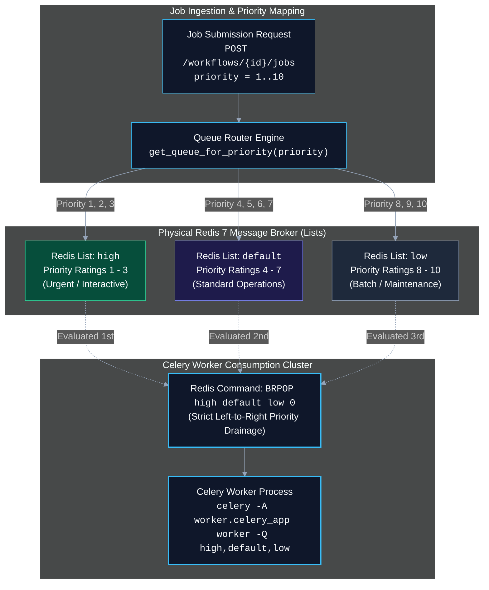

# Priority Queue Design Architecture

In distributed background task execution, not all workloads possess equal operational urgency. A customer-facing webhook trigger, password reset dispatch, or transactional alert must execute with sub-second responsiveness, whereas a bulk historical data sync or deep reporting job can safely tolerate queuing delays during peak system utilization.

This document explains why FlowForge implements task prioritization using **three physical tiered Celery queues (`high`, `default`, `low`) over a single Redis 7 broker**, details the mechanical trade-offs of this architecture, and explains why heavier message fabrics like RabbitMQ or Kafka were bypassed.

---

## 1. Problem Space: Priority Inversion & Queue Starvation

In an unprioritized, single-queue FIFO (First-In, First-Out) message broker:
1. **Head-of-Line Blocking**: If a user submits a batch job of 10,000 low-priority data extraction tasks, an urgent interactive job submitted immediately afterward is queued behind all 10,000 batch tasks.
2. **Priority Inversion**: Latency-sensitive operational pipelines miss SLA windows while worker threads remain fully occupied processing non-urgent background batch work.

To resolve this without introducing multi-broker operational complexity, FlowForge introduces a **deterministic tiered routing pipeline**.



---

## 2. Why Tiered Queues Over Simulated Numeric Priority

On the `Job` database model, priority is stored as an integer from `1` to `10` (where `1` denotes highest urgency, and `10` denotes lowest). A naive approach would attempt to pass this numeric integer directly to the message broker, expecting tasks with priority `1` to jump ahead of priority `2` in a single global queue.

However, **our message broker is Redis 7**.

### The Redis Broker Reality
- **Lack of Native Priority Primitives**: Redis is an ultra-fast in-memory data store whose fundamental queuing primitives are doubly-linked lists (`LPUSH`, `RPUSH`, `LPOP`, `RPOP`, `BRPOP`). It has no native AMQP-style priority frame support.
- **Flaws with Celery’s `priority_steps`**:
  While Celery provides an optional Redis `priority_steps` setting, it operates by dynamically fabricating multiple sub-lists under the hood (e.g. `celery\x06\x161`, `celery\x06\x162`). Under production loads or across multi-worker deployments, this emulation exhibits notable instability:
  - **Message Reordering Glitches**: Prefetching workers can pull lower-priority messages into local memory buffers while high-priority messages are waiting in other sub-lists.
  - **Connection Contention**: Managing dozens of simulated sub-lists increases round-trip Redis commands and creates non-deterministic scheduling behavior.
- **The Stability of Discrete Named Queues**:
  In contrast, **discrete physical queues** (`high`, `default`, `low`) are first-class, battle-tested primitives in both Kombu/Celery and Redis.

### The FlowForge Priority Mapping Engine
In [backend/app/core/queue_routing.py](file:///d:/Edutation%28P%29/FlowForge/backend/app/core/queue_routing.py), integer priorities are partitioned into three explicit operational tiers:

```python
HIGH_QUEUE = "high"
DEFAULT_QUEUE = "default"
LOW_QUEUE = "low"

QUEUES = (HIGH_QUEUE, DEFAULT_QUEUE, LOW_QUEUE)

def get_queue_for_priority(priority: int) -> str:
    """Maps an integer priority (1-10, lower = more urgent) to a tiered queue name.

    Mapping:
      - 1-3  -> "high"    (Interactive user jobs, urgent alerts)
      - 4-7  -> "default" (Standard business workflows, default=5)
      - 8-10 -> "low"     (Batch data imports, bulk reporting)
    """
    if 1 <= priority <= 3:
        return HIGH_QUEUE
    elif 4 <= priority <= 7:
        return DEFAULT_QUEUE
    elif 8 <= priority <= 10:
        return LOW_QUEUE
    else:
        # Graceful fallback for out-of-range bounds
        return DEFAULT_QUEUE
```

---

## 3. Worker Consumption Mechanics: The Power of `BRPOP`

When a worker node initializes in [worker/Dockerfile](file:///d:/Edutation%28P%29/FlowForge/worker/Dockerfile), it binds to all three queues in strict priority sequence:

```bash
celery -A worker.celery_app worker -Q high,default,low --loglevel=info
```

### Redis `BRPOP` Left-to-Right Precedence Guarantee
Under the hood, Kombu (Celery's messaging library) issues a blocking pop command to Redis formatted with the queues in the exact order declared by `-Q`:

```redis
BRPOP high default low 0
```

Redis defines strict left-to-right precedence for `BRPOP`:
1. Redis inspects the `high` list. If any elements exist, it immediately pops and returns the rightmost element.
2. If and only if `high` is completely empty, Redis inspects `default`.
3. If and only if both `high` and `default` are completely empty, Redis inspects `low`.
4. If all three lists are empty, the TCP connection blocks efficiently with zero CPU overhead until any client executes an `LPUSH` onto any of the monitored lists.

> [!NOTE]
> This guarantees that even if there are 500,000 pending tasks waiting in the `low` queue, an incoming task submitted to `high` is guaranteed to be consumed on the very next worker dequeue cycle.

---

## 4. Architectural Trade-offs & Limitations

While tiered physical queues provide rock-solid reliability and sub-millisecond dispatching, the design entails two deliberate compromises:

### 1. Coarse-Grained Intra-Queue Granularity
Within a given queue tier, consumption is strictly FIFO (First-In, First-Out).
- A task with priority `1` and a task with priority `3` both route to `high`.
- If the priority `3` task was enqueued 5 milliseconds before the priority `1` task, the priority `3` task executes first.
- There is no sub-tier reordering within the physical Redis list.

### 2. Non-Preemptive Cooperative Execution
Celery is a cooperative user-space task worker, not a preemptive operating system kernel:
- **No Worker Interruption**: If all worker concurrency processes are actively executing long-running tasks (for example, 4 worker threads running 60-second `sleep` tasks from the `low` queue), an incoming `high` priority task cannot preempt, pause, or suspend the running tasks.
- **Idle Cycle Bound**: The high-priority task must wait in Redis until at least one worker process completes its current task and queries `BRPOP` again.

### Mitigating Long-Running Task Blocking
To prevent low-priority tasks from monopolizing worker capacity:
1. **Hard Task Time Limits**: In [worker/celery_app.py](file:///d:/Edutation%28P%29/FlowForge/worker/celery_app.py), `task_time_limit = 300` forces termination of any task exceeding 5 minutes.
2. **Worker Pool Specialization**: In larger deployments, operators can run dedicated worker instances reserved strictly for `high` and `default` queues:
   ```bash
   # Dedicated Interactive Worker Pool (never touches 'low')
   celery -A worker.celery_app worker -Q high,default -c 4

   # Dedicated Background Batch Worker Pool
   celery -A worker.celery_app worker -Q low -c 2
   ```

---

## 5. Comparative Evaluation: Redis vs. RabbitMQ vs. AWS SQS

During the architectural design phase of FlowForge, several message broker alternatives were evaluated:

| Broker Dimension | FlowForge Choice: Redis 7 | RabbitMQ (AMQP 0-9-1) | AWS SQS (Cloud Managed) |
| :--- | :--- | :--- | :--- |
| **Priority Primitive** | **3 Physical Tiered Lists** (`high`, `default`, `low`) | Native `x-max-priority` integer ordering (0–255) | Separate SQS queues (High/Default/Low) |
| **Operational Complexity** | **Minimal**: Single lightweight C container (<50MB RAM). | **High**: Erlang VM, Mnesia database clustering, memory thresholds. | **Zero Infrastructure**: Fully managed cloud service. |
| **Result Backend Synergy** | **Native**: Serves as both task broker and Celery result backend. | **Poor**: Result queues in RabbitMQ cause severe memory churn and broker strain. | **Unsupported**: SQS cannot act as a Celery result backend. |
| **Preemption Support** | Cooperative on idle cycle. | Cooperative on idle cycle. | Cooperative on idle cycle. |
| **Local Dev Ergonomics** | Bootstraps in 1 second via Docker Compose. | Requires custom plugins and management UI setup. | Requires LocalStack emulation or live AWS credentials. |

### The Decisive Rationale
Because Celery requires a persistent result storage engine to record task returns, **FlowForge already required Redis** for `CELERY_RESULT_BACKEND`. Utilizing Redis as both the message broker and result backend eliminated an entire stateful database engine from the platform's infrastructure footprint, drastically reducing developer onboarding friction, CI execution times, and cloud hosting costs.

---

## Related Documentation & References

- [Job Lifecycle and Orchestration](job-lifecycle-and-orchestration.md) — How the orchestrator preserves priority when advancing sequential task steps.
- [Design Decisions and Trade-offs](design-decisions-and-tradeoffs.md) — Comprehensive philosophical rationale across all FlowForge subsystems.
- [Retry and Dead-Letter Strategy](retry-and-dead-letter-strategy.md) — How priority queues interact with exponential backoff and DLQ quarantine.
- [Environment Variables Specification](../04-reference/environment-variables.md) — Configuration parameters for `REDIS_URL` and Celery worker settings.
- [Running the Test Suite Guide](../03-how-to-guides/running-the-test-suite.md) — How priority queues are tested under eager mode in Pytest.