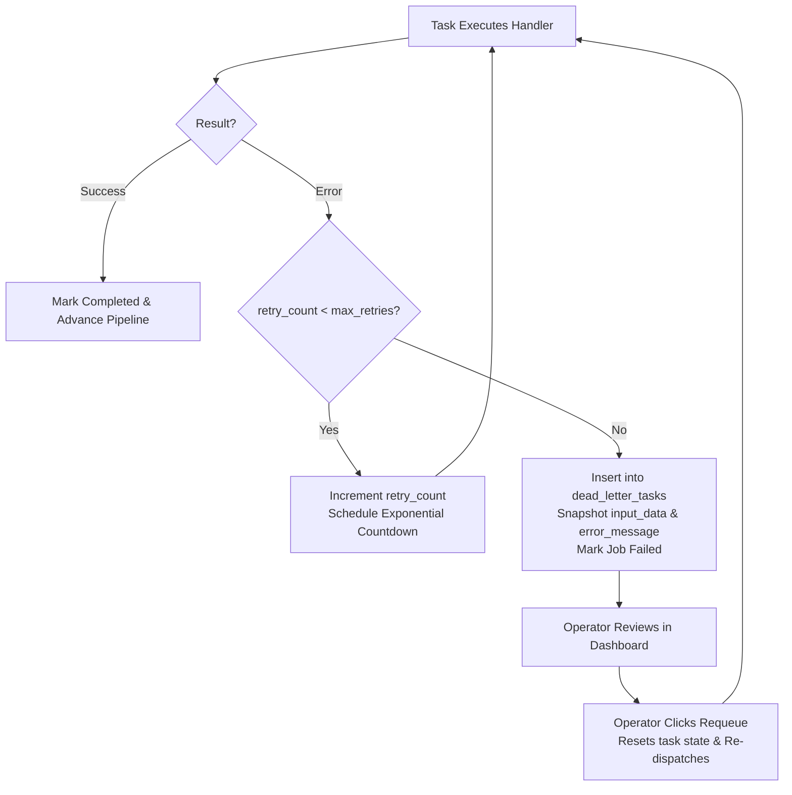

# Retry and Dead-Letter Strategy

Distributed systems are inherently subject to transient failures: network timeouts, database connection pool exhaustion, and remote third-party API rate limits. 

This document explains FlowForge's resilience architecture—how exponential backoff retries mitigate transient errors, why permanently failed tasks are isolated in a Dead-Letter Queue (DLQ), and the critical limitation regarding task idempotency.

---

## 1. Why Exponential Backoff Over Fixed Intervals

When a task fails, the simplest possible retry strategy is an immediate retry or a fixed interval (e.g., retry every 3 seconds). However, fixed-interval retries are dangerous in distributed systems:

1. **The "Thundering Herd" Problem**: If a downstream service experiences a brief outage, dozens of failed tasks retrying simultaneously on fixed timers will repeatedly flood the struggling service with concurrent requests, preventing it from recovering.
2. **Transient Glitches vs. Prolonged Outages**: A brief network blip resolves in milliseconds, whereas a database restart might take 30–60 seconds. A fixed retry interval is either too slow for quick glitches or too fast for service restarts.

### The FlowForge Backoff Formula
FlowForge implements an exponential backoff formula with an upper delay ceiling:

$$\text{delay} = \min\left(\text{RETRY\_BASE\_DELAY\_SECONDS} \times 2^{(\text{retry\_count} - 1)},\; \text{RETRY\_MAX\_DELAY\_SECONDS}\right)$$

With default settings (`base = 10.0s`, `max = 300.0s`):
- **Attempt 1 Failure**: $10.0 \times 2^0 = 10.0\text{ seconds}$ delay
- **Attempt 2 Failure**: $10.0 \times 2^1 = 20.0\text{ seconds}$ delay
- **Attempt 3 Failure**: $10.0 \times 2^2 = 40.0\text{ seconds}$ delay

### Non-Blocking Celery Countdowns
Crucially, the worker does **not** execute `time.sleep(delay)` during retries. Blocking the worker process would tie up concurrency slots and prevent other users' jobs from running.

Instead, FlowForge re-publishes the task message to Celery with a native countdown parameter:
```python
execute_task.apply_async(args=[task_id], countdown=int(delay), queue=queue)
```
Celery places the task into an internal scheduled timer queue in Redis. The worker process is immediately freed to consume other pending tasks.

---

## 2. Why Dead Letters Instead of Infinite Retries or Dropping

When all retry attempts are exhausted (`retry_count >= max_retries`), systems typically make one of two mistakes:
1. **Infinite Retries**: Retrying forever blocks pipeline execution, burns CPU cycles, and can clog message brokers with poison pills that will never succeed.
2. **Silent Drops**: Logging an error to console logs and dropping the message causes silent data loss. Operators cannot determine which records failed or inspect the attempted payload.

### The Dead-Letter Table (`dead_letter_tasks`)
FlowForge adopts the **Dead-Letter Queue (DLQ)** pattern using a dedicated relational database table:



### Key Benefits of This Approach
1. **Auditable Diagnostic Snapshot**: The `dead_letter_tasks` record saves the exact `input_data` JSON snapshot, the raw `error_message` string, the attempt count, and the exact failure timestamp.
2. **Intentional Human Intervention**: A poisoned task halts the job, preventing downstream steps from operating on corrupted or missing intermediate data. Recovery requires an explicit human operator decision to requeue after fixing the root cause.
3. **Historical Audit Record**: When an operator requeues a task (`POST /dead-letters/{id}/requeue`), the record is **not deleted**; its `requeued_at` timestamp is populated. This preserves a permanent audit trail proving that an outage occurred and was manually remediated.

---

## 3. The Honest Limitation: Non-Idempotent Task Handlers

> [!WARNING]
> **Known Architectural Limitation: Lack of Idempotency Guarantees**

In an ideal distributed system, every task is **idempotent**—meaning executing the same task multiple times produces the exact same outcome without unintended duplicate side effects ($f(f(x)) = f(x)$).

In FlowForge, **task handlers are not currently guaranteed to be idempotent**:

### How Duplicate Side Effects Can Occur
Consider an `http_call` task configured to charge a payment or send a customer notification:
1. The worker sends an HTTP `POST` request to an external billing API.
2. The remote billing API successfully processes the payment and charges the card.
3. However, before the billing API can return an HTTP 200 response, a network drop occurs, or the client connection times out after 10 seconds.
4. From the worker's perspective, `http_call` raised an `HTTPTimeoutException`. The worker flags the task as failed and schedules a retry with backoff.
5. On retry, the worker sends the exact same HTTP `POST` request again. **The customer is charged twice.**

### Why This Gap Exists Today
True idempotency requires:
- **Idempotency Keys**: Generating unique transaction tokens for every task attempt and passing them in HTTP request headers (`Idempotency-Key: <uuid>`).
- **External Support**: The receiving third-party API must support and enforce idempotency key deduplication.
- **Transactional Outboxes**: Atomic coordination between task execution and database state commits.

For FlowForge's current scope, implementing full idempotency frameworks across arbitrary task types was deemed excessive. However, this remains an essential consideration for developers writing custom task handlers.