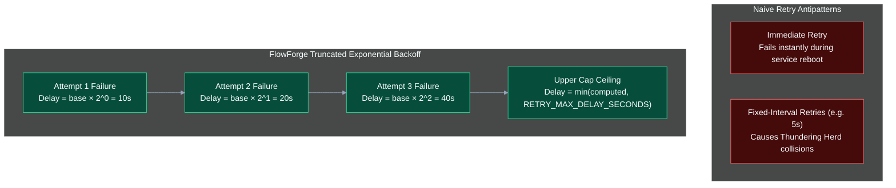
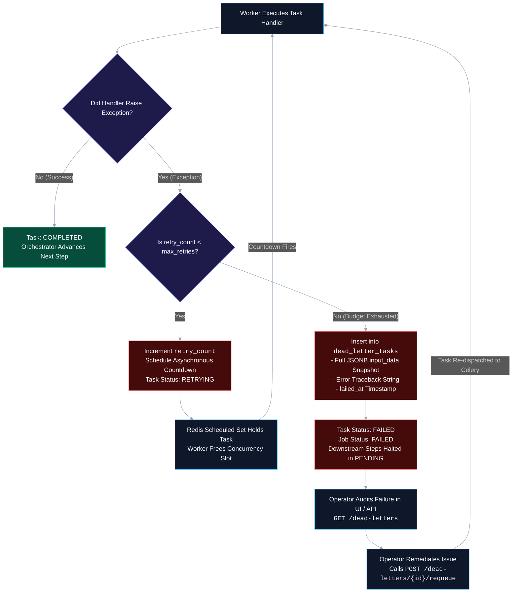
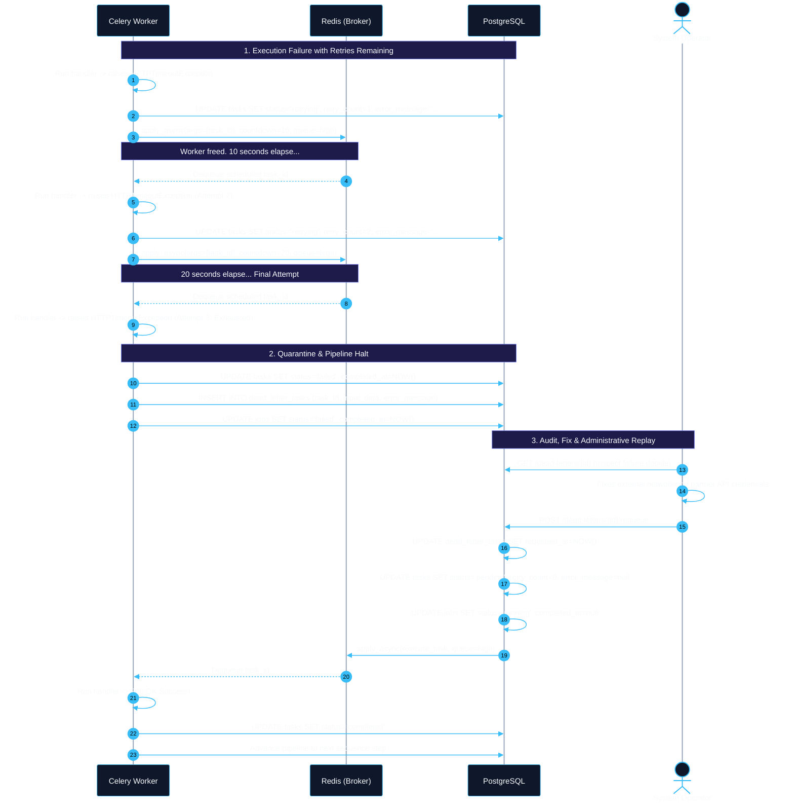
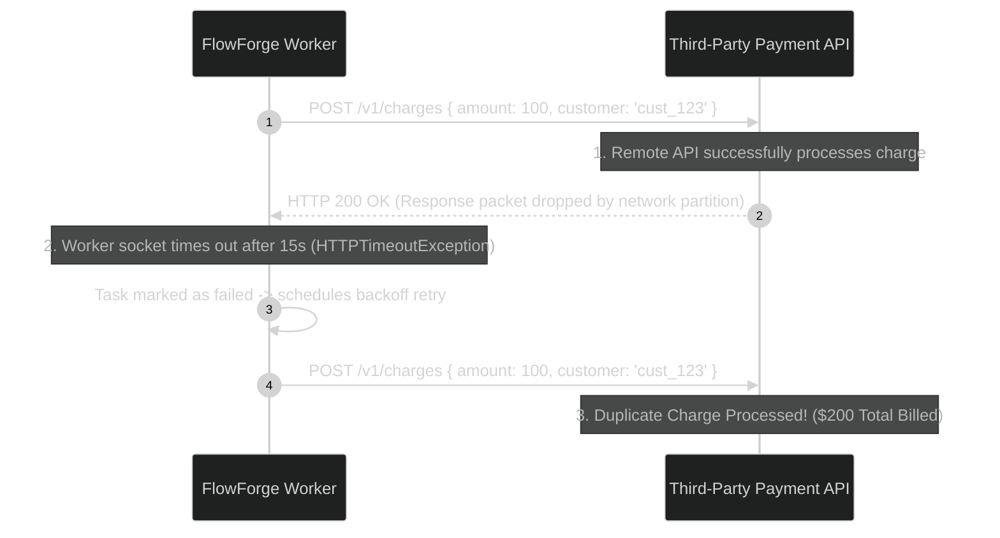

# Retry and Dead-Letter Strategy Architecture

In distributed computing, failures are inevitable. Network partitions, ephemeral database connection drops, downstream rate limiting (HTTP 429), and transient upstream server errors (HTTP 502/503) are common occurrences. 

A resilient workflow orchestration platform must be designed to withstand transient instability autonomously while isolating persistent, unrecoverable failures without manual firefighting or data loss.

This document details FlowForge's resilience architecture: the mathematics of truncated exponential backoff, non-blocking asynchronous countdowns, the relational Dead-Letter Queue (DLQ) quarantine model, and the critical distributed systems challenge of **task idempotency**.

---

## 1. Mathematical Model: Truncated Exponential Backoff

When an asynchronous task execution fails, naive systems typically respond in one of two suboptimal ways:
1. **Immediate Retry**: Re-executing instantly. If an external service is rebooting or suffering connection pool exhaustion, an immediate retry will invariably fail.
2. **Fixed-Interval Retries**: Retrying every $N$ seconds. If 1,000 tasks fail simultaneously due to a 10-second database blip, all 1,000 tasks will retry at the exact same moment on fixed timers, generating a destructive **"thundering herd"** that overpowers the recovering dependency.

FlowForge resolves this by implementing a **truncated exponential backoff** algorithm with an upper delay ceiling:



### The Backoff Formula
In [worker/tasks/execute_task.py](file:///d:/Edutation%28P%29/FlowForge/worker/tasks/execute_task.py), the delay before the next attempt is calculated as:

$$\text{delay} = \min\left(\text{RETRY\_BASE\_DELAY\_SECONDS} \times 2^{(\text{retry\_count} - 1)},\; \text{RETRY\_MAX\_DELAY\_SECONDS}\right)$$

With standard FlowForge configuration defaults (`base = 10.0s`, `max = 300.0s`):
- **Attempt 1 Failure** (`retry_count = 1`): $10.0 \times 2^0 = 10.0\text{ seconds}$
- **Attempt 2 Failure** (`retry_count = 2`): $10.0 \times 2^1 = 20.0\text{ seconds}$
- **Attempt 3 Failure** (`retry_count = 3`): $10.0 \times 2^2 = 40.0\text{ seconds}$
- **Attempt 4 Failure** (`retry_count = 4`): $10.0 \times 2^3 = 80.0\text{ seconds}$
- **Attempt 5 Failure** (`retry_count = 5`): $10.0 \times 2^4 = 160.0\text{ seconds}$
- **Attempt 6+ Failure**: Clamped to the maximum threshold of **$300.0\text{ seconds}$ (5 minutes)**.

### Non-Blocking Asynchronous Countdowns
A critical operational detail in FlowForge is that worker processes **never block local execution threads** using synchronous pauses like `time.sleep(delay)`. 

If a worker thread were to sleep for 40 seconds during a backoff window, that worker thread would be completely blocked—wasting hardware concurrency and preventing other users' jobs from executing.

Instead, FlowForge offloads timing to Celery's Redis-backed scheduler via the `countdown` argument:

```python
# worker/tasks/execute_task.py
queue = get_queue_for_priority(job.priority if job else 5)
countdown = 0 if getattr(celery_app.conf, "task_always_eager", False) else max(1, int(delay))

execute_task.apply_async(args=[task_id], countdown=countdown, queue=queue)
```

1. Celery places the delayed task into a Redis Sorted Set (`zset`) keyed by the execution timestamp.
2. The Celery worker immediately returns from `execute_task` and becomes 100% free to consume other pending tasks.
3. When Redis signals that the countdown timestamp has elapsed, Celery moves the task into the active execution list (`high`, `default`, or `low`), preserving the parent job's priority tier.

---

## 2. Dead-Letter Queue (DLQ) Quarantine Architecture

When a task fails repeatedly and exhausts its configured retry budget (`retry_count >= max_retries`), systems face a critical fork:
- **The Infinite Retry Anti-Pattern**: Retrying indefinitely turns persistent failures (such as malformed JSON or authentication errors) into **"poison pills"**. These tasks perpetually consume broker memory and worker CPU cycles, starving healthy workloads.
- **The Silent Drop Anti-Pattern**: Logging an error and discarding the message results in silent data loss. Administrators have no visibility into which entity failed or what payload caused the crash.

FlowForge implements the **Dead-Letter Queue (DLQ) isolation pattern** backed by a dedicated relational table: [backend/app/models/dead_letter.py](file:///d:/Edutation%28P%29/FlowForge/backend/app/models/dead_letter.py).



### Forensic Anatomy of `dead_letter_tasks`

The `dead_letter_tasks` table acts as a forensic quarantine black box:

```sql
CREATE TABLE dead_letter_tasks (
    id UUID PRIMARY KEY DEFAULT gen_random_uuid(),
    task_id UUID NOT NULL REFERENCES tasks(id) ON DELETE CASCADE,
    job_id UUID NOT NULL REFERENCES jobs(id) ON DELETE CASCADE,
    workflow_id UUID NOT NULL REFERENCES workflows(id) ON DELETE CASCADE,
    task_type VARCHAR(100) NOT NULL,
    input_data JSONB,
    error_message TEXT,
    retry_count INTEGER NOT NULL DEFAULT 0,
    failed_at TIMESTAMP WITH TIME ZONE NOT NULL,
    requeued_at TIMESTAMP WITH TIME ZONE
);
```

### Why Forensic Snapshots Matter
1. **Immutable Payload Capture**: The exact `input_data` dictionary passed to the handler at the moment of failure is serialized as `JSONB`. Even if the parent workflow is updated or deleted later, the diagnostic evidence remains accessible.
2. **Traceback Preservation**: The raw exception message or HTTP status code is saved in `error_message`, giving developers immediate root-cause diagnosis without grepping through container logs.
3. **Audit Trail on Recovery**: When an administrator triggers `POST /dead-letters/{id}/requeue`, the row is **not deleted**. Instead, `requeued_at` is stamped with the current timestamp. This provides verifiable historical proof that an incident occurred and was successfully recovered.

---

## 3. End-to-End Failure & Requeue Sequence Flow

The following sequence diagram illustrates the lifecycle of a task failing through retries, entering quarantine, and being administratively redriven:



---

## 4. The Critical Idempotency Challenge: At-Least-Once Delivery

> [!WARNING]
> **Known Architectural Seam: Task Handlers Are Not Guaranteed Idempotent**

In distributed systems, message brokers like Redis, Celery, RabbitMQ, and SQS guarantee **at-least-once delivery**, not exactly-once delivery. An operation is defined as **idempotent** if executing it multiple times produces the identical side-effect as executing it once:

$$f(f(x)) = f(x)$$

In FlowForge's default implementation, task handlers are **not strictly idempotent**.

### The Two-Phase Network Partition Vulnerability
Consider an `http_call` step configured to process a financial charge or dispatch a webhook to an external SaaS provider:



1. The FlowForge worker transmits the HTTP `POST` request.
2. The remote billing API receives the request, processes the credit card transaction, and commits the state.
3. However, before the HTTP 200 response reaches the worker, an intermediate router drops the TCP packet or times out.
4. From FlowForge's perspective, the request raised a socket timeout (`requests.exceptions.ReadTimeout`).
5. The retry engine triggers an exponential backoff retry.
6. The worker issues the exact same HTTP request a second time. **The customer is billed twice.**

### Engineering Recipes for Safe Idempotency
To build production-grade idempotent handlers within FlowForge, developers should adhere to the following patterns:

#### 1. Deterministic Idempotency Keys
Generate an idempotency token derived deterministically from the task's primary key (`task.id`):

```python
import requests

def idempotent_http_call_handler(config: dict) -> dict:
    url = config["url"]
    task_id = config["_task_id"] # Passed from task record
    
    headers = config.get("headers", {})
    # Send deterministic Idempotency-Key
    headers["Idempotency-Key"] = f"flowforge-task-{task_id}"

    response = requests.post(url, json=config.get("body"), headers=headers, timeout=15)
    response.raise_for_status()
    return response.json()
```

#### 2. Read-Before-Write Verification
Before performing a mutating operation (e.g., creating a user or writing a database record), the handler should query the target system for an existing entity matching a unique business reference (e.g. `order_reference_id`). If the entity already exists in the desired terminal state, the handler skips execution and returns the existing result immediately.

---

## Related Documentation & References

- [Managing Dead Letters Guide](../03-how-to-guides/managing-dead-letters.md) — Operational walkthrough for inspecting and redriving quarantined tasks via CLI and API.
- [Relational Data Model & Architecture](../04-reference/data-model.md) — Schema specifications for `tasks`, `jobs`, and `dead_letter_tasks`.
- [Priority Queue Design](priority-queue-design.md) — How backoff countdowns preserve priority queues in Redis.
- [Job Lifecycle and Orchestration](job-lifecycle-and-orchestration.md) — How failed tasks halt downstream sequential steps.
- [REST API Reference](../04-reference/api-reference.md) — Specifications for `/dead-letters` and `/dead-letters/{id}/requeue` endpoints.